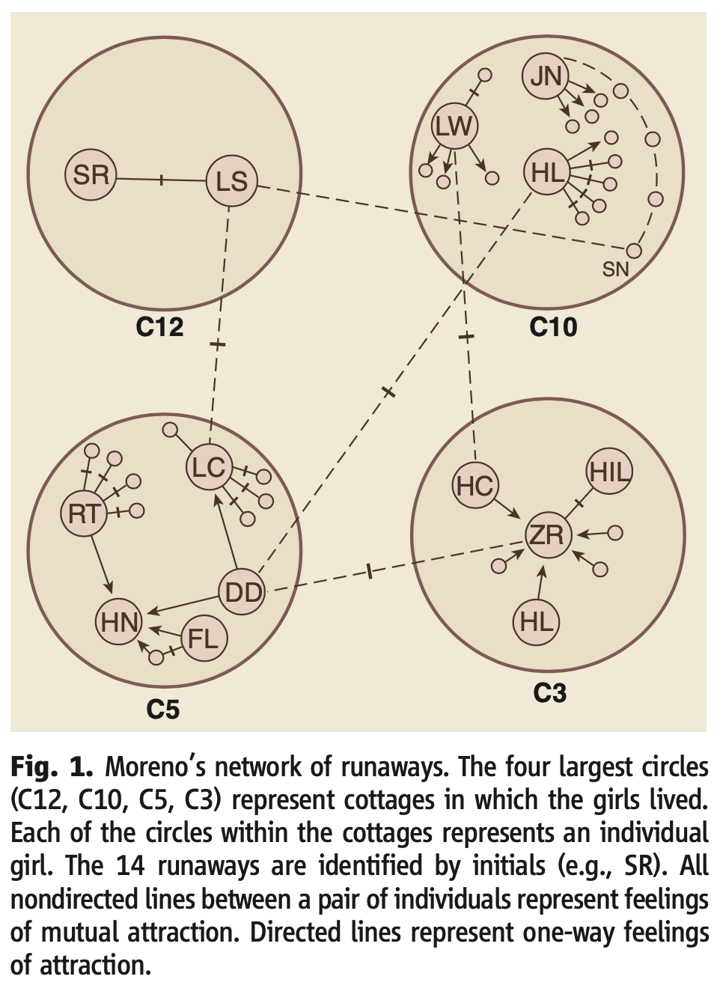

```{r echo=FALSE}
library(tidyverse)
source("../functions.R")
```

```{css}
.btn-group{
  display:none;
}
```

[Back to index](../index.nb.html)

# Abstract / Key Points



The reasons for social regularities were to be found not in the intentions of individuals but in the structure of the social environments in which they were embedded

The more centralized structures, such as the star structure, outperformed decentralized struc- tures, such as the circle, even though it could be shown mathematically that the circle structure had, in principle, the shortest minimum solution time

But the tendency in human networks seemed to be for the more peripheral members of a network (i.e., the nodes colored blue in the “Star,” “Y,” and “Chain” networks in Fig. 2) to channel information to the most central node (i.e., the nodes colored red in Fig. 2), who then decided what the correct answer was and sent this answer back out to the other nodes. The fastest performing network structures were those in which the distance of all nodes from the obvious integrator was the shortest (7)


The strength of weak ties and social capital 

`r colored("Social and physical scientists tend to have different goals", "gold", bold = T)` 

  - physical: it has not been unusual for a research paper to have as its goal to demonstrate that a series of networks have a certain property (and that this property would be rare in random networks) 
  - social:  
    - The default expectation has been that different networks (and nodes within them) will have varying network properties and that these variations account for differences in outcomes for the networks (or nodes) Indeed, it is the relating of network differences to outcomes that they see as constituting theoretical versus descriptive work
    - Social scientists have also been more concerned than the physical scientists with the individual node, whether an individual or a collective such as a company, than with the network as a whole. <--- This focus on node-level outcomes is probably driven to at least some extent by the fact that traditional social science theories have focused largely on the individual.
      - To compete against more established social sci- ence theories, network researchers have had to show that network theory can better explain the same kinds of outcomes that have been the traditional focus of the social sciences
    - Social scientists agree that survey data contain error, but do not regard an error-free measurement of who interacts with whom to be a substitute for, say, who trusts whom, as these are qualitatively different ties that can have different outcomes 
      -  In addition, social scientists would note that even when objective measures are available, `r colored("it is often more useful for predicting behavior to measure a person’s perception of their world than to measure their actual world.", "gold", bold = T)`

# Social network theory 

**It's not merely descriptive and it's just methodology"** 

1. Types of ties 


2. The importance of structure 

Whereas traditional social research explained an individual’s outcomes or characteristics as a function of other characteristics of the same individual (e.g., income as a function of education and gender), social network researchers look to the individual’s social environment for explanations, whether through influence processes (e.g., individuals adopting their friends’ occupational choices) or leveraging processes (e.g., an individual can get certain things done because of the connections she has to powerful others). A key task of social network analysis has been to invent graph-theoretic properties that characterize structures, positions, and dyadic properties (such as the cohesion or connectedness of the structure) and the overall “shape” (i.e., distribution) of ties.

3. Research questions

Social sciences emphasize variation in structure across different groups or contexts, using these variations to explain differences in outcomes, with the aim to predict a host of network properties 

Most work of this type has been conducted at the dyadic level (e.g., What is the basis of friendship ties? How do firms pick alliance partners?)

  - Opportunity-based antecedents 
    - the likelihood that two nodes will come into contact
  - Benefit-based antecedents 
    - some kind of utility maximization or discomfort minimization that leads to tie formation
    
The primary focus of network research in the social sciences ---> the consequences of networks 

  - a node’s position in a network determines in part the opportunities and constraints that it encounters, and in this way plays an important role in a node’s outcomes
  - This is the network thinking behind the popular concept of social capital, which in one formulation posits that the rate of return on an actor’s invest- ment in their human capital (i.e., their knowledge, skills, and abilities) is determined by their social capital (i.e., their network location)
  
  <hr>
  - Outcomes fall into two categories 
    - Homogeneity
      - the similarity of actors with respect to behaviors or internal structures
      - e.g., which firms adopt the same organizational governance structures; the prediction of similarity in time-to-adoption of an innovation for pairs of actors
    - Performance 
      - a node’s outcomes with respect to some good
      - firm centrality predicts the firm’s ability to innovate, as measured by number of patents secured (32), as well as to perform well financially; indivudals' centrality and power and influence 

4. Theoretical mechanisms 

Basic mechanism: direct transmission from node to node --->  something flows along a network path from one node to the other 
  
  - could be physical transfer or mimetic (imitative) process (e.g., contagion of ideas)

1. Binding is one of the mechanisms behind the popular notion of the performance benefits of “structural holes” (the absence of a tie among a pair of nodes in the ego network)

  - ego network: the set of nodes with direct ties to a focal node, called “ego,” together with the set of ties among members of the ego network
  - **egos with lots of structural holes are better performers in certain competitive settings**
    - The lack of structural holes around a node means that the node’s contacts are “bound” together—they can communicate and coordinate so as to act as one, creating a formidable “other” to negotiate with.


2. Exclusion mechanism

  - competitive situations in which one node, by forming a relation with another, excludes a third node
  - e.g., a chain network 
    - nodes are allowed to make pairwise “deals” with those they are directly connected to ---> node d can exclude node c by making a deal with node e. ---> A set of experiments (36) showed that nodes b and d have high bargaining power, whereas nodes a, **c**, and e have low power.
    


      
Challenge: double-hermeneutic 

  - def: theories can diffuse through a population, influencing the way people see themselves and how they act, 


-----
[Back to index](../index.nb.html)


`r colored("", "gold", bold = T)`


