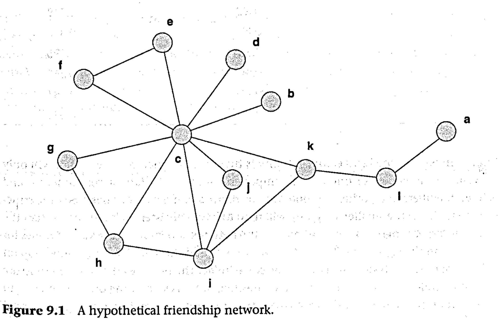

```{r echo=FALSE}
library(tidyverse)
source("../functions.R")
```

```{css}
.btn-group{
  display:none;
}
```

[Back to index](../index.nb.html)

# Abstract / Key Points

# 9.3 Undirected, non-valued networks 

## 9.3.1 Degree centrality 

In terms of the adjacency matrix X of an undirected network, degree centrality is simply the row or column sums of the adjacency matrix. If $d_i$ is the degree centrality of actor $i$ a.nd $x_{ij}$ is the ($i$, $j$)th entry of the adjacency matrix, then

\begin{equation}
\tag{1}
d_i = \sum_{j}^{}X_{ij}
\end{equation}

It can be shown mathematically that if something is taking a random walk through the network, the probability that it reaches a particular node is proportional to that node's degree.

## 9.3.2 Eigenvector centrality 

Eigenvector centrality can be described from a number of different perspectives (Bonacich, 1972). 

We present it here as `r colored("a variation of degree centrality in which we count the number of nodes adjacent to a given node (just like degree centrality), but weight each adjacent node by its centrality", "gold", bold = T)`:

\begin{equation}
\tag{2}
e_i = \frac{1}{\lambda}\sum_{j}^{}X_{ij}e_{j}
\end{equation}

$e$ = the eigenvector centrality score, $\lambda$ = a proportionality constant called the *eigenvalue*

`r colored("The equation basically says that each node's centrality ($e_i$) is proportional to the sum of centralities (the $e_j$) of the nodes it is adjacent to (i.e., where $x_{ij} = 1$) - in effect, when it comes to eigenvector centrality, a node is only as central as its alters. ", "gold", bold = T)` 

In eigenvector centrality we use the eigenvector with the biggest eigenvalue. (Ideally, the largest eigenvalue should be two or three times as large as the second largest.)

A simple way to make them unique is to *normalize the scores such that the sum of squares is 1*, but other approaches can be taken. This is not an issue when comparing centrality scores with each other *within a network*, but it can be an issue when comparing scores across different networks

We can interpret eigenvector centrality as `r colored("a measure of popularity", "gold", bold = T)` in the sense that `r colored("*a node with high eigenvector centrality is connected to nodes that are themselves well connected*", "gold", bold = T)`. This means that a node with small degree could have a higher eigenvector centrality score than a node with high degree if the first node's friends are very popular, while the second node's friends are not.

Eigenvector can be viewed as a measure of exposure to risk 



Nodes a and b both have degree 1, but b is more connected to nodes that are more connected 

Eigenvector centrality captures this difference and as a result assigns b a higher score. 

An important issue with eigenvector centrality is that, in disconnected networks, it will only assign values to members of one of the components - often the largest component - and zeros to all members of all other components  

## 9.3.3 Beta centrality 

Generalizes both degree and eigenvector centrality 

Defined as the row sums' of the matrix represented by the equation

\begin{equation}
\tag{3}
(I - \beta X)^{-1}X
\end{equation}

What is more illuminating is that, under certain conditions, the matrix $(I - \beta X)^{-1}X$ contained in equation (9.3) is equal to the *convergent infinite sum* shown in the equation

\begin{equation}
\tag{4}
R = \sum_{k = 1}^{\infty}(\beta^{k-1}X^k) = X + \beta X^2 + \beta^2X^3 + ...
\end{equation}

The $X^k$ terms in equation (9.4) are powers of the adjacency matrix. 

Importantly, the (i, J)th cell of the $k_{th}$ power of an adjacency matrix gives *the number of walks of length k from i to j*. The $\beta$ parameter (which is *chosen by the researcher*; chosen empirically to maximize predictive ability) serves as a `r colored("length-based weight", "gold", bold = T)`. Hence, the sum of the series gives the total number of walks between each pair of nodes of all possible lengths, weighted by $\beta^{k-1}$

When $\beta = 0$, the beta centrality reduces to simple degree centrality <--- all but the first matrix in the infinite series will be weighted zero and so knocked out

As we increase $\beta$, longer walks will begin to count as well. For example, if $\beta$ is 0.2, then walks of length 2 will be weighted 0.2, walks of length 3 will be weighted $0.2^2$ = 0.04, and so on. Really long walks - say, of length 10 - will still be largely ignored, since $0.2^9$ is only 0.000000512. 

If we think of a walk from a node to another node as a channel of potential indirect influence, `r colored("what $\beta$ does is determine how much we are going to count long walks in measuring the amount of influence a node might have on others", "gold", bold = T)`. Therefore, we can think of `r colored("beta centrality as a measure of the total amount of potential influence a node can have on all others via direct and indirect channels", "gold", bold = T)` (including repeatedly going through nodes reached earlier), where indirect channels are weighted (inversely) by their length, and $\beta$ controls how much the longer walks are counted.

Now let us consider what happens if we continue to increase $\beta$. When the absolute value of $\beta$ equals 1/$\lambda$), (the reciprocal of the largest eigenvalue of the adjacency matrix), the infinite sum no longer converges and equation (9.4) cannot be calculated.; Let the absolute value of $\beta$ get as close as we like to $1/\lambda$ ---> corresponding measure will become as indistinguishable as we like from eigenvector centrality. ---> from the lens of beta centrality we can view degree centrality and eigenvector centrality 'as two poles in a continuum of measures that vary in the extent to which longer walks are counted.

Example of empirically choosing $\beta$: how social position in an organization relates to knowledge of recent gossip

  - We use surveys to measure the network at time t, and the amount of knowledge each person has at t + 1. We then calculate beta centrality for a wide range of $\beta$s from 0 to just under the reciprocal of the largest eigenvalue, and correlate each with knowledge. The $\beta$ that yields the largest correlation is the one we choose. 
  - We then interpret the value of the optimal $\beta$ by looking at where it is in the range. If it is closer to zero, we know that, in our research setting, it is only short walks that are important. If it is closer to $1/\lambda$, we know that we are looking at a phenomenon where even long walks really matter.
  


What we can see is that if $\beta = 0$,then we simply get normalized degree and, in that case $b1, b2, b3$ are the most central. However, as we increase $\beta$, node $a$ becomes more central (even with a. alue of $\beta = 0.2$), because - although nodes $bl, b2, b3$ have more connections than node $a$ - node $a$ is more connected to well-connected nodes (i.e., to $bl, b2, b3$).


$\beta$ can be negative ---> subtract the weighted counts of walks of even length (corresponding to k being 2, 4, 6, ...) from weighted counts of walks of odd length ---> a node like $a$ in Figure 9.3 gets a higher score than nodes $b1, b2, b3$ when $\beta$ is positive but a lower score than these $b$ nodes when $\beta$ is negative. This is because there are many nodes (the $c$s) that are even lengths from a.

  - Captures **power dynamics**, where power is a function of
    - (a) the number of alters a focal node has available, and 
    - (b) the paucity of alternatives that ego's alters have.
    
  -  In practice, using a negative $\beta$ can make surprisingly difference.
    - In part, this is a function of the structure of the network (e.g., in a star network, the node in the center will have the highest score regardless of $\beta$), and 
    - in part it occurs because beta centrality counts walks rather than the number of distinct nodes at various distances. 
  

## 9.3.4 Closeness centrality 

Def: the sum of geodesic distances from a node to all others. (Recall that the geodesic distance from a node to another node is the length of the shortest path connecting them.) 
  
  - An inverse measure of centrality: the larger, the more peripheral ---> Actually captures "*farness*" (i.e., how far everyone is from ego)
  - Normalized version: divide the centrality into $n-1$ `r side_note("should n-1 be the numerator or denominator? A: numerator (See the example on p.179)")`
    - Max = 1; min = n-1   
    - High score ---> more closeness 
  - Interpret closeness centrality in terms of the minimum time until the arrival of something flowing through the network
    
none of these approaches to handling disconnected pairs of nodes is well justified theoretically. In addition, they contribute to low variance and a tendency for closeness scores to be related to the size of the component a node belongs to.

### 9.3.5 *k*-step research centrality

Def: The number of distinct nodes within distance $k$ steps of a given node ---> How many nodes a given node can reach in $k$ or fewer steps 

Typical k = 2 

From the point of view of assessing the risk of catching something, we might view this as an (admittedly simplistic) improvement over eigenvector centrality.

- A node that is within two links of many others can be seen as (a) having a high probability of catching what they have1 and (b) catching it early. They can also transmit something to many others very quickly 
- Note that by counting distinct others, the measure avoids the problem with eigenvector centrality that a node may appear to be well connected simply because its alters are well connected to each other ('echo chambers').
- Assumption: paths of length k are just as certain and as high-quality as paths shorter than k.
  - Solution 1: **Average reciprocal distance** ---> Weight the notes being counted inversely by how far away they are 
  - Solution 2: **Beta reach centrality** ---> is very similar to the use of $\beta$ in beta centrality, except that it only takes the shortest paths into account, whereas beta centrality involves all walks.

### 9.3.6 Betweenness centrality 

How often a given node falls along the shortest path between two other nodes ---> it is calculated for a given focal node by computing, for each pair of nodes other than the focal node; what proportion of all the shortest paths from one to the other pass through the focal node.

The betweeness centrality of a node $j$ is given by: 

\begin{equation}
\tag{5}
b_j = \sum_{i≠j≠k}^{}\frac{g_{ijk}}{g_{ik}}
\end{equation}

$g_{ijk}$ = the number of geodesic paths connecting $i$ and $k$ through $j$, and $g_{ik}$ is the total number of geodesic paths connecting $i$ and $k$. 

Typically interpret in terms of controlling flows through the network ---> filter, color, or distort the information 

In practice, the variance of betweenness tends to be quite high ---> effective discrimination between nodes and potentially correlating weel with other variables 

Assumption: being on the shortest path between two nodes who are 6 steps away from each other is the same as being on the shortest path between two nodes at distance 2. This might make sense when studying flows through a network, but is not as useful when studying how powerful nodes play others off against each other. 

  - Another approach could be to weight the importance of paths inversely by their lengths (Agneessens et al., 2017),

# 9.4 Directed, non-valued networks 

## 9.4.1 Degree 

Row sums as outdegree and col sums as indgree

In survey data, it is not unusual to regard node outdegree with some suspicion as it may reflect differences in interpretation by different respondents (who form the rows), or different le.vels of susceptibility to social desirability bias. For example, in asking about friendship ties within an organization, a node's high outdegree may indicate a very liberal interpretation of the word 'friend', or a feeling that they 'should' list everyone in their work unit as a friend.

### 9.4.2 Eigenvector and beta centrality 

- Right (outdegree) and left (indegree) eigenvector 
- Issue: 
  - Solutions require complex numbers ---> difficult to interpret 
  - Results can be ambiguous or nonsensical 
  
- Beta centrality is a better approach for directed data 

Application: 

- x-axis = index of formal power, constructed by computing a weighted average of power indicators including rank, tenure, and number of direct subordinates 
- y-axis = index of informal power, measured as the "in' beta centrality of the "who seeks advice from whom" network 


### 9.4.3 Closeness and *k*-reach centrality 

While we can easily define in-closeness as the column sums of the geodesic distance matrix and out-closeness as the row sums, the problem we run into is that directed graphs are particularly likely to be fragmented, so there are pairs of actors i and j in which either i cannot reach j or j cannot reach i.

We can, of course, apply the same techniques for our weak or disconnected graphs as we did for the undirected case, but with an.increased number of undefined distances, the closeness scores become even less meaningful, and variance across actors becomes very low. 

  - Instead, we might want to use k-reach centrality, where we can differentiate between in-reach centrality (how many nodes can reach a given node in k or fewer steps) and out-reach centrality (how many nodes a given node can reach in k or fewer steps) measures.


# 9.5 Valued networks 

Def: Indegree (outdgree) centrality simply as the average value of each row (column) of the adjacency matrix, or even more simply we can use the sum 

Eigenvector and beta centrality can be computed without modification 

  - For eigenvector centrality, a node's centrality is proportional to the sum of centralities of its alters but weighted by the strength of tie to that alter. 
    - This means that a high-valued connection to a low-centrality actor would produce a similar result to having a low-valued connection to a high-centrality actor

Unfortunately, identifying optimal valued paths is computationally intensive for all cases except where the values are costs or distances. As a result, most studies take the approach of dichotomizing their valued data and running centrality on the resulting binary data. By taking different cut-off values and comparing results, we often obtain better, more robust and more interpretable centrality results than by using the valued data directly

# 9.6 Negative tie netowrks 

E.g., dislike 

The point is that even though dyads in negative tie networks may transmit things from one node to the other, it is not clear that paths of a length greater than 1 serve.this function. 

Degree centrality works well with negative ties, requiring onlya simple reversal of the usual hypotheses. For example, we normally interpret indegree in a negative tie network as a measure of unpopularity instead of popularity, and we expect an increase in indegree to be associated with a reduction of power and influence, rather than an increase.

Although eigenvector centrality can be thought of as a kind of iterated degree centrality, it is unclear how useful eigenvector centrality is in a negative tie context.


### 9.6.1 PN centrality 

Consider first just the negative tie network. The recipient of a negative tie would be less affected by receiving a negative tie from an actor who gave out a lot of negative ties than if they were the sole recipient of a negative tie from an actor who only gave one negative tie.

Now imagine a situation in which lots of actors giving just a single negative tie did so to the same individual. In this case we would expect that individual to be on the margins of the network and so not be very central. 

This can be further compounded when we take account of the positive ties as well. Receiving single negative ties from actors who each attract a lot of positive ties would make the recipient very low in centrality. 

PN centrality takes into account of these ideas 

\begin{equation}
\tag{6}
PN = (1 - \frac{1}{2n-2}A)^{-1}I 
\end{equation}

$A = P-2N$

$P$ ---> positive tie matrix

$N$ ---> negative tie matrix (reverse coded, such that each entry is non-negative)

- In the case where there's no negative ties, A = P, the measure ranges from 1 ~ 2 
- In the case where there's no positive ties, A = N, the measure ranges from 0 ~ 1
- When both positive and negative ties exist, the measure ranges from -1 to 2
  - The value of -1 occurs when all the actors bar one have positive ties between them and they all have a negative tie to the remaining actor.


## 9.7 Induced centralities (aka. vitalities)

These measures assess the importance of a node by *removing* it from the network and seeing how much the network changes. The greater the change, the greater the induced centrality of the node.

If every node can reach every other, the measure is 1. If every node is an isolate, the measure is zero


Consider the network in Figure 9.6. The connectedness is 1. 

  - Suppose we remove node g. How much change is there in the connectedness of the network? None, since it remains connected. 
  - Now suppose we remove node h. The connectedness of the graph drops to 0.431, which, constitutes a change of 0.569.
  - Similarly, removing node i reduces connectedness by 0.529, removing m lowers connectedness by 0.209, and removing q lowers connectedness by 0.111. 
  - None of the other nodes have any effect on connectedness.


Can be applied to any property of the network as a whole - what is often referred to as a 'graph invariant'. ---> What it measures is each node's individual contribution to the graph invariant.

In ,the case of connectedness, this means we can identify nodes whose presence is contributing significantly to the global cohesion of the network

-----
[Back to index](../index.nb.html)


`r colored("", "gold", bold = T)`


  

