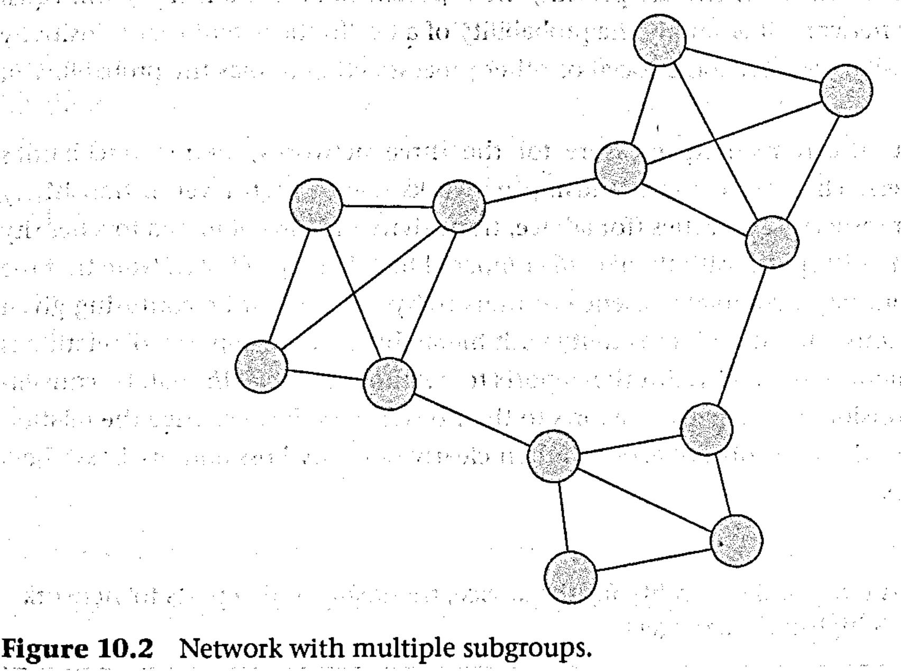

```{r echo=FALSE}
library(tidyverse)
source("../functions.R")
```

```{css}
.btn-group{
  display:none;
}
```

[Back to index](../index.nb.html)

# Abstract / Key Points

Many of the properties discussed in this chapter are measures of cohesiveness/cohesion of a network ---> the ability to transmit things, but doesn't necessarily correspond to flows (e.g., a network of who hates whom)

  - A network is cohesive if there exist paths from every node to every other. 

Shape differences (e.g., core-periphery structure vs. clumpy structure, though both could have the same cohesion)

In the context of this chapter, a group or whole network refers to the' ties among a set of nodes within *a specific boundary defined by the researcher*. 

  - Such groups could correspond to teams, departments, organizations, school classes, neighborhoods, gangs.; anything the researcher is interested in studying. 
  - Whole-network measures are typically most useful when used in a *comparative* way, meaning that we measure the network characteristic in a number of groups and then compare them. 
    - Cross-sectional as well as longitudinal 
  - Group measures can also be obtained by aggregating lower-level characteristics 

# 10. 2 Measures based on local properties 

## 10.2.1 Desity and average degree 

1. Density 
  
  - The prob that a randomly chosen pair of nodes have a tie 
  - $n / (n-1)$, for undirected ties, this would be divided by 2  
    - Can also be calculated as the average value of the adjacency matrix 
    - Convenient in valued network ---> average tie strength 

  - In principle density could be used for cross-network comparison 
     - But it almost always is lower in large networks than in small networks ---> Use the *average degree* of a network 
     
  - The relationship between average degree $\bar{d}$ and density for undirected-reflexive graphs 
  
e = number of edges, n = number of nodes   
  
\begin{align*}
\tag{1}
\bar{d} = \frac{2e}{n} = density*(n-1)
\end{align*}
   
   
### 10.2.2 Reciprocity 

By def, only works in directed networks 

MAN (mutual, asymmetrics, nulls) ---> one way to measure reciprocity is to find all non-null dyads (i.e., ones in which there is at least one arc), and then count the proportion of these that are mutuals (i.e., in which both nodes choose each other).

The reciprocity index is impacted by the density of the network; 

In fact, by chance alone, dense networks will tend to have more reciprocal dyads relative to the number of asymmetrical dyads, whereas in sparse networks the number of asymmetrical dyads will be a lot higher than the number of mutual dyads.

`r colored("Arc reciprocity", "gold", bold = T)`: which is defined as the proportion of all arcs that are matched by a reciprocating arc ---> `r colored("calculating the chance of a tie being present given that there is a tie in the opposite direction.", "gold", bold = T)` 

  - If there is no social force demanding reciprocity, then the probability of a tie from i to j will be the same irrespective of whether or not there is a tie from j to i. 
  - In contrast, higher than the density (with an upper limit of 1 indicating perfect reciprocity). 

### Transitivity and cyclicality 

These measures are simplistic in that they do not control for other characteristics of the network, such as the number of ties or the extent of centralization. 

1 . Transitivity: i ---> j, j ---> k, i ---> j; often seen in hierarchical status systems

In affective ties, transitivity can arise because of avoidance of `r colored("cognitive dissonance", "gold", bold = T)`. (if i likes j, and j likes k, it would induce cognitive dissonance in node i if i did not like k as well)

In undirected network, trans is called *closure* 

Networks high in transitivity often exhibit '*clumpiness*' - that. is, they have a structure characterized by regions of high density weakly connected to other regions of high density (see Figure 10.2). 



So human systems seemed to present a paradox: they are both clumpy and short-pathed. Watts and Strogatz soon discovered that the paradox was easily resolved as it only takes a few random connections between clumps to significantly shorten average path length, so the class of networks that are both clumpy and have short paths is quite a bit bigger than initially thought. 

\begin{align*}
\tag{2}
c_{transitivity} = \frac{ \sum{}_{i≠j≠k} \sum{}_{j≠k} \sum{}_{k} (x_{ij}x_{jk}x_{ik})}{\sum{}_{i≠j≠k} \sum{}_{j≠k} \sum{}_{k} (x_{ij}x_{jk})}
\end{align*}

Like arc reciprocity, `r colored("this measure of transitivity can be viewed as the conditional probability of tie given that ties and exist.", "gold", bold = T)`

2. Cyclicality: i ---> j, j --->, k ---> i; an inverse measure of hierarchy.

\begin{align*}
\tag{3}
c_{cyclicality} = \frac{ \sum{}_{i≠j≠k} \sum{}_{j≠k} \sum{}_{k} (x_{ij}x_{jk}x_{ki})}{\sum{}_{i≠j≠k} \sum{}_{j≠k} \sum{}_{k} (x_{ij}x_{jk})}
\end{align*}

The conditional probability of a certain tie, given the presence of two others. 

# Measures based on global peoperties 

## 10.3.1 Components and fragmentation

If the network is fragmented into separate components (see Chapter 2), things can flow only within components. Hence, one measure of cohesion is the number of components in the graph

The component ratio [0, 1]

\begin{align*}
\tag{4}
CR = \frac{c-1}{n-1}
\end{align*}

c = number of components, n - number of nodes

The measure is zero when the network forms a single component, and is. 1 when every node is an isolate.

Subtracting the component ratio from 1 gives a measure of cohesion

Connectedness is defined as the proportion of pairs of nodes that can reach each other by a path of any length - in other words, the proportion of pairs of nodes that are located in the same component. 

In directed non-reflexive graphs 

\begin{align*}
\tag{5}
\frac{\sum_{i≠j}r_{ij}}{n(n-1)}
\end{align*}

R is the reachability matrix in which $r_{ij}$ is 1 if nodes $i$ and $j$ are in the same component and 0 otherwise.

Based on the equation above, we can see that connectedness is just the density of the reachability network. 

Fragmentation is 1 minus conectedness, and is interpreted as the proportion of pairs of nodes that cannot reach each other by a path of any length

One use~case for connectedness or fragmentation measures is to evaluate `r colored("change", "gold", bold = T)` in the cohesion of a network over time.

### 10.3.2 Distance-based measures 

1. Average geodesic distance between all pairs of nodes 

  - When there's no link between nodes, this becomes tricky 
  
2. Variation on connectedness [0,1] ---> based on averaging not the actual distances but the reciprocal distance between pairs of nodes

\begin{align*}
\tag{6}
\frac{\sum_{i≠j}(1/d_{ij})}{n(n-1)}
\end{align*}

- Note also that, for disconnected networks, we recognize that as distances increase, the reciprocal tends to zero, suggesting we define the reciprocal of undefined distances as zero

- If every node were an isolate, the average reciprocal distance would be 0. 

3. k-reach approachL how many pairs of nodes can reach each other in less than a certain number of steps

# 10.4 Centralization and core-peripheriness

1. Centralization refers to the extent to which a network is dominated by a single node, meaning that one node is far more central than all the others. 
  
- To calculate centralization, we sum the difference between each node's centrality and the centrality of the most central node ---> This is like the concept of *standard deviation*, except that instead of deviation around the mean, it is deviation from the *maximum*.
- It is best used comparatively, as when measuring centralization of the trust network across multiple teams, and correlating the centralization scores with team performance.
- We can construct centralization from any centrality measure, not just degree.

2. Core-periphery structur 

A network has a core-periphery structure to the extent that there is a set of core nodes that have ties to each other and to the periphery and there is a set of periphery nodes that are only connected to the core and not each other.

If the network structure were a perfect core and periphery, the top-left block of the matrix would be all 1s and the bottom-right block would be all Os

  - An obvious way to measure core-peripheriness is to correlate Matrix 10.1 with an idealized matrix in which the top-left block is all ls, and the bottom-right is all Os.


# 10.5 Attributes-based measures 

e.g., one network for one gender


-----


[Back to index](../index.nb.html)


`r colored("", "gold", bold = T)`


  

