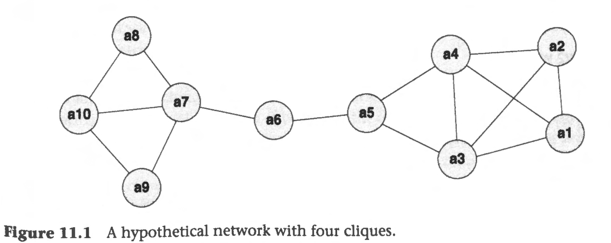

```{r echo=FALSE}
library(tidyverse)
#source("../functions.R")
```

```{css}
.btn-group{
  display:none;
}
```

[Back to index](../index.nb.html)

# Abstract / Key Points

Subgroup = Community = Cluster = Cohesive subgroup 

Social identity ---> actors within communities share norms and have common goals 

In-group favoritism, "us versus them" 

Super node: can be replaced to represent actors who share similar actions ---> reduce complexity and aid visualization  

`r colored("Formal definition of a subgroup is essential", "gold", bold = T)`

- Can't assume that the reader has an intuitive grasp of the concept involved and that it is not necessary to present an exact definition.

# 11.2 Cliques  

Def: A clique is a subset of actors in which every actor is adjacent to every other actor in the subset and it is impossible to add any more actors to the clique without violating this condition. 

- Formally, a clique is defined as a maximal complete subgraph (Luce and Perry, 1949).
  - 'Complete' means that every node in the clique is adjacent to every other. 'Maximal' means that we cannot increase its size and still have it be complete.
- Cliques can overlap so that individual actors can be in more than one clique

  

{a1, a2, a3, a4} form a clique

  - Other clique are {a3, a4, a5}, {a7, a9, a10}, and {a7, a8, a10}

Often there are many overlapping cliques, and it is difficult to deduce anything directly from the clique list

## 11.2.1 Analyzing clique overlaps 

Remove or reduce the overlap by performing some additional analyses on the cliques themselves 

`r colored("Actor-by-actor clique co-membership matrix", "gold", bold = T)` $V$, where $v_{ij}$ is the number of times $i$ is in a clique with $j$. The $i$ diagonal entry gives the number of cliques containing actor $i$. 

  - We note that the clique co-membership matrix is a proximity matrix in which larger values indicate a stronger link - that is, it is a similarity matrix.
  - This matrix can then be submitted to a hierarchical clustering procedure such as the average-linkage method. The result will be sets of non-overlapping nested clusters of actors. ---> Dendrogram  
  - The clustering is based upon the amount of activity of pairs of actors and not on the strength or overlap of the cliques ---> in a network with one large homogeneous group and another group consisting of a large number of overlapping cliques, the analysis will be biased towards the complex overlapping structure 
  - It completely eliminates one of the desirable features of communities, namely overlap.
    - Solution: construct a `r colored("clique-by-clique co-membership matrix", "gold", bold = T)` and use this to cluster the cliques as opposed to the actors 


## 11.3 Girvan-Newman algorithm

In large or complex data, a clique analysis can be difficult to interpret or even impossible, as it would not be computationally feasible.

An alternative approach is to define communities in terms of the output of a particular algorithm rather than starting from a definition

Girvan-Newman algorithm: Rather than finding groups directly, we can look for the structurally important edges whose removal fragments the network. These edges cannot be within the communities and so must be between them. 
  
  - This method will partition the data as opposed to finding possibly overlapping groups. The partition means that every actor is placed in one group only. 
  - Edge betweenness: count of the number of times an edge lies on a geodesic path between a pair of nodes
  - Step: 
    - 1. Set the maximum number k of communities required. 
    - 2 Calculate the edge betweenness of the network and find the edge (or select one of the edges if there is more than one) with the highest score.
    - 3 Delete this edge and count the number of components that now exist. 
    - 4 If the number of components reaches k then stop; otherwise go to step 2
  - Assessment of each partition ---> `r colored("modularity ($Q$)", "gold", bold = T)` 
    - Compares the number of internal links in the groups to how many you would expect to see if they were distributed in a random network with the same degrees.
    - Higher values mean that the algorithm has found more significant groupings. Negative values are possible, indicating that the groups are less cohesive than a purely random assignment
    - Formal def:
      - $n$ = nodes; $e$ = edges; adjacency matrix $X$; Given a partition of the nodes intro $c$ groups, we represent the group that contains actor $i$ by $c_i$. Let $d_i$ be the degree of actor $i$. 

\begin{align*}
\tag{1}
Q = \frac{1}{2e}\sum_{i=1}^{n}\sum_{j=1}^{n}(x_{ij} - \frac{d_id_j}{2e})\delta(c_i,c_j)
\end{align*}
, where $\delta({c_i, c_j}) = 1$ if $c_i = c_j$ and $0$ otherwise

# 11.4 Modularity optimization 

A different approach is to find a partition that optimizes modularity; that is, search through all possible partitions to find the one that has a maximum value for Q. ---> Unfeasible, too many possible partitions 

In some circumstances modularity optimization fails to find the obvious communities, particularly when they are small compared to the size of the network.

A second issue is that it is not clear what a good modularity score is. Graphs with no community structures still have positive modularity scores.

## 11.4.1 Fast greedy

Look for local instead of global optimization properties 

Start by placing every node in its own community. Then, for each community, we calculate the value $Q(y, z)$, which is the gain in modularity when community y is merged into a community z that it is adjacent to. Continue this until the matrix $Q$ has no positive values. 

## 11.4.2 Walktrap

Random walk with the walks set as 3,4,or 5 (4 is the default), such that it will not terminate within the same community 

## 11.4.3 The Louvain method 

The algorithm proceeds in two stages, a greedy stage followed by an aggregating stage. 

Aggregation: A new graph is then formed in the second aggregating stage in which the communities of the first stage are the nodes and the edges have values which are the sums of the weights of all the edges connecting each pair of communities. 

   

It is advisable to run the algorithm multiple times (with different order in which the nodes are examined in the first stage) to test the robustness of any partition

# 11.5 Label propagation 

This is a simple process that finds communities in nearly linear time

The most basic algorithm: 
  
  - Each node is given a label indicating which community it is in. 
  - Initially, each node is given a unique label. Every node is then visited in a random order and has its label updated. 
  - The new label is the most common label of the nodes it is adjacent to. If there is a tie, one of the most common labels is randomly selected. 
  - The process continues with a new random ordering until every node has a label that is the same as the maximum number of its neighbors.

# 11.6 Directed, disconected and valued data

With directed data, the maximum cohesion can only be achieved when every tie is reciprocated ---> symmetrize the data first to produce an undirected network of reciprocated ties.

Girvan-Newman method works well with directed data because edge betweenness applies to both undirected and directed networks.

Label propagation can both be extended to work on valued data provided the weights represent the strength of a tie.

For cliques, we want to dichotomize at different levels and compare the results

# 11.7 Large data

In principle, the clique method discussed at the beginning of the chapter is not suitable for large networks because the worst-case running time is $O(3^{n/3})$(3"13), which, for a network of 1000 nodes, is approximately $10^{159}$

The Louvain method can handle big data

# 11.8 Computational considerations 

Since larger networks tend to be less dense in general, the number of edges is not usually a major issue. Thus, a clique analysis on networks containing hundreds and even thousands of actors is feasible, provided there are not too many groups. 

If there is a problem in terms of computation, the analyst should consider increasing the minimum size of a group: this significantly decreases the number of groups, and sophisticated algorithms can use this information to reduce the number of edge

-----
[Back to index](../index.nb.html)


`r colored("", "gold", bold = T)`

  


  

