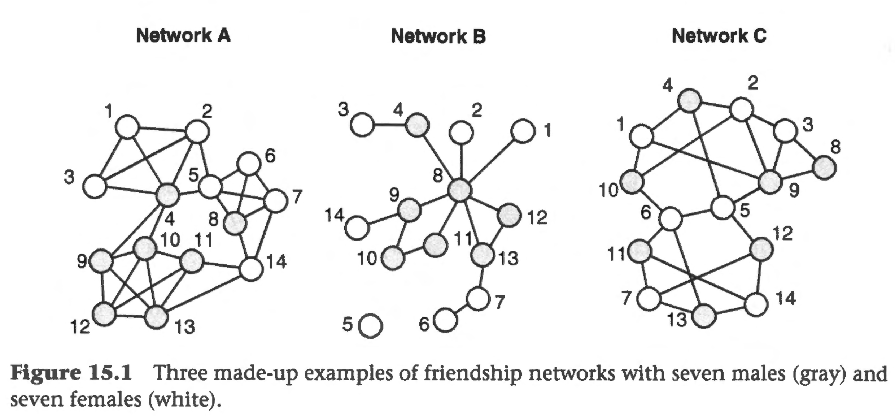

```{r echo=FALSE}
library(tidyverse)
source("../functions.R")
```

```{css}
.btn-group{
  display:none;
}
```

[Back to index](../index.nb.html)

# Abstract / Key Points

Analysis for the longitundinal data: 

  - Exponential random graph models (ERGMs, $p*$ models) ---> use the `ergm` package (part of the `statnet` package)
  - Stochastic actor-oriented models (SAOMs) ---> SIENA (i.e., Simulation Investigation for Empirical Network Analysis) ---> use the `RSiena` package

# 15.1 General introduction to ERGMs and the interpretation of parameters

One way to think about ERGMs is that they model an observed network as the long-term outcome of a set of 'social processes' acting simultaneously on the ties of a network.


Example: if we consider an undirected friendship network, we can think of a set of potential 'tendencies' or 'dispositions' that might have simultaneously given rise to the observed friendship network structure: `r colored("(These tendencies are also called 'social mechanisms', 'social processes', or 'social forces')")` 

  (1) an overall tendency among all dyads in the network to build or refrain from building a friendship tie, that is, a baseline tendency for a tie to be present among all pairs of nodes (e.g., because of a basic human need for attachment, weighed against the cost of having friendship ties); 
  (2) a tendency for ties not to be distributed evenly over nodes and instead concentrated in a few more popular nodes (perhaps because people seek to 'bask in the reflected glory' of popular others); 
  (3) a tendency for nodes to become friends with the friends of their friends, leading to triadic closure (e.g., because of a need to avoid cognitive dissonance); 
  (4) a disposition to build friendships with people who have specific characteristics, such as males (e.g., because of status differences related to gender); 
  (5) a tendency to befriend people with similar characteristics, such as the same gender (e.g., because of a positive emotional affinity to a person who is similar); and 
  (6) a tendency for friendship to emerge among people who frequently interact with each other (e.g., because of the opportunities generated by interacting).
  
Hence, the observed network structure is viewed as the result of a combination of different tendencies, such as the ones mentioned above, that shape the network by influencing the probabilities of certain ties forming.

## 15.1.1 Finding tendencies in a network



Each shows a different network structure that could emerge among the same 14 people (seven females and seven males). Intuitively, we would expect that different sets of social forces were at play in generating each of the structures.

We need to realize that when we consider one tendency, it is net of all other tendencies in the model. 

## 15.1.2 ERGM parameters capturing network dispositions

Following the logic set out in Section 15.1.1, each of these tendencies can be related to counts of specific network properties (also called network statistics or configurations) in the observed network, which indicates how specific tendencies will be captured in the ERGM, and hence provide the names for these specific parameters (see Table 15.1). 

Each of these parameters, which we represent by the Greek letter $\theta$, can range from negative infinity to positive infinity, with O in the middle (similar to the coefficients in a classic logistic regression) . 


## 15.1.3 Examples of ERGMs


This example illustrates how the observed network should be considered as the combined outcome of a set of tie-generating processes which jointly have led to a specific network structure. It also shows the importance in ERGMs of controlling for structural (and other relevant) tendencies when studying a specific effect. ---> ERGMs can help us disentangle the importance of different social mechanisms which might be alternative explanations for some outcome (Goodreau et al., 2009). 

We need to explicitly model any other effects that might be important

# 15.2 Obtaining {approximate) maximum likelihood estimates for an ERGM

The results obtained when running ERGMs will not always be correct (i.e., the model will not always succeed in converging towards the correct maximum likelihood estimate answers) 

\begin{align}

P[X = x_{obs}] = \frac{e^{\theta_1z_1(x_{obs}) + \theta_2z_2(x_{obs}) + \theta_3z_3(x_{obs})}}{\sum^{all}_{k = 1}[e^{\theta_1z_1(x_{k}) + \theta_2z_2(x_{k}) + \theta_3z_3(x_{k})}]}

\end{align}

  - In essence, the numerator is the (exponentiated) sum of the network statistics, weighted by the associated parameters. 
  - The denominator consists of a sum across all possible networks with the same number of nodes as the observed network.
  - In the formula, $x_k$ refers to one of these possible networks
  - Our objective is to find the values for the set of parameters ($\theta$) that will maximize the probability of observing the graph we did, that is, maximize the value of $P[X =x_{obs}]$

To obtain the ML estimates for the parameter values, a simulation-based algorithm is used to approximate the ML estimate. 

## 15.2.1 Generating networks with specific parameter value

The simulation process used for ERGMs is more complex because it requires multiple parameters as input, and therefore a *Markov chain* approach is needed instead (Snijders, 2002)

This sequential process in which a tie decision is solely based on the current structure of the network, is a Markov process.

An important aspect of this Markov process is that over time it will (normally) start generating networks that follow these rules, and because dyads are sequentially updated based on the current network (and not on the starting network), the original starting network will not matter in the long run.

To get a representative sample network, we therefore need to take enough steps that the current network is not 'impacted' by the starting network (this is called the *'burn-in'* period).

Moreover, since in each step a network will only be different by at most one tie, *we also do not draw subsequent networks* but instead sample by taking a network and waiting a number of steps before taking the next network. 

If we wait long enough between draws (the interval), the networks will have sufficiently changed (but still follow the rules of the parameters) that the subsequent draws are not too highly correlated, ensuring a random sample of networks resulting from the set of parameters is obtained 

## 15.2.2 Estimation procedure and assessing convergence

If we succeed in generating networks that are similar to our observed network, then this means that the parameter values are the (unique) approximate values for the ML estimates, which are the most likely combination of values that might have led to our observed network.

Getting convergence can be challenging and partly depends on making sure the appropriate parameters are selected, a topic we turn to in the next section.

## 15.3 Parameter selection and goodness of fit

An important decision to make is which parameters to include in a model. For an undirected (one-mode) network, one should generally include at least three structural parameters: 

  - one related to the density (e.g., the edges effect); 
  - one related to the degree distribution (generally some star-type structure or other set of parameters related to the degree); 
  - and an effect relating to triadic closure.

There are two main reasons we choose the parameters that we do in a model. 
  
  - One is that we want to achieve convergence. 
  - Another is that we want to control for alternative explanations, which are embodied in specific parameters.


## 15.3.1 Parameter selection and convergence

## 15.3.2 Improving an ERGM: goodness of fit

This means that when we generate simulated networks based on the model, they should be close to the observed network not only with respect to those parameters included in the model (i.e., meaning we obtained convergence), but also with respect to other statistics not explicitly accounted for in the model. 

That is, a large number of graphs are simulated using the parameter estimate values of the fitted model (*after convergence* - i.e., with the ML estimates for the parameters in the model). For these simulated graphs, we can now calculate other configurational aspects (i.e., other than those directly related to the parameters of the model), such as the degree assortativity (i.e., the level to which high-degree nodes prefer to link with other high-degree nodes, and low-degree nodes tend to link with other low-degree nodes - see Table 15.4) and compare these average numbers to their corresponding values in the observed data. 

# 15.4 Directed networks

With directed networks, we generally include a minimum set of effects that include the density of the network, the level of reciprocity, effects capturing the indegree and outdegree distribution, and triadic configurations such as transitivity and cyclicality.


-----


[Back to index](../index.nb.html)

`r colored("")`


  

