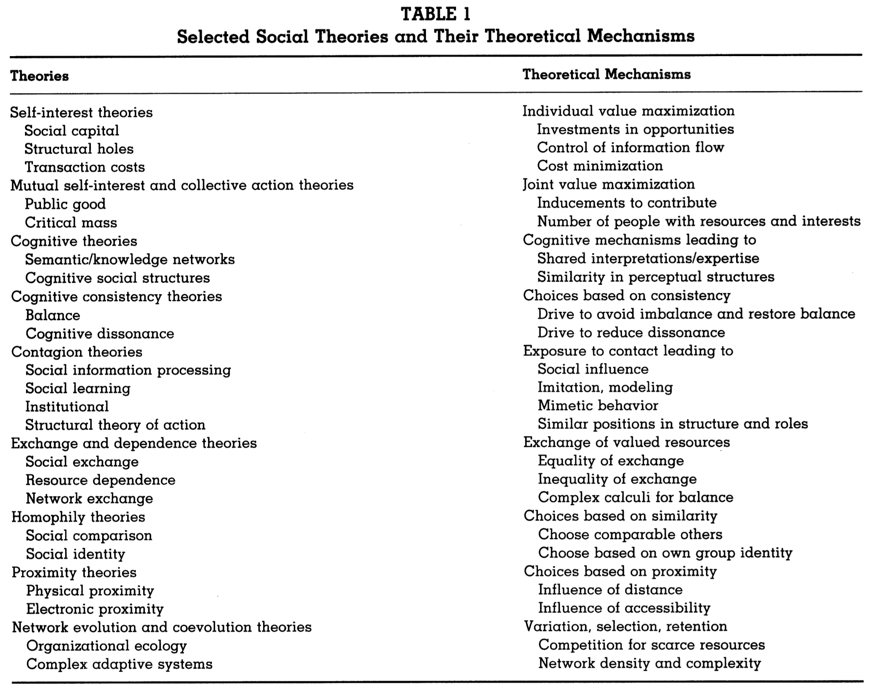

```{r echo=FALSE}
library(tidyverse)
source("../functions.R")
```

```{css}
.btn-group{
  display:none;
}
```

[Back to index](../index.nb.html)

# Abstract / Key Points

Network forms of organization are neither vertically organized hierarchies like their bureaucratic predecessors nor unorganized marketplaces governed by supply and demand. ---> Rather, network organizational forms use flexible, dynamic communication linkages to connect multiple organizations and people into new entities that can create products or services. 

These new forms are agile and are constantly adapting as new links are added and dysfunctional ones dropped. Thus, the evolving, *emerging network form is the organization*. 

# Reconceptualiziing organizations as network 

The premise that organizations are networks of recurring relationships applies to organizations at any level of analysis --- small and large groups, subunits of organizations, entire organizations, regions, industries, national economies, and even the organization of the world system"

# Theiretical and methodological challenges 

The focus has shifted toward modeling the dynamics through which flexible organizational forms emerge.

Monge and Contractor (2001) identify nine families of theoretical mechanisms that have been used to explain the creation, maintenance, dissolution, and reconstitution of organizational networks. 
`r side_note("See the Week 1's readong (the chapter) for more info")`
- 1. Theories of self-interest 
- 2. Theories of mutual interest and collective action
- 3. Cognitive theories 
- 4. Cognitive consistency theories 
- 5. Contagion theories 
- 6. Exchange and dependency theories 
- 7. Homophily theories 
- 8. Proximity theories 
- 9. Theories of network evolution and co-evolution 



Four theoretical implications emerge from this review: 

1. A wide array of social theories are amenable to network formulations. 
2. In some cases, different theories, using similar theoretical mechanisms, offer similar explanations but at different levels of analysis. 
3. Different theoretical mechanisms sometimes offer complementary as well as contradictory explanations at the same level of analysis. 
4. There is considerable variation in the depth of conceptual development and empirical research across the different theories and theoretical mechanisms. 

Methodologically, three moves have emerged 

1. from exploratory and descriptive techniques to confirmatory and inferential techniques
2. from single-level, single-theoretical network analyses to multitheoretical, multilevel analyses
3. from purely network explanations to hybrid models that also include attributes of the actors

A need for a multitheoretical, multilevel model to test hypotheses that might influence the structural tendencies of a network ---> allowing for the specficiation of hypotheses grounded in multiple theories and at multiple levels. 

# Multitheoretical, multilevel models 

Addressing the interdependency among observations 

`r colored("Graph realization")`: Here we assume that the graph under consideration is random; hence, the observed network (i.e., the empirical data) is only one graph realization among (usually) many theoretical possibilities. ---> The set of possible configurations of the network is referred to as the *sample space* (Wasserman & Faust, 1994).

Hypotheses about network properties in effect pick out different types of graphs as more probable within the sample space.

  - There is nothing unusual about this: it is exactly the same logic for statistical inference regarding individuals, the only difference being that we have a distribution of graphs, rather than a distribution of individual scores
  - Question of interest: whether the observed graph realization exhibits certain hypothesized structural tendencies. The extent to which these tendencies are exhibited is captured by *parameters*, which are estimated by quantifying the effects of the hypothesized structural property on the probability of ties being present or absent in the network.
    - These parameters describe a *distribution of graphs with the hypothesized properties*, in which `r colored("the observed graph is the most typical representative")`. If a parameter is statistically significant, then the hypothesized property is statistically important for understanding the structural tendencies of the observed network.
    - i.e., the hypothesis is that graph realizations with the hypothesized property have larger probabilities of being observed. ---> In other words, the probability of ties being present or absent in the graph reflects the hypothesized relational property 
    - The models allow for conclusions both about global network properties and about the probability of network ties, given properties of their surrounding network (a local property).

Unlike their use in causal modeling, endogenous variables here are not predicted by exogenous variables. Rather, both explain structural tendencies of the network.

  - Structural tendencies based on configurations of the focal relation itself --- in this case, the communication relation --- are defined as endogenous variables. 
  - In contrast, structural tendencies that incorporate factors other than the focal relation itself --- for instance, the attributes of actors in the network --- are defined as exogenous variables. 
  - Hence, all variables "outside" the focal communication relation are defined as exogenous variables
  <hr> 
  - `r colored("Endogenous variables")` (rows 1 through 4 in Table 2) refer to various relational properties of the focal network itself that influence the probability ties will be present or absent in the same network.
    - capture the extent to which relational properties of the network influence its self-organization. 
    - they suggest that the configuration of ties in the observed realization reflects an underlying structural tendency that is consistent with the hypothesized network property
  -  `r colored("Exogenous variables")` (rows 5 through 10 in Table 2) refer to various properties outside the focal network that influence the probability ties will be present or absent in the focal network.
    - include the attributes of the actors in the network and additional network relations among the actors, as well as the same network relation at previous points in time


## Endogenous Influences on Network Structural Tendencies

### Actor level 

(Row 1 in Table 2) these actor-level properties could include network metrics, such as an ac tor's centrality, prestige, or structural autonomy


Testing hypothesis from the structural hole theory ---> The hypothesis that actors seeks to enhance their structural autonomy by forming ties with two or more unconnected other would be supported if the probability of ties being present or absent in the network reflected actors' tendencies to exhibit structural autonomy

### Dyadic level 

 (Row 2 in Ta ble 2), these dyadic-level properties could include mutuality and reciprocation.

Theories of social exchange, network exchange, and resource dependence suggest that actors forge ties using a calculus of exchange of material or information resource. 
  - This hypothesis would be supported if the probability of ties being present or absent in the network reflected actors' tendencies to exhibit mutuality or reciprocity.


  - In Figure 2, social exchange theory would suggest a positive tendency for a tie from actor F to actor A, since it would reciprocate the tie from actor A to actor F. 
  - However, social exchange theory would posit a negative tendency for a tie from actor D to actor C, since it would not reciprocate a tie from actor C to actor D.

### Triadic level 

(Row 3 in Table 2), these triadic-level properties include transitivity or cyclicality. 

Transitivity:  

  - If the link is sentiment, theories of cognitive balance (Heider, 1958; Holland & Lein hardt, 1975, 1981) suggest a tendency toward consistency in relations. (Colloquially, a friend's friend should be one's own friend, and one should like one's friend's friends)
  - If the network denotes formal relations, such as exercise of authority, transitivity reflects a hierarchical tendency --- one's boss's boss is also one's boss
  - hypotheses about transitive behavior would be supported if there were greater probabilities for graph real izations in which triads of actors in the network exhibited a high degree of transitivity

Cyclicality: 

  - If the link is resource,  then cyclicality can be thought of as illustrating the theory of generalized exchange ---> Actor A does a favor for B, and B, rather than return the favor directly to A, does a favor for C, who, in turn, does a favor for A, returning A's favor to B indirectly
  -  Hypotheses about cyclical behavior would be supported if there were greater probabilities for graph realizations in which triads of actors in the network exhibited a high degree of cyclicality.


### Global level 

(Row 4 in Table 2), these global properties include the network's degree of centralization. 

Theories of collective action (Coleman, 1973, 1986; Marwell & Oliver, 1993) and public goods theories (Fulk, Flanagin, Kaiman, Monge, & Ryan, 1996; Monge et al., 1998) suggest that actors in a network are more likely to obtain a collective good if the network is centralized (Marwell, Oliver, & Prahl, 1988). 

This hypothesis would be supported if the probability of ties being present or absent in the network reflected the network's tendencies to exhibit a high degree of centralization.


## Exogenous Influences on Network Structural Tendencies

Rows 5 through 8 consider the structural tendency for differential network tie formation specifically among actors who also share common attributes, such as organizational affiliation.

### Actor level 

These actor level properties include such attributes as age, gender, membership in an organization, and the type of organization. 

  - Tories of homophily suggest that individuals have ties to others with whom they share similar attributes.
  - These hypotheses would be supported if the probabilities of ties being present or absent in the network reflected actors' tendencies to choose others with similar attributes.


### Dyadic level 

These dyadic-level properties include mutuality and reciprocation (defined previously in the discussion of row 2 in Table 2). 

In an extension of the theories of social exchange and resource de pendence, the argument proposed here is that there is a greater tendency for exchange ties (i.e., mutual or reciprocated ties) to occur among pairs of actors who share similar attributes. 

  - These hypotheses would be supported if the probability of ties being present or absent in the network reflected actors' tendencies to reciprocate ties with other actors sharing similar attributes.


### Triadic level 

These triadic-level properties include transitivity and cyclically (defined previously in the discussion of row 3 in Table 2).

In an extension of the theories of cognitive balance and generalized exchange, the argument proposed here is that there is a greater tendency for transitive and cyclical ties, respectively, among actors who share similar attributes. 

These hypotheses would be supported if the probability of ties being present or absent in the network reflected actors' tendencies to engage in transitive or cyclical relations with other actors sharing similar attributes.


### Global level 

These global properties include network centralization (defined previously in the discus sion of row 4 in Table 2). 

In an extension of the theories of collective action and public goods, the argument proposed here is that there is a greater tendency for network centralization to occur among subgroups of actors who share similar attributes. 

These hypotheses would be supported if the probability of ties being present or absent in the network reflected actors' tendencies to forge more centralized subgroup networks with other actors sharing similar attributes.


In Figure 8, theories of collective action would suggest a greater tendency for a tie from actor A to fellow government actor C, since it would enhance the centralization within government actors, but a lower tendency for a tie from actor A to industry actor E, since it would enhance centralization between government and industry actors 

### Other relations in the network 

(Row 9 in Table 2)

E.g., The convergence theory of communication (Richards & Seary, 1997; Rogers & Kincaid, 1981), cognitive theories (Carley, 1986; Carley & Krackhardt, 1996; Krackhardt, 1987a; Stohl, 1993), and transactive memory theory (Hollingshead, 1998; Mo reland, 1999; Wegner, 1995) offer arguments that can be used to map the influence of actors' cognitive or semantic networks (Monge & Eisen berg, 1987) onto their communication networks.

These theories argue that the presence or absence of a cognitive or semantic tie between these actors is associated with the presence or absence of a communication tie between the actors.

  - these hypotheses would be supported if the probability of ties being present or absent in the focal network reflected the presence or absence of ties in the exogenous networks.

Figure 9 indicates that there is a greater tendency for a friendship tie from actor A to actor B, because they communicate with one another, and a lower tendency for a friendship tie from actor C to actor D, because they do not communicate with one another.


### Relations at previous points in time 

In their most primitive form, theories of evolution (McKelvey, 1997) would argue that inertia alone would predict that a tie between actors at a previous point in time would increase the tendency of the tie to be maintained at a subsequent point in time. 


# Empirical example: The CRADA network 


-----
[Back to index](../index.nb.html)


`r colored("")`


  

