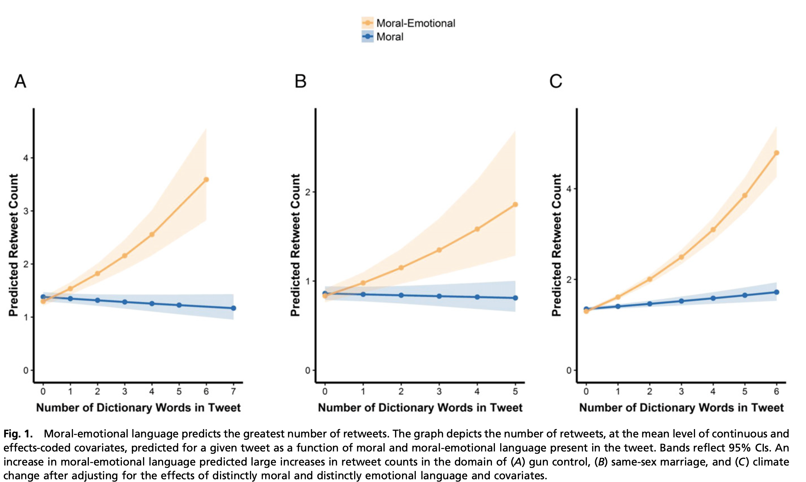

```{r echo=FALSE}
library(tidyverse)
source("~/Desktop/Academy/Readings/functions.R")
```

```{css}
.btn-group{
  display:none;
}
```

[Back to index](../index.nb.html)

# Abstract / Key Points

Q: processes by which some moral ideas spread more rapidly or broadly than others. 

Moral contagion ---> the expression of moral emotion is key for the spread of moral and political ideas in online social networks 

Results: the presence of moral-emotional words in messages increased their diffusion by a factor of 20% for each additional word. 

Furthermore, we found that moral contagion was bounded by group membership; moral-emotional language increased diffusion more strongly within liberal and conservative networks, and less between them. 

# Intro 

Our moods, thoughts, and actions are shaped by the entire network of individuals with whom we share direct and indirect relationships (5). 

Emotions tend to be highly associated with moral judgments (3), amplify moral judgments (7), and may even serve to “moralize” actions that would otherwise be considered nonmoral (8). 

We hypothesized that the presence of moral emotions would increase the likelihood that a given message would go “viral.”

  - (i) Is moral contagion simply driven by basic emotional contagion, or does it require a mix of moral appraisal and emotional expression (20)? 
  - (ii) Is moral contagion driven by a “negativity bias,” as is the case with other psychological processes (21), or does it capture a more general process that applies to positive as well as negative emotions? 
  - (iii) Are there specific emotions that drive moral contagion (13)? 
  - (iv) Does moral contagion contribute to the diffusion of moral content within and between political group networks, or only within them (22)? 

# Methods and results 

Words are categorized using a dictionary-based approach 

Regression model and incident rate ratio 



Question (ii): results vary across topics 
  
  ---> Gun control: both predicted sharing 
  ---> Same-sex marriage: positive moral emotional language is a positive predictor, whereas negative moral emotional language is a negative predictor 
  ---> Climate chante, only negaitve moral emotional language predicted sharing 

Question (iii)

  - Anger, disgust (high-arousal negative) and sadness (low-arousal negative)
  - The effect of anger is context dependent, whereas sadness is associated with less sharing 

Question (iv)

User's political ideology is *estimated* based on their followers network 

MLM with interaction of the membership and moral emotional language 


Effects present in the gun control (Panel A) and climate change (Panel C) 

These findings indicate there may be an in-group advantage (22, 33) for moral contagion; that is, moral-emotional language may spread more widely within in-group networks than out-group networks (for a visualization of the retweet network for messages containing moral and emotional language, see Fig. 3). 

# Discussion 

Highlight the role of specific emotions 

`r side_note("See the nature papers by the Facebook team (Guess et al., 2023")`To the extent that the spread of online messages infused with moral-emotional contents is circumscribed by group boundaries, communications about morality are more likely to resemble echo chambers and may exacerbate ideological polarization. Our results also speak to recent controversies over the role of social media in creating a biased informational environment (36). For example, the use of negative messages about rival political candidates containing strongly worded moralemotional terms may spread more easily within (but not neces- sarily between) liberal or conservative social networks.

-----
[Back to index](../index.nb.html)


`r colored("")`


  

