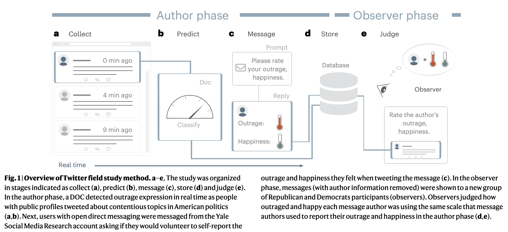

```{r echo=FALSE}
library(tidyverse)
source("~/Desktop/Academy/Readings/functions.R")
```

```{css}
.btn-group{
  display:none;
}
```

[Back to index](../index.nb.html)

# Abstract / Key Points

Social media users overperceive levels of moral outrage felt by individuals and groups, inflating beliefs about intergroup hostility

Observers systematically overperceive moral outrage in authors, inferring more intense moral outrage experiences from messages than the authors of those messages actually reported. 

Overperception of individuals’ moral outrage amplifies perceptions of collective moral outrage and beliefs about norms of moral outrage expression, affective polarization and ideological extremity.

# Intro 

Why the misperception (overperception, specifically): 

  - Observers' perceptual processes: 
    - Limited cures and lack of real-time social feedback ---> ambiguous communication intent ---> false alarm is less costly than misses 
    - Have priors that the media is full of outrage
  - Authors' motivations to express outrage: ---> `r colored("express outrage in ways that are not tethered to their actual experiences of outrage ")` 
    - Social and identity motivation ---> signal group affiliation and trustworthiness ---> reputational rewards 
    - Rewards from the platform 

Group-level implication 

  - Those high-level of perceived outrage affect how people judge how the group is feeling, perhaps more outraged than the group actually is
    - `r colored("Overperceive the extremety of group emotions")` ---> `r colored("Crowd-emotion-amplication effect")` `r side_note("See Ong et al., 2018 ---> emotion self-enhancement bias")`
    - See also Goldenberg, A., Garcia, D., Halperin, E., Zaki, J., Kong, D., Golarai, G., & Gross, J. J. (2020). Beyond emotional similarity: The role of situation-specific motives. Journal of Experimental Psychology: General, 149(1), 138–159. https://doi.org/10.1037/xge0000625
  - When we overperceive how outraged others in our network are, we may also increase our belief that it is socially appropriate to express outrage in the network (norms of outrage expression), that our network dislikes the political outgroup (affective polarization) and that our network is politically extreme (ideological extremity). 


# Method 

Procedure



Overperception is tested with a MLM framework. 

  - Random effects are tweets and observer. 
  - source (i.e., author vs. observer) as a dummy-coded predictor 


-----
[Back to index](../index.nb.html)


`r colored("")`


  

