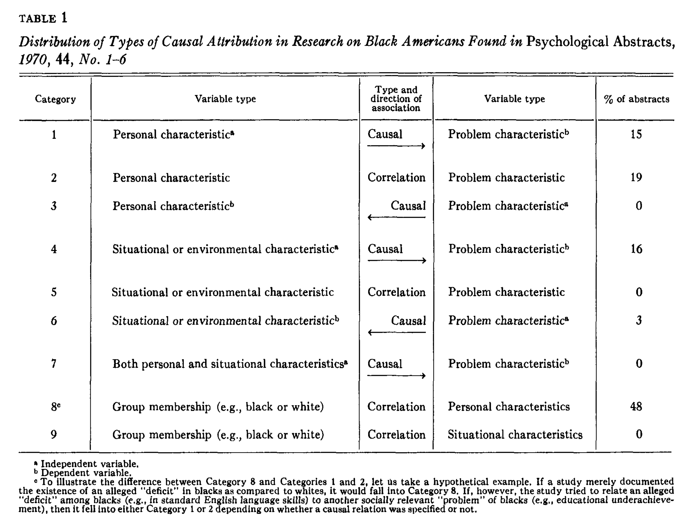

```{r echo=FALSE, message=FALSE}
library(tidyverse)
source("~/Desktop/Academy/Readings/functions.R")
```

```{css echo=FALSE}
.btn-group{
  display:none;
}
```

[Back to index](../index.nb.html)

# Abstract / Key Points

- Applied research is on the rise (e.g., received more funding)

- This article discusses "applied research" with respect to national level social policies 

- Social problems in social science are often defined in a "person-centered" or "person-blame" approach that reinforces the status quo
  - `r colored("Our concern is with 
    (a) psychologically oriented research that focuses on 'person-centered' characteristics (those that lie within the individual), while ignoring situationally relevant factors (those external to the individual); and 
    (b) the tendency to attribute causal significance to person-centered variables found in statistical association with the social problem in question.")`

- The way that social problems are defined and studied can have a significant impact on the solutions that are proposed. Psychologists often uncritically accept the problems raised by those in power, who tend to deem deviations as abnormal and need fixing
  - The "social problems" need to be questioned: `r colored("To question established definitions is to challenge important institutions and belief systems that have their origins in those definitions.")`
  - Person-blame definitions may deflect attention and energies away from important situational determinants, often to the detriment of those supposedly being helped. The significance of this discussion resides in the fact that regardless of the type of problem and the intent of the investigator, `r colored("*the findings of psychologically oriented research lend themselves more easily to person-blame than to system-blame interpretations of the problem*")` --> In consequence, such research frequently plays an integral role in a chain of events that results in blaming people in difficult situations for their own predicament.
  - The participants from such an approach are selected because they are `r colored("vulnerable to the social scientist for research scientists")` --> more identifiable and accessible as a research population. 
    - Think about why we do not study rich, but poor, people when studying poverty
    - `r colored("there is a lack of data on landlords, bankers, and city officials who permit building code violations that would justify using them as targets for person-change treatment efforts.", "coral")`
  - The involvement of social scientists carries with it the implication that *socially undesirable behavior is the problem, rather than the inevitable by-product of political trade-offs and technological fixes*, thereby distracting attention from the real causes. --> research thus becomes `r colored("a means to other goals")`
  - People in power can be "helpful" as long as the way in which the target group is helped serves the interests of those offering assistance. 
    - The system-antagonistic poor become "deserving" of help only if they accept personal blame for their social and economic position in society; that is, because of personal impediments, they would be unable to effectuate personal and social goals even under the most ideal conditions. Otherwise, they remain "undeserving" of help and are ignored or controlled through the exercise of negative sanctions.

- Problem from a psychological training: Train a person in psychological theory and research, and suddenly a world disastrously out of tune with human needs is explained as a state of mind.

- Having a focus on environmental causation doesn't necessarily mean helping solving the problem from an environmental perspective 
  -The new ideology attributes defect and inadequacy to the malignant nature of poverty, injustice, slum life, and racial difficulties. The stigma that marks the victim and accounts for his victimization is an acquired stigma, a stigma of social, rather than genetic, origin. But the stigma, the defect, the fatal difference—though derived in the past from environmental forces—is still located within the victim, inside his skin.  `r colored("*With such an elegant formulation, the humanitarian can have it both ways. He can, all at the same time, concentrate his charitable interest in the defects of the victim, condemn the vague social and environmental stresses that produced the defect (some time ago), and ignore the continuing effect of victimizing social forces (right now). It is a brilliant ideology for justifying a perverse form of social action designed to change, not society, as one might expect, but rather society's victim*", "coral")`

- What is good for science and the individual scientist may not be good for those on whom the research is based 
  - `r colored("The repercussions of our research findings—the views of the world they inspire or perpetuate—may seem like epiphenomena to us, but they are often painfully real for those affected by them.")`




-----

[Back to index](../index.nb.html)

`r colored("")`


