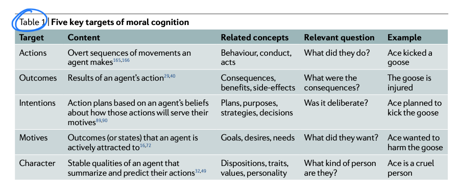

```{r echo=FALSE, message=FALSE}
library(tidyverse)
source("~/Desktop/Academy/Readings/functions.R")
```

```{css echo=FALSE}
.btn-group{
  display:none;
}
```

[Back to index](../index.nb.html)

# Abstract / Key Points


group membership can be an important factor in drawing more morally negative motive inferences of others, independent of actions, and these negative motive inferences could have a key role in reinforcing intergroup hostility and conflict




-----
[Back to index](../index.nb.html)

`r colored("")`


