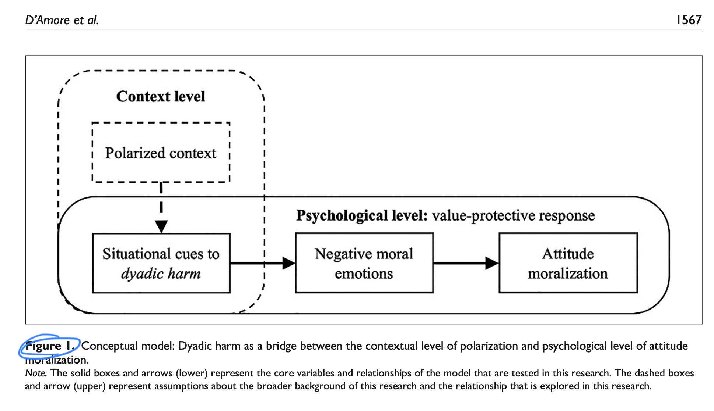

```{r echo=FALSE, message=FALSE}
library(tidyverse)
source("~/Desktop/Academy/Readings/functions.R")
```

```{css echo=FALSE}
.btn-group{
  display:none;
}
```

[Back to index](../index.nb.html)

# Abstract / Key Points

Def: `r colored("attitude moralization")`: the process through which an attitude becomes grounded in one's core values 
  - Measured with 4 items
    - e.g., "To what extent is your position on XXX issue a reflection of your core moral beliefs and convictions?"

We assume that polarization at the societal level can set the stage for either constructive change or moral conflict to emerge. We define polarization as the existence of conflict- ing attitudes in society and the structural formation of groups around these attitudes in conflict




-----
[Back to index](../index.nb.html)

`r colored("")`


