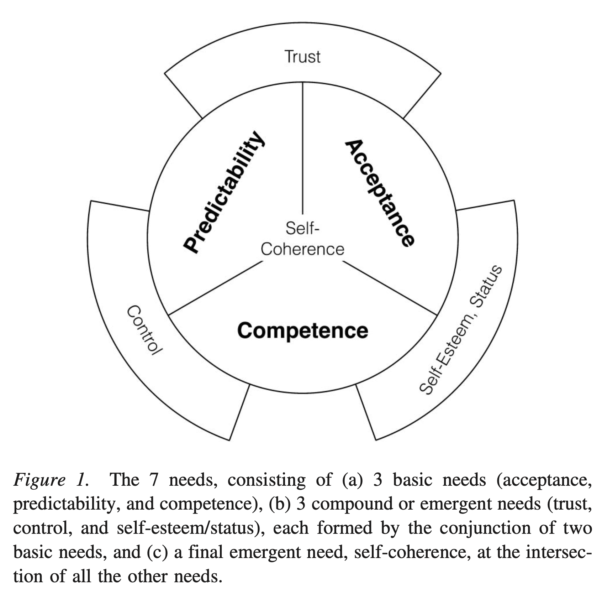

```{r echo=FALSE}
library(tidyverse)
source("~/Desktop/Academy/Readings/functions.R")
```

```{css}
.btn-group{
  display:none;
}
```

[Back to index](../index.nb.html)

# Abstract / Key Points

They ["boundaries between areas of psychology] have always seemed somewhat arbitrary or artificial, more a function of the tastes or methods that happen to dominate at a given time and less a function of fundamental differences in the principles and mechanisms that are operative across areas. 

Motivation is at the core of human psychology and that understanding motivation is the key to understanding personality and development 

- Motivation derives from basic human needs, including psychological needs 
- These needs give rise to goals designed to meet the needs 
- As people pursue need-fulfilling goals, they develop mental representations 
- These representations (consisting of beliefs, representations of emotions, and representations of action tendencies) guide future goals 
- In doing so, they foster characteristics, recurrent patterns of acts and experiences ("traits") --- indeed, traits can be seen as styles of pursuing need-fulfilling goals 
- These underlying representations and styles of goal pursuit are at the core of personality and personality development
- Understanding these representations of styles of goal pursuit gives us leverage for promoting growth and change 

# What are the basic psychologyical needs?

- A need needs to meet 
  - (a) that there is chronic, high, and universal value attached to the goals that serve it and 
  - (b) that successfully attaining goals related to that need is important for optimal well-being in the present and optimal psychological development in the future
- Basic need ---> Not be derivative of other motives 
  - Problem with studies on adults: by adulthood it is difficult to know which needs are basic and which are simply very important needs that have been built from basic needs
  - `r colored("Irreducibility to other needs, universal high value from very early in life, and importance for well-being and optimal development from very early in life.")` 
- Evidence from developmental psychology:
  - (a) that infants from very early on are particularly attuned to information that pertains to a given need, 
  - (b) that very young infants typically pursue goals related to those needs, and 
  - (c) that infants or young children fail to thrive when they do not have enough opportunities to fulfill goals related to those needs.
<hr> 
- `r colored("Three basic needs: ", "coral")` 
  - Acceptance (the term acceptance is used in place of belonging on the basis of developmental psychology; "although I believe that, after early infancy, acceptance comes to encompass belonging")
    - Also called need for positive social engagement
  - Predictability 
  - Competence 
- `r colored("Four needs that are formed from combinations of the basic ones: ", "coral")` 
  - Trust
  - Control 
  - Self-esteem/status 
  - Self-coherence
    - within self-coherence, I identify two subneeds (not depicted in Figure 1), 
      - identity and 
      - meaning, 
      - both of which are proposed to play key roles in anchoring the self and both of which have received wide attention in psychology in recent years.

- The boundaries between needs can be blurry at the edges 



SDT: Their need for autonomy, however, is viewed here as a key facet of the later-emerging need for control, that is, as a need to have control over the expression of one’s thoughts and feelings, and over one’s actions.

# The Three Basic Needs

Basic needs are there from birth or shortly thereafter and, importantly, that infants come prepared to pursue them. 

- Infants have built-in attentional mechanisms, built-in inferential and representational abilities, and built-in behavioral capacities that orient them toward need-relevant information and that allow them to pursue goals and learn from their experiences.

  - Infants must know how their world works (prediction) and  
  - they must learn how to act on the world (competence). This learning will lead to effective functioning over time. 
  - But there is a long period during which infants, while surprisingly smart, are largely incompetent when it comes to many behaviors necessary for their survival and well-being, such as coordinated goal-oriented actions and self-regulation. 
  - Other people must help them perform these functions. Thus, part of the world—other people—is separated from the rest of the world as a special case. Infants must know whether people will be responsive to them when they are needy or in distress, and how they can best make this happen (acceptance).

## Need for Acceptance

- The most basic form of social needs
- The term expresses children’s early need to participate in supportive relationships. ---> there is abundant evidence that from the start infants are attuned to social cues, recognize positive social interactions, and come equipped to pursue acceptance-related goals.
- Examples of "accepting" social interactions: being reciprocal or synchronous

## Need for Optimal Predictability

- Current theory and research in cognitive science and neuroscience is suggesting that the brain may be built for “predictive coding” and that its basic modus operandi is to generate, apply, and revise predictive models (see Clark, 2015).
- The need for optimal predictability is the desire to know the relationships among events and among things in your world: what follows what, what belongs with what, or what causes what. 
  - “What’s going on here and how do I make sense of it?” cf. Wilson 2022
-  Infants are well equipped to do this. In line with our criteria for a basic need, evidence abounds that young infants are particularly attuned to prediction-relevant information, ready to learn from it, and equipped to pursue prediction-related goals from early on.
- They extract statistical patterns from stimuli in their environment, even when there is no external reward or “motivating” stimulus delivered to them (see Aslin & Newport, 2012). 
  -  Attuned to probability and prefer causal relationships 
- Researchers have made the important distinction between the unpredictability and the harshness of the child’s early environment and have found separate and pronounced effects for unpredictability, including enhanced stress and aggression and poorer self-regulation (Baram et al., 2012; Simpson, Griskevicius, Kuo, Sung, & Collins, 2012; see Frankenhuis, Gergely, & Watson, 2013). 
- Animals generally prefer shock that is preceded by a highly predictable signal (Badia, Harsh, & Abbott, 1979), even if there is no way of escaping it.

## Need for Competence

- Competence is about building skills for acting in or on the world.

- Seek and practice new skills (e.g., Vygotsky’s (1978) zone of proximal development and Piaget’s (1975/1985) assimilation and accommodation)

- Infants are highly attuned to competence-building stimuli and to signals from competence-enhancing people.
  - Infants show the same neural response to a direct gaze as adults do when they (adults) are receiving communicative signals (Csibra & Gergely, 2009). 
  - Competence-building activities are avidly pursued and intrinsically rewarding from the start.

# The Four Compound Needs

These compound needs require more complex schemas or metacognitive skills, including 

  - (a) more fully formed mental models that integrate basic needs (as “trust” integrates acceptance and pre- dictability), 
  - (b) greater self-awareness (as in the need for con- trol), and/or 
  - (c) the ability to compare oneself to a standard (as in “self-esteem/status”).

The compound needs, simply because they emerge from a conjunction of earlier needs, are not necessarily less important.

The distinction between basic and compound needs is not simply a technicality. It remains important to understand how and when particular needs come into play if we are to understand what opportunities and vulnerabilities arise at different points in development. This will allow us to further understand when the presence or absence of particular experi- ences (e.g., of trust, of personal control) might be critical.

## Need for Trust (the Conjunction of Acceptance + Predictability)

- Young infants recognize acceptance and track predictability, but they do not seem to integrate them into a higher-order or gener- alized schema: trust.
- In the current theory, trust will result when a child’s need for acceptance and predictability are met, and voluminous literature attests to the beneficial effects of warm, predictably responsive caretakers and the deleterious effects of their absence

## Need for Control (the Conjunction of Predictability + Competence)

- The need for control is central to many theories, and comes to include agency, autonomy, and self-control.
- I suggest that the need for control emerges when children understand the order and predictability of their worlds and become aware of themselves as agents who can be players in that world— who can use their competence to take charge of situations and to make or change the rules and not just follow them 
- A meta-analysis of studies on the origins of childhood anxiety found that, of all the aspects of parenting style that were studied, parental overcontrol (low autonomy granting) was the strongest predictor of anxiety disorders (McLeod, Wood, & Weisz, 2007). It was a stronger predictor of childhood anxiety than was parental rejection
- Control and autonomy can *take very different forms in different cultures* and what might look to us like deprivation of control in other cultures may simply be the channeling of control into more cul- turally appropriate forms 

## Need for Self-Esteem/Status (the Conjunction of Acceptance + Competence)

- I view the need for self-esteem or status as a compound need, originating from a combination of the need for acceptance and the need for competence (although it may later rest on other things, like fidelity to one’s values).
- Because self-esteem and status arise from one’s self-evaluation (either of one’s merits or one’s standing relative to others), I propose that two developments are necessary for the need for self-esteem/status to emerge: *self-awareness* and *standards.*
- In the current model, because both acceptance and competence are components of self-esteem, there is much room for cultural variation in the nature and sources of self-esteem. That is, people in all cultures will strive to succeed and evaluate them- selves within their social system—but given different bases for acceptance and given the valuing of different kinds of competence, self-esteem may be defined, experienced, and sought in different ways.

## Need for Self-Coherence

- The need for self-coherence represents the need to feel that you are psychologically intact and rooted. Colloquially, we say (or at least we used to say back in the day) we feel “together,” as opposed to “unglued” or “falling apart”. 
- Self-coherence is the “hub” of all the needs ---> outcomes from all need-related goals can feed into feelings of self-coherence, and that by monitoring self-coherence we keep tabs on the well-being of the self 
- I propose that the need for self-coherence arises once the child has learned enough about its world to establish clear expectations for how the world should work: Violations of those expectations (e.g., violations of optimal predictability) may then be unsettling or uprooting.

### Two components of self-coherenc 

- Goals relating to both *identity* and *meaning* may be vigorously pursued, and both may be seen as the glue that binds the self (or selves) and keeps it (them) together.
- “Identity” answers the question “Who am I?” and includes people’s social roles, social categories and areas of self-perceived competence—things that define and situate them (cf. Markus & Nurius, 1986). 
- "Meaning" answers the question “How does/should the world work (in ways that matter to me)?” and refers more to the rules and principles that govern, or should govern, events in the world
- Identities and meanings are powerful motivators because they can give shape and purpose to people’s lives. For this reason, we may seek heightened feelings of self-coherence. For example, taking up social or political causes may give people important identities (by making them respected members of valued social groups) and at the same time may offer them meaning (opportunities to bring the world into line with their ideals)

## What Do People Want?

- People seek to balance the attainment of goals across the different needs.
  - e.g., they may seek to maximize the pursuit of control without jeopardizing acceptance; 
  - they may seek to maximize the pursuit of predictability without jeopardizing the quest for increasing competence;
  - and they may seek to maximize their pursuit of acceptance without jeopardizing other identity-relevant goals.

# Needs Can Develop Throughout Life

- *Needs can undergo lifelong development, extending to larger spheres, to goals toward others, and even to abstract values.*
- Needs may start with self and then be applied to others or the world. Wanting and experiencing acceptance can foster the desire to give acceptance or be a caring person; learning and being taught can breed the desire to teach others; gaining a sense of predictability can foster the desire to provide predictability for others (be trustworthy). 
- Values can be abstracted needs. That is, over time, major values can form from abstractions and generalizations of core needs. For example, valuing justice may be thought of as valuing trustworthiness as a characteristic of the world, valuing equality may be thought of as valuing the universal acceptance of all people, and valuing tolerance may be thought of as valuing respect for others’ meanings and identities.

## Are These Needs Universal?

- The needs can vary in the relative emphasis they receive in different cultures, in the particular goals they spawn, and in the characteristic modes of goal pursuit.

# Motivation: Turning Needs into Goals

Def: the forces that drive and direct behavior

## Needs Differ From Goals

Following the def of motivation, 
  
  - needs serve the energizing (drive) function, whereas 
  - goals and goal processes then serve the directive function, guiding the individual step by step toward need fulfillment

Looking at goals in the context of the needs that fuel them remains essential. In this way, we can better understand the origins and bases of goals, as well as the personality patterns that arise from the pursuit of goals that are rooted in different needs.

# The Formation of Goal-Relevant Mental Representations: “BEATs”

## Representations Help Turn Latent Needs into Active Goals

The core of the theory: `r colored("As individuals experience needs and pursue need-fulfilling goals they form rep- resentations of their experiences. These representations serve as future guides to how to fulfill their needs in the world. As such, they help turn latent needs into active goals and thus are at the heart of motivation (and personality). In this section, I introduce these mental representations.")`

- BEATs (mental representations of experiences): 
  - Beliefs 
  - Emotions 
  - Action tendencies 

- I note that BEATs are related to past constructs, such as schemas (Markus, 1977) or cognitive-affective processing units (Mischel & Shoda, 1995), but BEATs are meant to sharpen our focus on the three building blocks of mental representations (particularly beliefs) that then serve as guides to future action.

- Examples: 
  - Attachment style
  - Mindset (implicit theory of intelligence)
  
- When a need is aroused, how do people decide what to do? As I describe later, `r colored("BEATs will be activated and these stored beliefs, emotions, and action tendencies will help people select among the array of possible goals.")`
  - They will help people interpret the situation, evaluate possible courses of action and anticipate how they will feel if the actions do or do not succeed. In this way, BEATs will guide goal selection and then goal pursuit in constant interplay with moment-to-moment on-the-ground experiences. 

### The components of BEATs.

- Beliefs 
  - The beliefs that are most relevant here are conceptions of the nature and workings of the world and the people and things in it
  - E.g., the world is good or bad, controllable or uncontrollable; people can accept or reject you; beliefs about one's ability 
  - The subset of beliefs we are concerned with here is the subset that has *motivational relevance*, that is, relevance to need-fulfilling goals and in particular goals related to psychological needs. This is in contrast to the countless other beliefs that typically have little bearing on our personal goals, e.g., Newton's second law of motion 
- Emotions 
  - During and after goal pursuit, people can experience a variety of emotions or sensations, which can be encoded and activated in the future when similar goals are under consideration (see Siegel, 2012).
  - Their activation creates anticipated feelings about future goals, which can play a strong role in which goals are selected.
- Action tendencies 
  - Representations of what you did (or observed others doing) when pursuing relevant goals in the past. 
  - e.g., Mental imagery of actions, (embodied) motor representations of actions, or declarative encoding of actions --->  provide candidate means for future goals.

### Focusing on the beliefs part of BEATs

- The importance of emotion and action is well appreciated in psychology, but a major tenet of the current theory is that *beliefs* are a key part of motivation, personality, and development, much more so than has generally been appreciated.
- They can be seen as guides to how one fulfills one’s needs in the world.
- I suggest that goodness and control beliefs grow out of the most basic needs

# Goals Are Accompanied by Online Acts and Experiences

Def: the thoughts, feelings, and behaviors that the person actually experiences and potentially displays during goal pursuit.

Figure 2a: Goal pursuit typically results in outcomes. All the online acts and experiences, including outcome-related experiences, can feed back into and potentially change the mental representations (BEATs) by updating old BEATs or creating new ones. Importantly, as a goal is pursued, there can be a continual interplay between the background BEATs and the online acts and experiences 


# From Motivation to Personality 

## Modern Personality Theories Often Neglect Needs or Need-Related Goals

- Roberts (2009): A valid criticism of many modern personality trait theorists and researchers is that they have not provided a deeper analysis of the constituent elements that make up traits, nor the mechanisms that elucidate how they cause things to occur.
- CAPS (cognitive-affective processing system) model suggests how underlying processing units that are chronically accessible in particular con- texts can create relatively stable patterns of behavior—and thus suggests how traits come to life.
- Like CAPS, the current theory seeks to embody the dynamics of behavior and is built on mental representations, but our representations (BEATs) are constructed around people’s needs and goals and then shape their future goals. Like the five-factor model, the current theory is interested in common patterns of thoughts, feelings and behaviors, ones shared by many people, but it seeks to understand their motivational origins and their ongoing motivational underpinnings and, by doing so, it seeks to offer a new perspective on development and change.

# What Is Personality and What Does a Motivation- Based Theory of Personality Require?

See Figure 2b: Note there're (a) characteristic and recurrent online acts and experiences underpinned by (b) characteristic and highly accessible BEATs.

# Understanding Traits in Terms of Needs, Goals, and Representations

Costa and McCrae (1988) themselves wondered about this: “Given the correspondences between needs and traits . . . , it might be instructive to apply these concepts to explain the dynamic operation of traits . . .” (Costa & McCrae, 1988, p. 264).

The Needs ---> BEATs ---> Online Acts framework portrays *traits as the end product of a series of motivational and social–cognitive processes* that provide clear entry points for influencing development and change

## Matching Needs and Traits

- Three of the traits—extraversion, agreeableness, and neuroticism can be seen to reside primarily in the social needs, that is, in the need for acceptance and/or the social aspects of self-esteem/ status. 
- The two other traits, openness to experience and conscientiousness, can be seen to reside primarily in the needs for competence and control/self-control. 

## Going From Needs and BEATs to Traits

- I suggest that we can see the traits as characteristic ways in which people try to fulfill these needs given their accessible BEATs.


-----
[Back to index](../index.nb.html)


`r colored("")`


  

