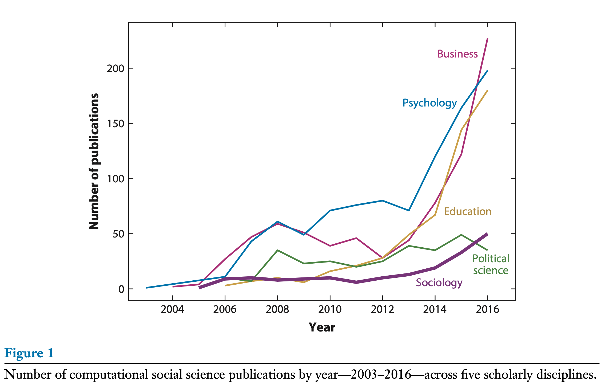

```{r echo=FALSE}
library(tidyverse)
source("../functions.R")
```

```{css}
.btn-group{
  display:none;
}
```

[Back to index](../index.nb.html)

# Abstract / Key Points

We review the evolution of this field within sociol- ogy via bibliometric analysis and in-depth analysis of the following subfields where this new work is appearing most rapidly: (a) social network analysis and group formation; (b) collective behavior and political sociology; (c) the sociology of knowledge; (d) cultural sociology, social psychology, and emo- tions; (e) the production of culture; ( f ) economic sociology and organiza- tions; and (g) demography and population studies

In our view, the most influential work within computational social science in the coming years will be the type that `r colored("is able to link macro levels of theories about topics such as cultural change to microlevel processes of decision making", "gold", bold = T)`. Such efforts will most likely not be possible with social media data, administrative records, or other new sources of digital data alone. Rather, they will require creative hybrid methods that illuminate the space between different levels of analysis.


The evolution of the defniition: 

  - Within social science, the term originally described agent-based modeling— or the use of computer programs to simulate human behavior within artificial populations (Bruch & Atwell 2015, Macy & Willer 2002). This work led to fundamental theoretical advances in the study of social psychology, network analysis, and many other subjects (e.g., Baldassarri & Bearman 2007, Centola & Macy 2007, Watts 1999). 
  - Within STEM fields, by contrast, any study that employs large datasets that describe human behavior is often described as computational social science (e.g., Helbing et al. 2000, Pentland 2015).
  
Authors' def:  Computational social science is an interdisciplinary field that advances theories of human behavior by applying computational techniques to large datasets from social media sites, the Internet, or other digitized archives such as administrative records. `r side_note("They focus on the quantity, whereas the quality of data might be more important. \n Also, such data are not limited to digitized archives or on digitial platform, though they are indeed a big source of data")`

 

the Summer Institutes in Computational Social Science (SICSS)—a major training event in the field funded by the Russell Sage Foundation and the Alfred P. Sloan Foundation

# 1. SOCIAL NETWORKS AND GROUP FORMATION

Population-level research 

1. Diffusion of complex contagions in social networks

Watts and colleagues, for example, employed email data to demonstrate and elaborate on core social science theories in digital spaces such as the principle of six degrees of separation (Dodds et al. 2003, Watts 2004), network dynamics and equilibrium (Kossinets & Watts 2006), and opinion leadership (Watts & Dodds 2007).

Bail et al. (2017) employ Facebook data to identify synergy between the diffusion of emotional and rational communicative styles in a large network of people discussing public health issues. In another study, Bail et al. (2019) use Google Search data to track the diffusion of cultural products across global networks. 

`r colored("Together, these studies show that microlevel interactions between individuals can generate macrolevel diffusion patterns anticipated by early social science theorists such as Gabriel de Tarde.", "gold", bold = T)` 

2. Network dynamics via online games

Shirado et al. (2019) examined how network brokerage shapes inequality. They find that well-connected individuals can suffer when too many others come to depend on them for services.

Guilbeault et al. (2018), for example, show that diverse political groups produce more accurate estimates of political facts if they are anonymous to each other, but less accurate estimates if their political identities are revealed to each other. Becker et al. (2019) show that the wisdom of crowds also improves estimation in politically homogeneous settings.

# 2. COLLECTIVE BEHAVIOR AND POLITICAL SOCIOLOGY

peripheral users in movement networks can generate large cascades of in- formation, but that leadership and hierarchy create larger information flows (Barberá et al. 2015, González-Bailón et al. 2013, González-Bailón & Wang 2016). 

Recent work by Bail (2015) and Bonikowski & Gidron (2016) demonstrates how fringe discourse can enter the mainstream by analyzing the social position of actors within discursive fields and the emotional valence of their language.

Other studies examine the interaction between political discourse and policy change.Flores (2017),for example,uses text data from Twitter to show how anti-immigration laws hardened public opinion against immigration in Arizona.

These studies investigate how political tribes form and highlight the role of “echo chambers” that create selective exposure to information. Network-based research suggests that polarization arises from homophily among conservatives and extremists (Boutyline & Willer 2017) as well as more general homophily and peer influence processes (DellaPosta et al. 2015). 

As noted above, Becker et al. (2019) find that `r colored(" politically homogeneous groups make better decisions in online games", "gold", bold = T)`. At the same time, other research reveals that `r colored("exposure to opposing views can create backfire effects", "gold", bold = T)`. Bail et al. (2018b) paid Twitter users to follow bots that exposed them to opposing political views and found this treatment increased partisanship. Still, other studies indicate that minimizing signals of partisan identity (Guilbeault et al. 2018), using specific moral language (Feinberg & Willer 2015), and matching the linguistic styles (Romero et al. 2015) may help reduce polarization.

# 3. SOCIOLOGY OF KNOWLEDGE (Scientific consensus)

Bruggeman et al. (2012) demonstrate the importance of differentiating between citations that signal agreement and citations that signal disagreement. Using simulations, they find that small proportions of citations that are contentious have significant effects on whether citation networks signal consensus.

Studying millions of online book purchases, for example, Shi et al. (2017) reveal partisan interests in science. Consumers of liberal-leaning political books prefer basic science, whereas customers of conserva- tive books tend to prefer applied, commercial science. *This implies that science might both bridge and reinforce political differences within the general public*.

# 4. CULTURAL SOCIOLOGY, SOCIAL PSYCHOLOGY, AND EMOTIONS

Cultural change --> Bail (2016a) also develops a theory of “cultural bridging” which indicates organizations that adopt brokerage positions within discursive fields are more likely to attract large audiences

Emotional contagion in public discussions about public health issues on Facebook, or the likelihood that exposure to emotional language makes social media users more likely to become emotional themselves—and thus more likely to interact with emotional content as well (Bail 2016c). 

# 5. PRODUCTION OF CULTURE

Using data from Spotify and Billboard, Askin & Mauskapf (2017) find songs perform best when they sound similar to songs that were on the chart the year before but include minor diversions from such themes as well

# 6. ECONOMIC SOCIOLOGY AND ORGANIZATIONS

# 7. DEMOGRAPHY AND POPULATION STUDIES

-----
[Back to index](../index.nb.html)


`r colored("", "gold", bold = T)`


  

