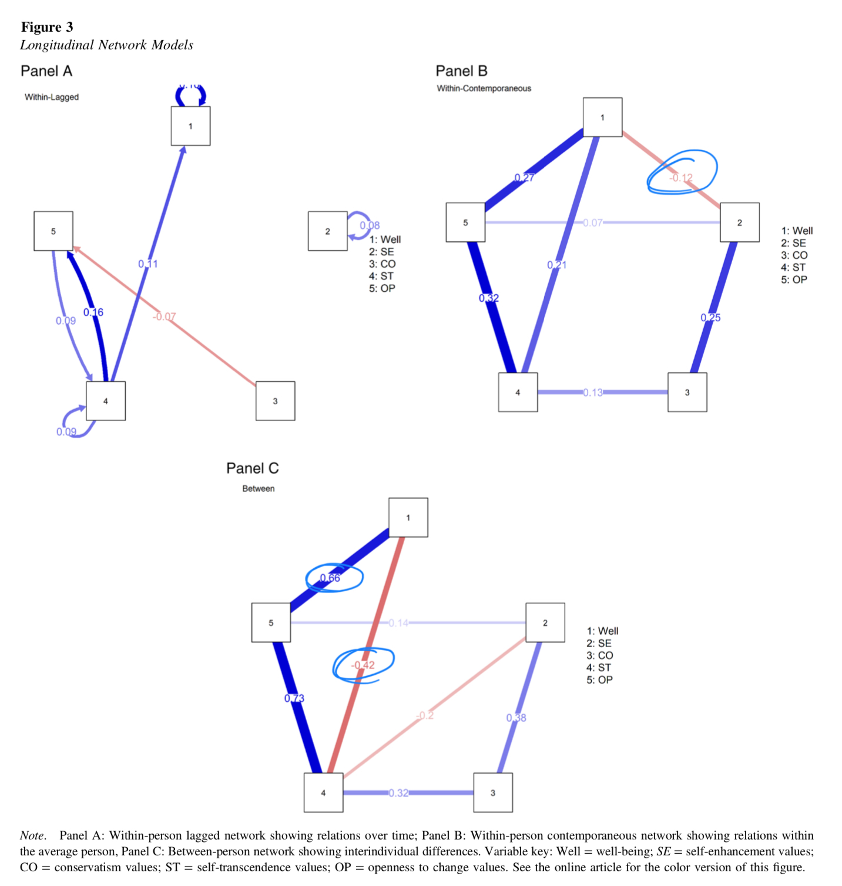

```{r echo=FALSE}
library(tidyverse)
source("../functions.R")
```

```{css}
.btn-group{
  display:none;
}
```

# Back to index 

[Back to index](../index.nb.html)

# Abstract 

Longitudinal network perspective 

  - within-person lagged 
  - within-person contemporaneous 
  - between-person 



-----
[Back to index](../index.nb.html)


  

