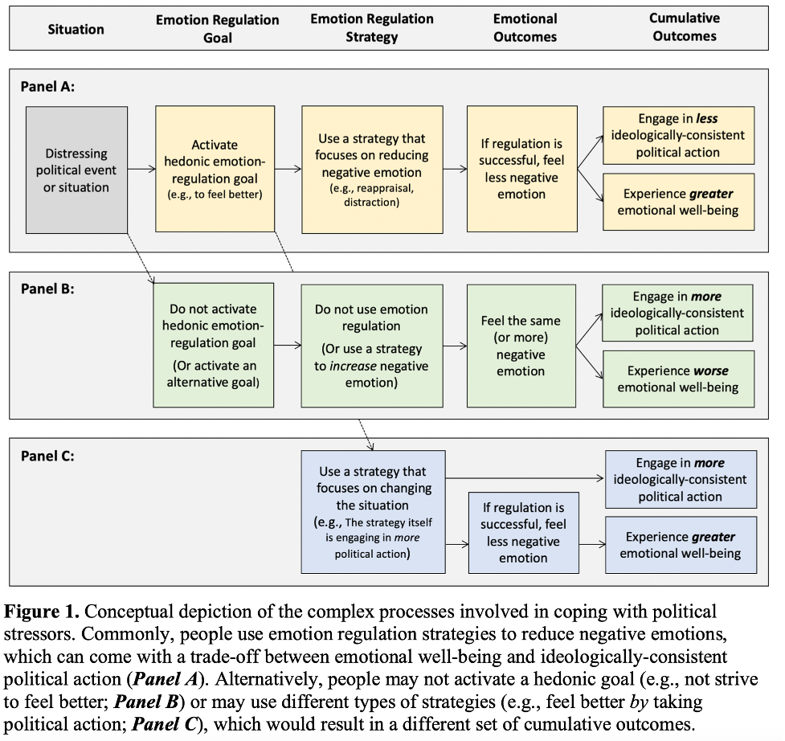

```{r echo=FALSE}
source("/Users/yuchenwei/Desktop/Academy/R Markdown settings/functions.R")
library(tidyverse)
```
```{css}
.btn-group{
  display:none;
}
.title {
  color: white;
  text-align: left;
}
h1{
  color: lightgreen;
  font-family: Georgia;
}
h2, h3, h4{
  color: pink;
  font-family: Georgia;
}
```


# Back to index 

[Back to index](../Final project.nb.html)

# Abstract / Key points 



Politics and identity ---> "Politics become a marker of who they are and what they stand for" 

  - Politics is often also a source of negative emotions (a chroinic stresor, i.e., a hard-to-change system), which although feels unpleasant, motivates people to engage in political action 
    - `r colored("as they reduce negative emotional responses to politics and protect well-being, they can also reduce the underlying force that motivates people to take political action aimed at changing the political system that evoked the emotions in the first place.", "gold")`
  - the conflict between the personal (hedonic) ER motive and groups's motive to change the system
  
# Thoughts 

The importance of individual political action? 

  - "Political action occurs when individuals engage in any action to achieve group goals in a political context"
  - `r colored("How much would this micro-level momentum translate to the macro-level change?", "gold")` 
  
# Other things 

Emotions other than anger are also motivated, such as sadness and fear

System justification is viewed as *a form* of reappraisal 

This article focuses more on reappraisal, while another commonly used strategy to cope with politics is *distraction*


-----
[Back to index](../Final project.nb.html)

```{r echo=FALSE}
file.copy("Empty.Rmd", "Final project")
file.rename("./Final project/Empty.Rmd", "./Final project/Final project.Rmd")
file.edit("./Final project/Final project.Rmd")
```

`r colored("", "gold")`


  

