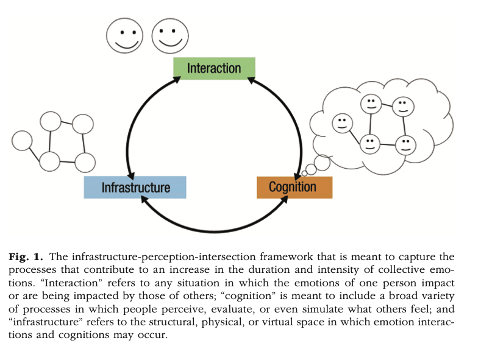

```{r echo=FALSE, message=FALSE}
library(tidyverse)
source("~/Desktop/Academy/Readings/functions.R")
```

```{css echo=FALSE}
.btn-group{
  display:none;
}
```

[Back to index](../index.nb.html)

# Abstract / Key Points

Propose an "interaction-cognition-infrastructure" framework to study collective emotion




`r colored("What is it important? ")`

- Prediction problem 
- Regulation problem` 

## Interaction 
- Activation/ contagion --> asymmetric influence among group members

## Cognition
- A broad term that includes perception, evaluation and simulation 
- Over-perception at the individual level and on the summary level 
  - The latter can be attributed to (a) sustained attention on emotional stimuli in the set of stimuli, and (b) memory biases that favor emotional stimuli
- People also choose their tie who shows stronger emotions 

## Infrastructure
- Physical, virtual, and psychological spaces that shape group emotional experience and expression
- Can influence decision to join a group, and within the group, who to connect 
- Can shifts the nature of the emotions (e.g, physical and temporal distance with the feelings of sadness and anger towards school shootings)
- Can also shift what kinds of emotions are shared (e.g., what emotions are shared in close-ties vs. distant ties networks)

-----
[Back to index](../index.nb.html)

`r colored("")`


