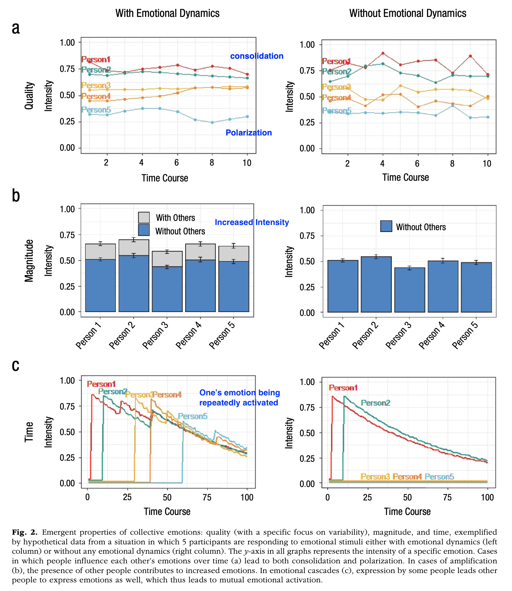

```{r echo=FALSE, message=FALSE}
library(tidyverse)
source("~/Desktop/Academy/Readings/functions.R")
```

```{css echo=FALSE}
.btn-group{
  display:none;
}
```

[Back to index](../index.nb.html)

# Abstract / Key Points

Also his book chapter in the handbook of emotion regulation 

Collective emotion is not group-based emotions, which are still individual emotions (but experienced as a member of a group)

- Definition of collective emotion: defined as macrolevel phenomena that emerge from emotional dynamics among individuals who are responding to the same situation
- Emergent properties: 
  - Quality:
    - Variability: consolidation vs. polarization
    - Type: e.g., after a period of sadness, collective comfort or support may emerge 
  - Magnitude: Emotion tend to amplify in collective context 
  - Time: While individual emotions may subside quickly, collective emotions may persist for a longer time due to (1) social sharing and social appraisal processes, and (2) new waves of individuals joining the collective emotional experience --> emotions keep being activated 



# Questions
- Measurement of collective emotion 
- Consequences of collective emotion 
- Regulation of collective emotion


-----
[Back to index](../index.nb.html)

`r colored("")`


