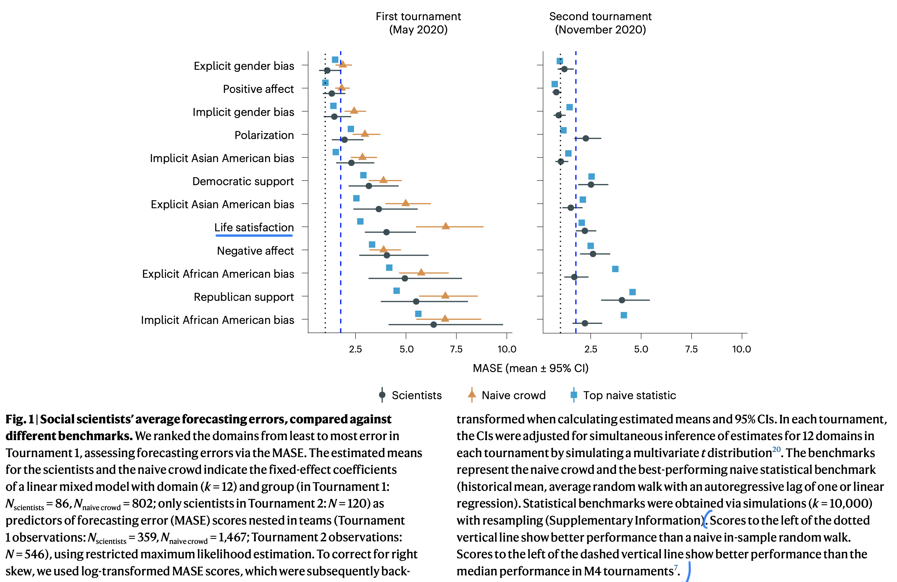

```{r echo=FALSE}
library(tidyverse)
source("../functions.R")
```

```{css}
.btn-group{
  display:none;
}
```

[Back to index](../index.nb.html)

# Abstract / Key Points

We ran two forecasting tournaments testing the accuracy of predictions of societal change in domains commonly studied in the social sciences: ideological preferences, political polarization, life satisfaction, sentiment on social media, and gender–career and racial bias

Benchmarking forecasting accuracy revealed that social scientists’ forecasts were on average no more accurate than those of simple statistical models (historical means, random walks or linear regressions) or the aggregate forecasts of a sample from the general public (N = 802). However, scientists were more accurate if they had scientific expertise in a prediction domain, were interdisciplinary, used simpler models and based predictions on prior data.

Fourth, social scientists tend to theorize about individuals and groups and conduct research at those scales. However, findings from such work may not scale up when predicting phenomena on the scale of entire societies39. Like other dynamical systems in economics, physics or biology, `r colored("societal-level processes may also be genuinely stochastic rather than deterministic. If so, stochastic models will be hard to outperform.", "gold", bold = T)` 




-----
[Back to index](../index.nb.html)


`r colored("", "gold", bold = T)`


  

