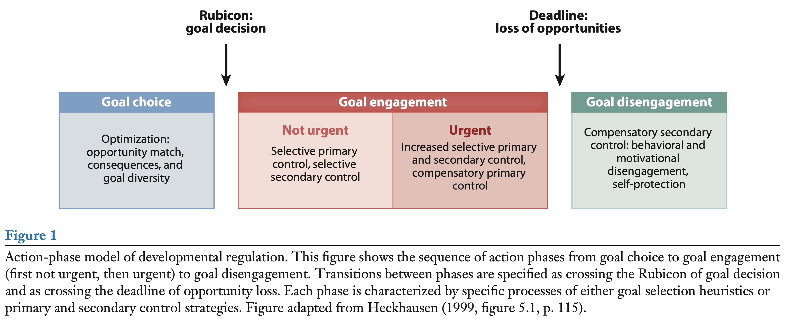

```{r echo=FALSE}
library(tidyverse)
source("~/Desktop/Academy/Readings/functions.R")
```

```{css}
.btn-group{
  display:none;
}
```

[Back to index](../index.nb.html)

# Abstract / Key Points

The major life-span approaches to individual agency and developmental regulation are discussed, with a focus on the motivational theory of life-span development. 

Individuals differ in their capacity to regulate their goal engagements effectively within the age- graded structure of opportunities and constraints in their life courses.

[2023-10-07: This piece feels to me very centered on indiduals' controls (i.e., their agency; being proactive about their development; making decisions about engaging in or disengaging from the goals)]

# 1. INTRODUCTION 

Personal agency comes from the investment of effort and time in striving for long-term goals and stay on developmental paths that we think will help us achieve those goals

Life-span developmental psychology has addressed the role of individuals as active coproducers of their own development in the context of two strong shaping factors, the *biological maturation* of the individual and the *age-graded nature of societal institutions* `r side_note("What does that mean?")`

*Life-course sociologists* have studied how individuals influence their life course in the context of societal institutions and social structure

Psychological and sociological perspectives on individual agency in adulthood and old age reveal that individuals cannot simply invent themselves and their life courses, but rather need to `r colored("adapt to their social and developmental ecology and its opportunities and constraints. ")` ---> individual agency in shaping one’s future is always constituted and, at the same time, constrained by one’s biological status and one’s position in a given societal structure. ---> `r colored("Individual agency reflects both constraint and freedom, and at the same time provides the raw material for transforming social structure (Giddens 1984).")`

In the context of life-span development, `r colored("individual agency is about motivation and action for long-term goals")`. The relevant action field for this individual agency in development is the life course, with its age-graded and sequentially organized structure of opportunities and constraints (Heckhausen 1999).

# 2. INDIVIDUAL AGENCY AND MOTIVATION IN THE REGULATION

## 2.1. Purpose of Adaptive Agency in Development

Primary control (according to motivational theory of life-span development): 

- Short- and long-term goal pursuits to maximize the effects that *our behavior has on the environment* in pursuit of such essentials as food, shelter, mates and reproduction, and the welfare of offspring
- Individuals, throughout their lives, strive to maximize primary control of their environment and developmental outcomes.
- The key to an overall successful life is to manage the delicate balance of investing time and effort in major life domains, including work, family, health, and leisure. Moreover, effective developmental regulation requires that individuals are sensitive to biological or societal opportunities and constraints for pursuing important goals as they arise 
- Our MTD proposes that successful development and aging is based on maximizing the extent to which a person has influence (i.e., primary control) not only in one area, but also across the multiple major domains of life in a way that is synchronized with age-related changes characteristic of human development

## 2.2. Achieving Successful Development by Optimized Goal Choice

Goal choice and motivational engagement and disengagement is informed by and reflective of a time perspective (i.e., when to do what) and the opportunities and constraints for achieving primary control in multiple domains (e.g., which goals come first, and can they be built on, or do they impair progress towards other goals).

Particularly when individuals try to achieve upward social mobility and attempt to overcome hurdles to more favorable life paths, they must effectively plan, prioritize, and orchestrate their motivational, behavioral, material, and social resources 

Three heuristics for optimization in choosing developmental goals

1. Congruence with life-span changes in opportunities and constraints ---> pursue goals at the peak of their attainability 

2. Managing interdomain and long-term consequences 

  - Related goals (e.g., education and career) and conflicting goals 

3. Maintaining a diversity of goals ---> flexiable, easy to switch when one is unattainable 

## 2.3. Developmental Agency through Action Cycles of Engagement with and Disengagement from Long-Term Goals 

### 2.3.1. Action-phase model of developmental regulation. 

1. The SOC model was proposed by Baltes & Baltes (1989, 1990) as a broad metatheoretical framework to conceptualize individual experience and responses to developmental gains and losses across the life span. 

- *Selection* is conceptualized as the narrowing down and preference for certain areas of functioning, *optimization* refers to resource investment in these selected areas of functioning, and *compensation* comprises attempts to adjust to developmental losses. 
- Updated SOC model introcues a motivational persepctive ---> effective selction when resource is abundant and loss-based selection when resource is scare (e.g., shrunken time perspective)

2. The dual-process model of self-development (Brandtstädter 1986, 1998, 2009)

- Discrepancies between self-conceptions and actual capacities can be overcome by one of two processes:
  - Assimilation in which the individual engages in self- directed activities aimed at bringing personal development in line with their self and life goals (e.g., attain a promotion) 
  - Accommodation (flexible goal adjustment)

3. MTD ---> conceptualizes and operationalizes a set of distinct control strategies for goal engagement and disengagement 



- Note that (unlike the original SOC model) the MTD does not view control strategies as adaptive per se, but rather as adaptive only insofar as they serve the pursuit of appropriate goals, for example, goals that match available opportunities or that have positive consequences for future control striving.
- Selective primary control: selective investment in the pursuit of certain goals 
  - Once the Rubicon is crossed, individuals switch from deliberative mindset (process large amounts of information in objective, unbiased ways) to implemental mindset (narrowed-down, goal-oriented, and biased information processing so as to maximize volitional investment in the chosen goal) `r side_note("Why does it sound a bit obssessive to me...")`
- Metavolitional strategies ---> selective secondary control
  - E.g., Imagine the joy and pride associated with eventually achieving a difficult goal (e.g., graduating from college) and thus re-energize their efforts to pursue the goal.
- Developmental deadlines: A circumstance that is common in life-span developmental contexts is that goal-related opportunities decline with age (e.g., biological clock for child bearing), and thus, goal pursuit becomes urgent as the individual approaches a point where further goal pursuit is no longer productive due to a critical loss of opportunities for the goal in question (e.g., having a child before menopause) (Heckhausen et al. 2001). 
  - Selective secondary control strategies become ever more important as goal attainment becomes less likely 
    - E.g., Perceptions of enhanced control over goal attainment, *elevated valuation of the aimed-for goal* `r side_note("Increased autonomous motivation")`, anticipated positive emotions with goal attainment, and avoidance of distraction
  - Compensatory primary control strategies also become prominent (e.g., getting help from other people)
  - If goal attainment is completely impossible ---> compensatory secondary control strategies to disengage 
    - Disengaging from an important goal can undermine an individual’s self-esteem and general confidence about their own effectiveness as an agent. 

### 2.3.2. Different phases in the action cycle require different motivational mindsets

Action cycles: a goal decision phase followed by planning and action phases, culminating in intention deactivation (disengagement) and postactional evaluation (for reviews, see Achtziger & Gollwitzer 2018, Heckhausen 1991).

The major challenge in the pursuit of long-term goals is not to employ hard-knuckled persistence, but rather to keep returning to the goal pursuit for more or less short bouts of enhanced goal engagement, in spite of all the other ongoing activities and motivational commitments. `r side_note("Jia, L., Hirt, E. R., & Koh, A. H. Q. (2019). How to have your cake and eat it too: Strategic indulgence in big-time collegiate sports among academically successful students. Social Psychological and Personality Science, 10(6), 792–801. https://doi.org/10.1177/1948550618789403")`

### 2.3.3. Challenge of moving from goal engagement to disengagement.

- In circumstances that involve unattainable goals, individuals need to disengage from the respective goal and pursue other meaningful and attainable goals. 
  - A large body of research supports this assumption by showing that the capacity to disengage from unattainable goals and reengage in alternative goals facilitates improved levels of psychological well-being and physical health (Wrosch et al. 2003).

- Individuals with compromised capacities to disengage from and adjust unattainable goals experience greater distress, secretion of stress hormones, inflammatory processes, and physical health problems (Castonguay et al. 2014, Wrosch et al. 2013), likely because they cannot effectively avoid repeated failure experiences when pursuing unattainable goals `r side_note("fixated")`

- The experience of an action crisis (repeated failure of goal pursuit) may break a person’s positively biased implemental mind-set and trigger a new evaluation process about whether the pursuit of a certain goal should be continued (Brandsta ̈tter & Schu ̈ler 2013).

- *Late in life, goal disengagement may become more difficult* because it is harder to find new meaningful goals to replace an obsolete goal pursuit, which could lead to extremely negative psychological states, such as aimlessness or hopelessness (Wrosch et al. 2007b).

### 2.3.4.Roleofemotioninmotivationalself-regulation

- The role of emotion in self-regulation from a motivational perspective 
  - Incentives: serve as a motivational pull toward an anticipated desirable change in emotion
  - Instigators: function as a motivational push when an unsatisfactory life situation calls for active change of the current situation `r side_note("We do what we do because we feel something or because we want to feel something")`
  - Motivational resources: an emotional balance within a certain functional range is needed to effectively pursue long-term developmental goals

- Repeated failure can lead to negative affect, which can, at first, work as an emotional instigator for trying harder (Wright 1996) but, when prolonged and repeated many times, can deplete an individual’s motivational resources to pursue goals. 

- The functions of emotions 
  - anger ---> threatened but attainable goal
  - sadness could serve as a signal that it is time to let go of a goal and move on to something else.
  
# 3. DEVELOPMENTAL CHALLENGES AND INDIVIDUAL AGENCY: A SET OF RESEARCH EXAMPLES

## 3.1. Adaptation of Agency to Overall Changes in Controllability Across the Adult Life Span

This predominantly maturation-and socialization-based surge slows down during adolescence and early adulthood but still continues to rise. Primary control capacity peaks in early or late (likely as a function of social class) midlife. In late midlife and old age, primary control capacity gradually declines, with accelerations in decline associated with major health problems.
  


`r side_note("This figure seems to suggeest that people, regardless of age, strive for control over the environment. ('control striving remains a fundamental need throughout life' --- The need for autonomy?) ")`

### 3.1.1. From gain-oriented to loss-avoiding goals.

However, there seems to be an age-related shift in goal focus not only in number of goals, but also in intensity of goal engagement, with younger adults showing more persistence when pursuing gain-oriented goals, and older adults reporting more intense goal engagement with loss-avoiding goals (Freund 2006).

### 3.1.2. Increase in compensatory secondary control across adulthood.

Numerous studies have found that goal disengagement is more prevalent among older adults (Brandtsta ̈dter & Renner 1990, Heckhausen 1997); that adults at different ages focus on different goals, which implies that they disengage from previously pursued goals (Nurmi 1992); and that adults disengage even from highly valued personal goals when encountering depleted control opportunities (Heckhausen et al. 2001, Wrosch & Heckhausen 1999).

Goal disengagement can have negative consequences or self-esteem and confidence in future success ---> individuals use strategies of protecting the self against it 
  
  - Positive reappraisal (e.g., attributing failure to external factors, downgrading the value or importance of the goal)
  - Downward social comparison 

### 3.1.3. Function and age differences in regret.

The age-related experience and consequences of life regrets represent an example of the role of emotions in producing developmental outcomes and their associations with motivational strategies.

In addition to specific emotions, such as despair, or wistful emotions (Gilovich et al. 1998), regret also involves specific cognitions associated with upward counterfactual thoughts (e.g., what would have happened if ...?) (Roese 1997). Such experiences of regret are frequently encountered in central life domains (Roese & Summerville 2005) by most adults and at different ages (Landman 1987).

Regrets can be reconciled if one takes into account the potentially contrasting perspectives on regrettable events at different times in the life span.

A motivational and life-span perspective would propose an age-related shift in the reasons for and consequences of regret experiences. 

## 3.2. Navigating Change: Life-Course Transitions, Social Mobility, and Societal Transformation

### 3.2.1. Developmental deadlines

The pursuit of specific developmental tasks is particularly fruitful during optimal lifetime windows ---> During such lifetime windows, success in achieving a respective developmental task is optimized based on a constellation of biological, sociostructural, and age-normative factors

E.g., biological clock for childbearing

E.g., Romantic relationship formation: while separated young adults engaged more frequently in goal engagement strategies related to forming a new intimate relationship, separated adults in late midlife more frequently used goal disengagement strategies

# 4. FUTURE DRIECTIONS 

The role of emotions as incentives, instigators, and resources in motivational self-regulation has so far rarely been empirically investigated. Certain emotions may be more suitable than others during certain action phases (e.g., anger during goal engagement, sadness during goal disengagement) and may vary accordingly in their usefulness with age. There may be important connections between effective agency in adulthood and old age and the early developmental origin of individual differences in emotional experience and regulation


-----

[Back to index](../index.nb.html)

`r colored("")`


  

