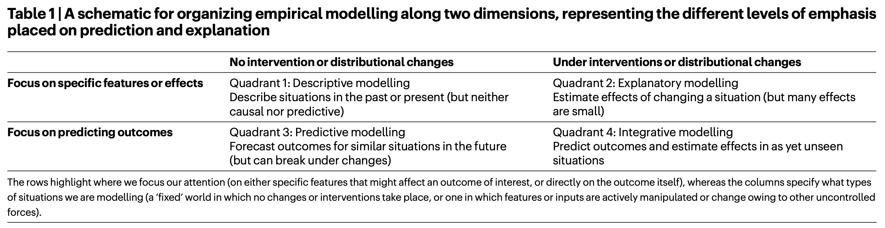

```{r echo=FALSE}
library(tidyverse)
source("../functions.R")
```

```{css}
.btn-group{
  display:none;
}
```

[Back to index](../index.nb.html)

# Abstract / Key Points

The goal of this Perspective is to provide some clarity around how these approaches (explaintory vs. predictive) differ from one another and to propose how they might be productively integrated. Towards this end we make two contributions. 

  - The first is a schema for thinking about research activities along two dimensions—the extent to which work is explanatory, focusing on identifying and estimating causal effects, and the degree of consideration given to testing predictions of outcomes—and how these two priorities can complement, rather than compete with, one another. 
  - Our second contribution is to advocate that computational social scientists devote more attention to combining prediction and explanation, which we call integrative modelling, and to outline some practical suggestions for realizing this goal.

Epistemic tension between social scientists and computer scientist ---> a tension between the epistemic values of social and computer scientists. 

  -  On the one hand, social scientists have traditionally *prioritized the formulation of interpretatively satisfying explanations of individual and collective human behaviour*, often invoking *causal mechanisms* derived from substantive theory. 
  - On the other hand, computer scientists have traditionally been more concerned with *developing accurate predictive models*, whether or not they correspond to causal mechanisms or are even interpretable
  - Result: Whereas quantitative methods in social science are designed to identify causal relationships or to obtain unbiased estimates of theoretically interesting parameters, machine learning methods are typically designed to minimize total error on as-yet unseen data
    - ---> It is standard practice for social scientists to fit their models entirely ‘in-sample’, on the grounds that they are seeking to explain social processes and not to predict outcomes, whereas for computer scientists evaluation on ‘held out’ data is considered obligatory11. Conversely, computer scientists often allow model complexity to increase as long as it continues to improve predictive performance, whereas for social scientists models should be grounded in, and therefore constrained by, substantive theory

Critiques against each approach 

  - On the one hand, theory-driven empirical social science has been criticized for generating findings that fail to replicate, fail to generalize, fail to predict outcomes of interest, and fail to offer solutions to real-world problems
  - On the other hand, complex predictive models have also been criticized for failing to generalize as well as being uninterpretable and biased. Meanwhile, extravagant claims that the ability to mine sufficiently large datasets will result in an ‘end of theory’ have been widely panned.

Considering the predictive power of explanatory models can help to prioritize the causal effects we investigate and quantify how much they actually explain, and may reveal limits to our understanding of phenomena. Conversely, an eye towards explanation can focus our attention on the prediction problems that matter most and encourage us to build more robust models that generalize better under interventions and changes.


# Prediction versus explanation

The issue of traditional explinatory approach in social science: The pitfall of NHST: NHST invokes the language of prediction; however, the prediction that is being made is often not directly about the outcome of interest, nor even about the magnitude of some theoretically interesting effect, but simply that the hypothesized effect is not zero. In other words, a common application of NHST is not so much to test predictions at all but instead to argue that a theory is not inconsistent with the data and then to use the theory as an explanatory tool.    
  
  - while there are circumstances under which it is useful to show that an effect is unlikely to be zero, in the complex world of human and social behaviour it is highly likely that many effects are non-zero
  - Showing that one’s preferred theory cannot be ruled out by the data is therefore an exceptionally weak test of the theory, and hence explains much less than it appears to.

The issue of purely predictive models: 

  - model performance can change markedly under interventions that alter the associations in question, or can otherwise result in biased or misleading interpretations


# A framework for integrative modelling



To be clear, the opportunity highlighted by Table 1 is not that researchers, computational or otherwise, should focus only or even mostly on quadrant 4.

1. Descriptive
  
  - def: how to think about, define, measure, collect, and describe relationships between quantities of interest. ---> fundamental to any scientific endeavor 
  - e.g., traditional stats, survey research, *topic modeling*, qualitative work 

2. Explanatory 
  
  - def: activities whose goal is to identify and estimate causal effects, but that do not focus directly on predicting outcomes
  - methods in this quadrant tend to prioritize simplicity, considering one or only a handful of features that may affect an outcome of interest
  - the emphasis on studying effects in isolation can lead to little, if any, attention being paid to predictive accuracy. 
    - ---> As many effects are small, and simple models can fail to incorporate the broader set of features pertinent to the outcome being studied, these methods can suffer from relatively poor predictive performance
    
3. Predictive 

  - def: activities that attempt to predict the outcome of interest directly but do not explicitly concern themselves with the identification of causal effects
  - By evaluating performance on a held-out test set, these methods focus on producing predictions that generalize well to future observations.
  - From a policy perspective, it can be helpful to have high-quality forecasts of future events even if those forecasts are not causal in nature
  - That said, there is often an implicit assumption that the data used to train and test the model come from the same data-generating process, akin to making forecasts in a static (albeit possibly noisy) world. As a result, while these methods often work well for a fixed data distribution, they may not generalize to settings in which features or inputs are actively manipulated (as in a controlled experiment or policy change) or change as a result of other, uncontrolled factors.
  
4. Integrative modeling 

  - def: ctivities that attempt to predict as-yet unseen outcomes in terms of causal relationships
  - More specifically, whereas quadrant 3 concerns itself with data that are *out of sample*, but still *from the same (statistical) distribution*, here the focus is on generalizing `r colored("‘out of distribution’", "gold", bold = T, ita = T)` to a situation that might change either naturally, owing to some factor out of our control, or because of some intentional intervention such as an experiment or change in policy. This category includes distributional changes for settings that we have observed before (that is, setting an input feature to a specific value, rather than simply observing it to be at that value) as well as the more extreme case of entirely new situations (that is, setting an input feature to an entirely new value that we have never seen before).
    -  Ideally work in this quadrant would generate high-quality predictions about future outcomes in a (potentially) changing world. 
  - The scarcity of this approach <--- Models that carefully synthesize the causal relationships between different relevant factors to make high-quality predictions of future outcomes are inherently more difficult to formulate and evaluate than models that aim only for explanatory or predictive power in isolation.
    
# Suggestions 

1. Integrate modelling approaches

Specifically, we can ask how well our estimates and predictions generalize under the types of interventions or changes considered in quadrant 4. In practice, this would mean more cross-domain or out-of-distribution model testing: how well does a causal estimate made in one domain transfer to another domain, or how well does a predictive model fit to one data distribution generalize to another?

In quadrant 2 there are recent examples of using methods from machine learning to improve the causal estimates made with existing explanatory techniques, such as matching and instrumental variables (61) as well as to develop new techniques such as adaptive experimentation to more efficiently learn the effects of deploying different policies (62) 

Akin to a 'coordinate ascent’ algorithm ---> researchers iteratively alternate between predictive and explanatory modelling

2. Clearly label contributions 

First, it should differentiate as cleanly as possible between contributions in the four quadrants of Table 1; and second, within each quadrant it should identify the level of granularity (for example, high, medium or low) that is exhibited by the result.


3. Standardize open science practices

  - Pre-registration 
  - Common task framework
    - Centralizing these efforts under the common task framework would force a diverse set of researchers to find common ground in deciding on what the real problems of interest are. `r side_note("cf. Watt, 2017; Bowers & Testa, 2019")`
    - It would also standardize the evaluation of progress and make it easy to combine insights across studies
  
-----
[Back to index](../index.nb.html)


`r colored("", "gold", bold = T)`


  

