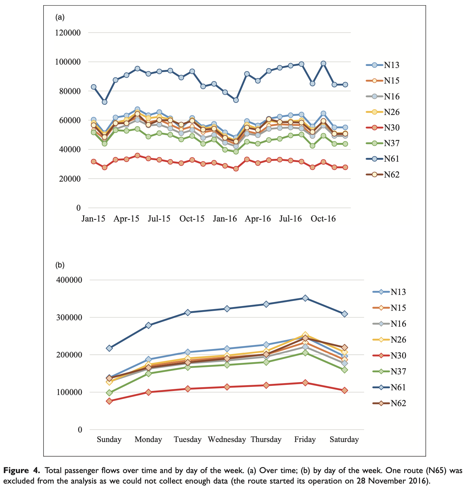

```{r echo=FALSE}
library(tidyverse)
source("../functions.R")
```

```{css}
.btn-group{
  display:none;
}
```

[Back to index](../index.nb.html)

# Abstract / Key Points

Evidence-based policy making in bus system 

Clear evaluation metric: efficiency ---> the ratio of service output to input, as measured by the ratio of passenger flows (i.e., the total number of passengers boarding and alighting from the bus at each bus station) to the number of bus runs. This study thus examines whether station- level passenger flows per run are greater for routes selected using Big Data than for other routes.

Linear regression and Causal inference 

To be clear, our analysis does not provide direct evidence of whether or to what extent the use of Big Data has contributed to the success of the Owl Bus service. However, the results reveal a remarkably clear difference in passenger flows between the Owl Bus and the control groups. Such evidence suggests that the implementation of the Owl Bus service positively contributed to improving the average efficiency of city bus operations.



Large variation in the efficiency ---> equity reason ---> Can't just have routes that have more profits, because they only cover areas with higher SES 

Interviewee: 

"The big data analyses tell us that late-night traffic is the highest in the (wealthy) Gangnam areas. Some may call it politics and others may call it justice, but govern- ments cannot introduce late-night bus routes only in those areas, even if doing so would be the smartest way to spend public money from an efficiency point of view."


-----

[Back to index](../index.nb.html)


`r colored("", "gold", bold = T)`


  

