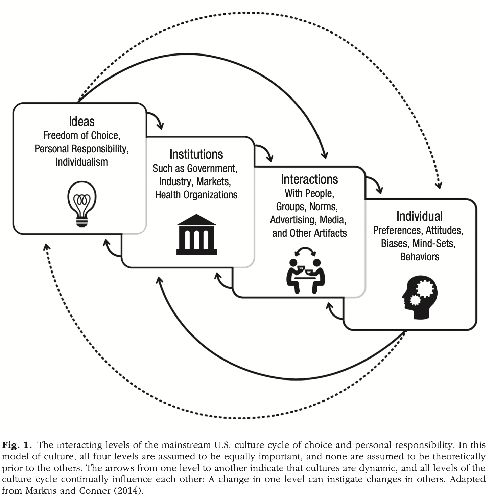

```{r echo=FALSE}
library(tidyverse)
source("../functions.R")
```

```{css}
.btn-group{
  display:none;
}
```

[Back to index](../index.nb.html)

# Abstract / Key Points

Preventable lifestyle diseases. We examine how deeply rooted cultural narratives about “free choice” and “personal responsibility” infuse policymaking, advertising, media, social norms, and individual attitudes about health in the United States. We argue that these narratives contribute to ill health in the United States: They encourage stress and worry over health, blame and stigmatization of the unhealthy, widened health disparities, and the failure to adopt policies that could save lives.

A focus on choice and personal responsibility paints an incomplete picture of the drivers of health. It distracts attention from the role of social and environmental factors in shaping health—factors that indi- viduals generally cannot affect alone, such as pollution, public safety, occupational hazards, inequality, and affordability of healthy foods and quality health care.

The leading risk factors for preventable disease—including tobacco and alcohol use, diet, lack of physical activity, and exposure to pollutants—do not occur randomly but are “closely related to the social, demographic, environmental, economic, and geographic attributes of the neighborhoods in which people live and work”

A pervasive focus on personal responsibility increases individuals’ stress and worry over health, encourages blame and stigmatization of the unhealthy, and erodes trust in medical expertise. Furthermore, the belief that health choices are a personal concern—outside the appropriate scope of government intervention—leads to the adoption of policies that may inadvertently widen health disparities and slows or stalls the adoption of policies that could save lives.


`r colored(" To organize our analysis, we draw on the culture cycle model, which examines culture in terms of four interacting levels: individuals, interactions, institutions, and ideas (Markus & Conner, 2014; see Fig. 1). In this model, individuals are simultaneously products and producers of their cultures. Cultural ideas, institutions, and interactions encourage individuals to think, feel, and act in particular ways; at the same time, the thoughts, feelings, and actions of individuals shape the broader cultures to which they belong. This model does not separate the cultural from the structural: Institutions require ideas to animate them, and ideas require struc- tures to lend them influence and power (see Markus & Hamedani, in press).", "gold", bold = T)`

 


 


People against the nannying state 

-----
[Back to index](../index.nb.html)


`r colored("", "gold", bold = T)`


  

