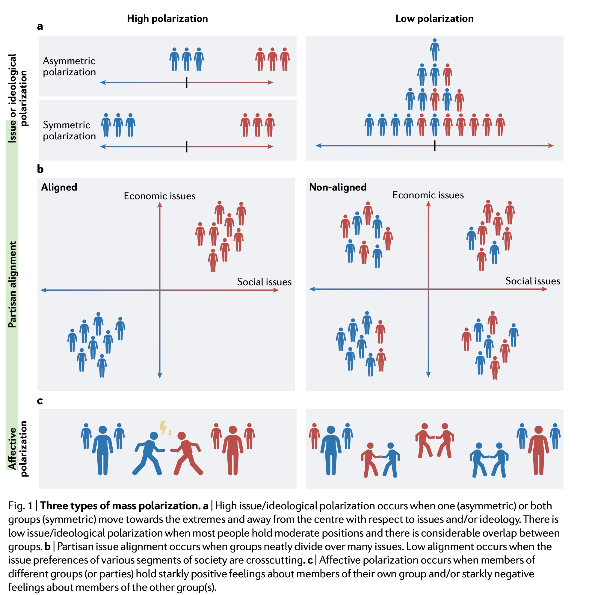

```{r echo=FALSE, message=FALSE}
library(tidyverse)
source("~/Desktop/Academy/Readings/functions.R")
```

```{css echo=FALSE}
.btn-group{
  display:none;
}
```

[Back to index](../index.nb.html)

# Abstract / Key Points

Democracy is at risk when citizens become so polarized that an ‘us versus them’ mentality dominates. 

A major chal­lenge for future research is to identify ways in which partisans and ideologues can engage with one another constructively, rather than trafficking in hatred and the politics of provocation and backlash

`r colored("Justifications")`

  - Ego-justifying and group-justifying motives lead individuals to defend their own pre-existing beliefs and those of their in-group, respectively. 
  - However, a distinct class of system-justifying motives contributes to asymmetric forms of polarization.

`r colored("Ideology")`

  - Whereas conservative-rightist ideology is associated with valuing tradition, social order and maintenance of the status quo, 
  - liberal-leftist ideology is associated with a push for egalitarian social change. 

Operational definitions of political polarization

1. Moving towards the extremes and away from the center 
2. Partisan alignment
  - multiple potential cleavages (e.g., based on social class, region or religion) might be reduced to a single dimen­sion that comes to dominate political relations. Put another way, members of a group (such as a political party) might come to share similar views across many different issues, so that these issue positions do not crosscut group membership.
3. Affective polarization

# Cognitive–motivational mechanisms



These different types of polarization can become mutually reinforc­ing. 

## Ego and group justification


# Social-communicative contexts 

## Source factors
  - elite signaling 
  - social networks

## Channel factors 
  - mass media: exposure to ideologically driven networks externs both persuasive and reinforcement effects 
  - social media: 
    - patterns of online ideological segregation resemble offline patterns of media consumption205, and most social media users are exposed to reasonable levels of ideological heterogeneity
    - abundance of political misinformation 

## Message factors 
  - framing (e.g., shift the salience of group identity)
  - narrative sharing personal experiences rather than facts appears to foster respect and humanize politicians, even in the eyes of their adversaries, thereby reducing affective polarization
-----
[Back to index](../index.nb.html)


`r colored("")`

