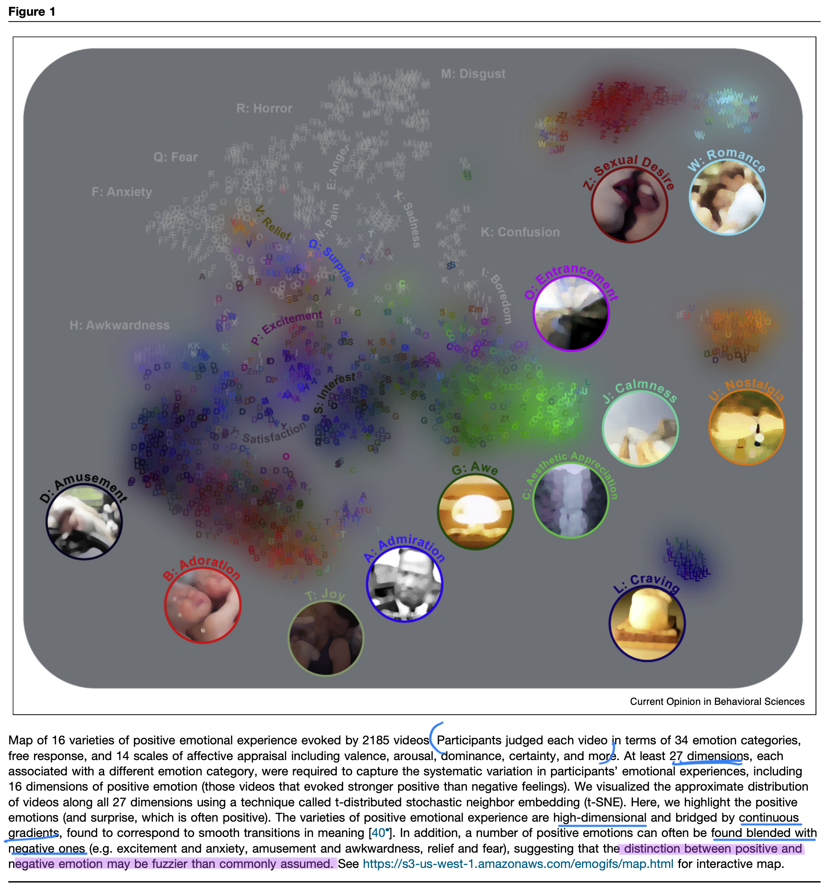

```{r echo=FALSE}
library(tidyverse)
source("../functions.R")
```

```{css}
.btn-group{
  display:none;
}
```

[Back to index](../index.nb.html)

# Abstract / Key Points

Theoretical framework: *Social functionalist theory* (SFT) ---> emotions structure attachment relations, cooperative alliances, hierarchies, and collectives

  - SFT posits that emotions shift behavior, thought, and feeling to enable attachments between parents and offspring, romantic bonds, friendships, status hierarchies, and social collectives.     
  - Emotional expression is not only a manifestation of subjective feeling; it coordinates dyadic and collective interactions. 
  - Emotional experience frames social-moral judgments about harm, risk, trust, fairness, and status 

We synthesize how top-down confirmatory studies and data-driven, computational studies converge on evidence for 11 positive emotions with distinct experience, expression, and physiology. This taxonomy includes amusement, awe, compassion, contentment, desire, love, joy, interest, pride, relief, and triumph.

A computational approach that relies on participants’ own interpretations of vast arrays of stimuli, be it emotion-eliciting films or music or inter- pretations of facial, vocal, or artistic expression 

  - Dimensionality: the number of kinds of emotion
  - Distribution: whether there are discrete boundaries between emotions (Ans: no)
  - Conceptualization: how distinct emotion concepts and valence and arousal capture how people construct emotion (discrete emotion concepts, more so than valence or arousal, drive the experience, expression, and physiology of emotion
  
This taxonomy greatly overlaps with those based on physiology (Shiota et al., 2017) and subjective experience (Weidman & Tracy, 2020)

Taxonomy: 

  - Attachment: desire, love, and compassion 
  - Power and status: pride and triumph 
  - Knowledge and social-cultural practice: amusement, awe, and interest `r side_note("Why is amusement here?")`
  - Goals and challenges: contentment, joy, and relief 




-----
[Back to index](../index.nb.html)


`r colored("", "gold", bold = T)`


  

