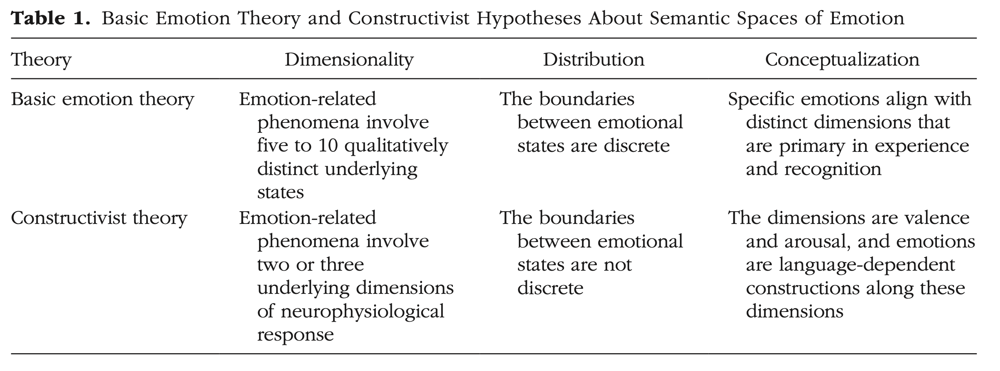

```{r echo=FALSE}
library(tidyverse)
source("../functions.R")
```

```{css}
.btn-group{
  display:none;
}
```

[Back to index](../index.nb.html)

# Abstract / Key Points

Insights from the Semantic Space Theory: 

  1. Emotion is high dimensional, defined by blends of upward of 20 distinct kinds of emotions, and not reducible to low-dimensional structures and conceptual processes as assumed by constructivist accounts.
  2. Specific emotions are not separated by sharp boundaries, contrary to basic emotion theory, and include states that often blend. 
  3. Emotion concepts such as “anger” are primary in the unfolding of emotional experience and emotion recognition, more so than core affect processes of valence and arousal.




-----
[Back to index](../index.nb.html)


`r colored("", "gold", bold = T)`


  

