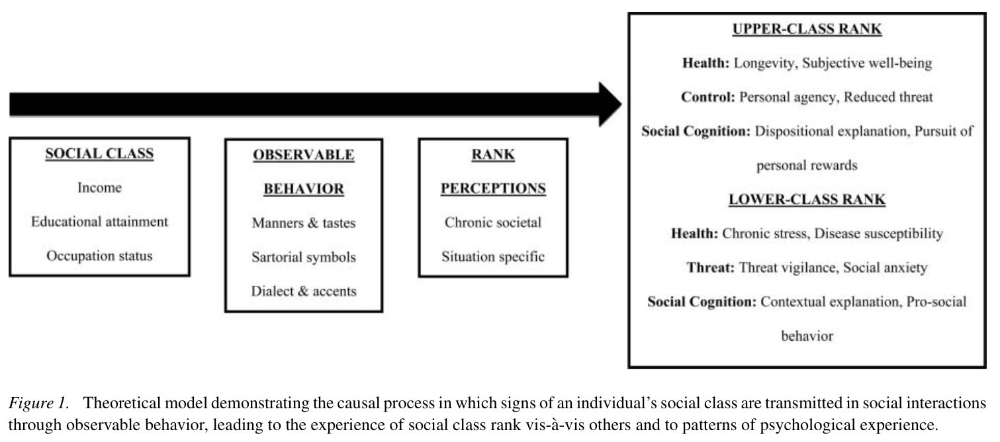
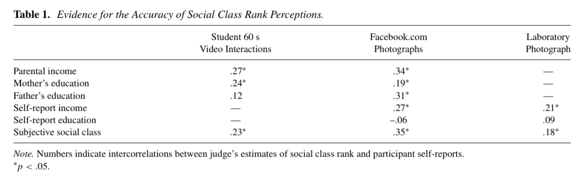
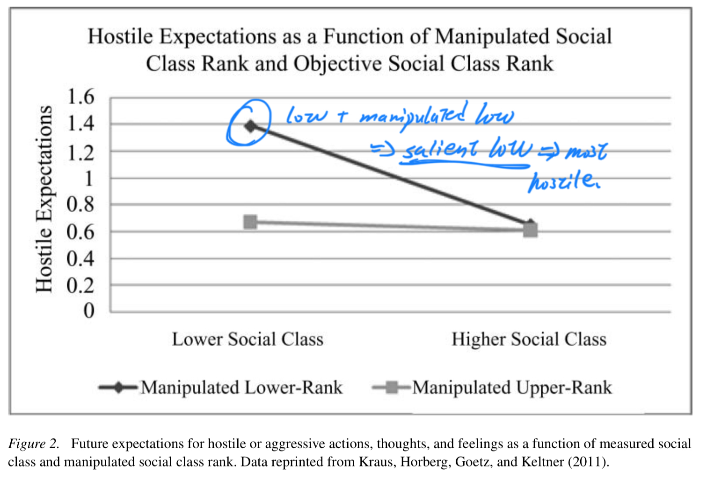

```{r echo=FALSE}
library(tidyverse)
source("/Users/yuchenwei/Desktop/Academy/R Markdown settings/functions.R")
```

```{css}
.btn-group{
  display:none;
}

```


# Back to index 

[Back to index](../index.nb.html)

# Abstract 

A rank-based perspective on social class shines light on several future areas of research: 

Specifically, understanding how social class ranks individuals vis-a`-vis others leads to predictions about

- how class is signaled in interactions, 
- influences social cognition and health, 
- is shaped by global economic inequality trends, and 
- changes across the life course

Social class can be manipualted and thus its causal role can be tested 

# Intro 

Being at the top (or bottom) of the social class hierarchy shapes manners, tastes for art, music, and culture (Bourdieu, 1979; Kohn & Schooler, 1969), the social and economic opportunities people have across the life course (Stephens, Markus, & Fryberg, 2012), and even the actual length of the life course itself (Adler et al., 1994).

Facing social class in this fashion leads to an important realization: If a ranking at the top (vs. bottom) of the class hierarchy has such a profound effect on one’s daily cultural experiences, opportunities, and mortality, then it must fundamentally shape the ways in which people perceive and respond to their social environments on a daily basis. 

Goal: to develop a theory of how social class influences basic social cognitive processes. 

`r colored("In particular, this article examines perceptions of rank vis-a-vis others as a foundational aspect of the psychological experience of social class and considers how conceiving of social class as a rank-related construct provides a framework for testing the causal influence of social class on basic cognitive, emotional, and behavioral patterns.", "gold")`

# Empirical traditions in social class research 

Cultural perspective (e.g., Markus & Kitayama, 2003; Snibbe & Markus, 2005; Stephens, Fryberg, & Markus, 2012; Stephens, Markus, & Townsend, 2007) <br> ---> social class is conceptualized as an immersive environment where individuals are socialized to take on particular conceptions of the self and models for how to relate to others (Markus & Kitayama, 1991, 2003).

Econ resources

  -  The study found, for instance, that merely thinking about money increases self-sufficiency, independence, and social distance between people (Vohs, Mead, & Goode, 2006). 
  - In related work, economists have examined de- cisions under conditions of resource scarcity: Individuals who are made resource poor tend to exhibit lower cognitive control and, as a result, make less rational economic decisions than their resource rich counterparts (Shah, Mullainathan, & Shafir, 2012).
  
Health ---> threat & uncertainty perception ---> physio threat responses ---> wear and tear 

# The social ladder: A ranked-based perspective on social class 

Comparisons of material resources define an individual’s rank in society vis-a`-vis others ---> <br> many of the psychological processes experienced by individuals of relatively upper or lower class backgrounds can be described in terms of experiences at the top or bottom of society’s pecking order

`r colored("Many of the everyday social contexts an individual inhabits are fundamentally shaped by perceptions of social class rank at a *_chronic_* level (e.g., perceptions of one’s standing in society as a whole) and that are *_specific_* to a situation (e.g., perceptions within a friendship, at work, or within a team).", "gold")`

 ---> social class rank is communicated through social behavior both rapidly and accurately and that perceptions of social class rank are a primary psychological mechanism in the experience of social class, shaping the ways in which individuals perceive the social world and relate to others



# Signs of social class rank 

Fuzzy: e.g., people do not agree on the occupation-social class link 
Concrete: 

- Living conditions 
- Behavioral profiles (e.g., which fork to use, what shows to watch)
  - ---> provide a basis for judging one’s own social class rank relative to others.
  - ---> people send and receive information about their social class background, and in turn become aware of their rank in society on a chronic societal level, and within a specific group or situation 

`r colored("The social class information that is sent and received within interactions is a reflection of the social selves of individuals (e.g., Snibbe & Markus, 2005; Stephens et al., 2012), and as such, communication of position on the social ladder of society is likely to occur both effortlessly and below conscious awareness","#82E0AA", "16pt",ita = T)`

`r colored("Signs of social class are transmitted via *thin slice* like personality and social identities", "gold","18pt" ,bold = T)`. 



Of interest, whereas judges were accurate in their ratings of social class rank based on these photographs, they were `r colored("inaccurate in their estimates of other rank-related constructs","gold")`: Judges could not accurately discern dispositional power (e.g., “In my relationships with others, I feel that I have a great deal of power”) or the resting testosterone levels of the participants, measured through saliva samples.

`r side_note('A question, then, is "What are the cues that convey social class signals?"')`
`r side_note("Also, as they later ask, would concealing those cues have negaitve effects on one's well-being?")`
`r colored(side_note("This would support my analysis that within a dyad, people would sense the difference in their social class."), "gold", "16pt", T)`
`r colored("One important implication of this research is that individuals from both upper and lower class backgrounds regularly enter into social interactions in which their social class is known, even though it is never explicitly mentioned.", "#82E0AA", "18pt", T)`

  - `r colored("For lower class individuals, these chronic rank perceptions may be especially likely to activate threat reactions and poor health trajectories.", "orange")` 
  - `r colored("For upper-class individuals, chronic elevated rank per- ceptions may increase expectations of personal control, choice, and autonomy within interactions, even in the absence of actual control or autonomy.", "orange")`
  
# Rank manifestations in the experience of social class 

The experience of social class rank (that their social class is known to others upon entering an interaction) influences the health trajectories of individuals as well as patterns of social cognition.

## Social class rank and health outcomes 

Physio and self-rated health outcomes 

Rank perceptions are theorized to be a remarkably powerful predictor of health outcomes because they closely covary with daily experiences of chronic psychological stress
  ---> as high-ranking individuals feel autonomy, free- dom, and control in their environment, low-ranking individuals experience social constraint, helplessness, and uncertainty—a recipe for the experience of chronic psychological stress

In research *moving beyond estimates of health that are subject to self-report biases*, lower-class rank perceptions—assessed using the same ladder measure—predict physiological profiles that are consistent with chronic psychological stress (e.g., high blood pressure; Adler et al., 2000; Wright & Steptoe, 2005), greater susceptibility to a common cold virus (Cohen et al., 2008), and at an ecological level, greater mortality (Kopp, Skrabski, Re ́ thelyi, Kawachi, & Adler, 2004) relative to upper-class rank percep- tions. 
  
Community: 
  -  Perhaps lower-class individuals, living in regions or communities where their lower class rank is particularly visible to others, might be especially likely to experience poor health outcomes. In contrast, lower-class individuals living in communities with similarly lower-class families might be buffered from the experience of low rank in their social lives, and may receive health benefits as a result. 


## Social class rank and social cognitiions 

For individuals from relatively lower-class backgrounds, belonging to a lower rank in society indicates that the social environment is a primary determinant of social behavior, and that one’s own capacity to marshal material and social resources to overcome external threats or to pursue opportunities is reduced relative to others. In contrast, individuals from relatively upper-class backgrounds perceive themselves as higher in rank relative to others, and these rank perceptions heighten the sense that one can manage threats and seek social opportunities freely, without being encumbered by the external environment (Kraus et al., 2012).

Experimental works <--- an individual’s social class covaries with a host of other demographic variables (e.g., neighborhood demographic characteristics, ethnic background, religious beliefs) that are potential confounds in correlational studies linking self-reports of social class to patterns of social cognition. 

### Threat vigilance 

  - `r arr("d")`social class, `r arr("u")` cynical mistrust and hostility 
  - cause: For instance, lower-class individuals tend to live in environments that are defined by increased violence and punitive responses from the criminal justice system (Sampson, Raudenbush, & Earls, 1997) along with increased social threats and ostracism (Williams, 2007)


`r side_note("Manipulating people of low social class to feel high in social class does not change their hosility levels")`
  


It is possible that chronic threat perceptions, theorized to underlie the chronic psychological stress of lower-class individuals (Marin, Chen, & Miller, 2008), may be dampened in contexts where observable signals of social class rank are less visible (e.g., a public primary school with uniform policies) or in countries where social class rank disparities are less evident (e.g., countries with low income inequality).

### Social perception 

- individuals of lower class rank tend to be more vigilant of their external social environment, and perceptive of events or objects that happen outside the self. 
- high-ranking individuals tend to perceive that they have enhanced control and influence over social threats and opportunities, and as such focus more on internal goals, motivations, and emotions, and comparatively less on their external environments (cf. Grossmann & Varnum, 2011; Varnum, Na, Murata, & Kitayama, 2012; Kraus et al., 2012). 

`r side_note(colored("Emotion perception", "gold", "16pt"))`
Lower-class individuals, measured as a self-rated ranking on the social ladder, tended to fluctuate their target emotion ratings based on the changing expressions of the individuals in the background more than did upper-class individuals, reflecting lower-class individuals’ tendency to take context into account in their judgments of others’ emotions. 

However, a significant interaction (moderation effect) emerged between the control manipulation and participants’ social class rank ratings: 

  - Lower-class individuals’ tendency to fluctuate emotion ratings based on the context was particularly likely when these individuals were manipulated to think about themselves as low in personal control (Kraus et al., 2009). 
  - In contrast, when lower-class individuals were manipulated to experience elevated control beliefs, their emotion ratings were similar to those of their upper-class counterparts. 
  
This experimental evidence suggests that personal control beliefs, which covary with elevated rank, explain the tendency of lower-class individuals to show `r colored("increased perceptual awareness of others’ emotions in the external environment.", "gold")`
  
it is possible that this lack of perceptual awareness, rather than the motivation to be callous or uncaring, underlies the tendency of upper-class individuals to show lower levels of prosocial behavior toward others in laboratory investigations and surveys (cf. Kraus et al., 2012).

Future dir: would upper-class individuals be more likely to help a person in need if they felt more similar in rank to that person? 

## Climbing the social ladder 
  
Social class can be temporily shifted 

Although exhibiting symbols of upper-class rank is likely to be effective in reducing others’ perceptions of one’s subordinate rank, there are likely to be other symbols of social class that will be more difficult to change because they require years of socialization and newly learned models of the social self (e.g., Markus & Kitayama, 2003; Stephens, Markus, & Fryburg, 2012). 

For these reasons, people who *cross social class boundaries *(e.g., *the first-generation college student* who attends an elite private university) may actually feel, at least at first, chronically lower in social class rank in their new sur- roundings (e.g., Johnson et al., 2011). 

`r colored("This logic may partially explain why studies find that parental measures of income and education predict class-based social cognitive patterns better than do self-assessments of current income or education", "gold")` (Griskevicius, Tybur, Delton, & Robertson, 2011). 

In future research, it will be important to study the time course of changes in social class rank among individuals who are upwardly mobile. Perhaps these upwardly mobile individuals, despite their objective increases in social class rank, take several years before they start to engage in social cognitive patterns that are consistent with their newly elevated position on the social ladder.

# The social ladder as a new frontier of research 

## Signs of social class rank 

Colleges and universities ---> first gen ---> lack of fluency in such contexts 

  - ---> perceptions of lower rank at a university can create extra cognitive brden for lower-class students, which can lead to reduced performance in classroms and increased alienation from the larger academic community 
  - the use of uniform as a possible solution 
  - tech savviness as a signal of social class 

## The unequal social ladder 

Contextual inequality ---> living in social contexts where wealth, affluence, and prosperity are concentrated in only a few individuals will heighten the extent that a person’s lower-class rank is made salient in social interactions.

Mod:

  - `r colored("one might expect that social class exerts greater influence on psychological processes in contexts or countries where economic inequality is especially high (e.g., the United States) and less so in countries where inequality is lower (e.g., Norway).", "gold")`
  - Economic inequality might also intensify the experience of social class rank, and as such make being in a low position on the social ladder particularly unsatisfying
    - in the US, in years where economic inequality is higher, people report lower levels of life satisfaction (Oishi, Kesebir, & Diener, 2011)

Local comparison and community:

  - income rank within one’s county zip code—that is, being higher (vs. lower) in social class rank in one’s local community—was a significant predictor of elevated life satisfaction (Boyce et al., 2010). 
  - Moreover, after accounting for local income rank, raw income did not significantly predict life satisfaction (Boyce et al., 2010).

## Politics and the social ladder 

`r colored("Self-conscious emotions:", "cyan", "18pt", T, T)`

  - e.g., guilt, shame, embarrassment `r arr("u")`, social class `r arr("d")`
    
  - e.g., pride `r arr("u")`, social class `r arr("u")`
  <br> 
  - `r colored("People of low social class don't take actions because they don't feel anger ---> justification", "gold")`: Given that anger tends to be associated with action tendencies, whereas self-conscious emotions do not motivate action (Smith & Ellsworth, 1985), perhaps patterns of self-conscious emotion explain why lower-class individuals are less likely to take political action in support of reducing societal unfairness.
    - In particular, heightened levels of self-conscious emotion may underlie why some lower-class individuals tend to support the status quo even when it involves their own distinct economic disadvantage relative to others (e.g., Jost, Pelham, & Carvallo, 2002).

## The social class ladder across culture 

the influence of social class on core psychological processes is likely to be stronger in countries with higher levels of economic inequality. 
  
  

-----
[Back to index](../index.nb.html)


  

