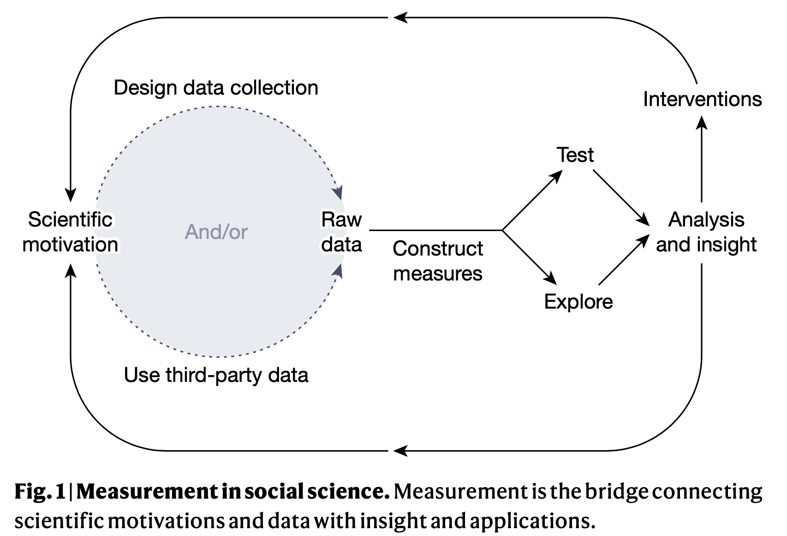

```{r echo=FALSE}
library(tidyverse)
source("../functions.R")
```

```{css}
.btn-group{
  display:none;
}
```

[Back to index](../index.nb.html)

# Abstract / Key Points

Here we evaluate the potential of this massive instrumentation—the creation of techniques for the structured representation and quantification—of human behaviour through the lens of scientific measurement and its principles

In the twenty-first century, human behaviour—from mobility to information consumption to various types of interpersonal communication—is increasingly recorded somewhere and potentially computationally tractable.

Claims:

  - First, the study of societies is different from the study of the stars, because the patterns that characterize human behaviour will generally differ across time and place. 
  - Second, the measures built from these streams are potentially suspect in ways that must be actively interrogated, because these sources were not built with scientific goals in mind.


# Intro 

As Robert Merton famously wrote, “Perhaps sociology is not yet ready for its Einstein because it has not yet found its Kepler....”. Merton’s provocation was that sociology did not yet have the *empirical foundations on which to build great theory*. Duncan Watts, in response, writes 62 years later, “*...by rendering the unmeasurable measurable, the technological revolution in mobile, Web, and Internet communications has the potential to revolutionize our understanding of ourselves and how we interact. Merton was right: social science still has not found its Kepler. But three hundred years after Alexander Pope argued that the proper study of mankind should lie not in the heavens but in ourselves, we have finally found our telescope."*

# The unstable logics of society and measurement

Generlizability, but not universality, is the goal of most social scientists 

Reflexivity (self-fulfilling prophecies): the very sociotechnical systems that are gathering the data about people, which are actively (and in some cases intentionally) changing the social world that social science would study. ---> the loop that links social reality with the theo- ries and the metrics that we devise to explain it. ---> *how our measures can distort the phenomena that they were designed to monitor.*



  - The bandwagon and the underdog effects ---> polls and forecasts have on voting behaviour.
  - Observer effect ---> The reaction to the observed phenomenon, in other words, changed the phenomenon itself. (e.g., Google Flue Trends)
  - Obfuscation ---> we can now disrupt measurements by deliberately adding ambiguous or misleading information to interfere with data collection (e.g., VPN, sharing one Netflix account)
  

`r colored("Social media, for example, not only capture human behaviour, but also have the potential to alter important patterns of human society, such as the speed of information flows, the scope of media production and the actors responsible for defining public opinion.", "gold", bold = T)`

Emerging sociotechnical systems are reducing the relevance of some old scientific instruments used to measure human behaviour ---> If we only evaluate new measures against the old, we simply replicate their shortcomings, mistaking the gold standard of the twentieth century for objective truth (e.g., media consumpton should not be measured in terms of how many broadcasts one listens to a day now) 

  - Examples of inappropriate questions: "How many tweets did you see today?" 
  
Many of the ways to measure behaviour developed in the early days of quantitative social science were: (1) necessary given constraints on measurement at the time; and (2) grounded in a social reality that was markedly different.

# What trace data measure 

Construct validity ---> convergent and discriminant  

`r colored("Formal theory is useful not only in generating hypotheses, but also in selecting an appropriate way of measuring constructs with big data.", "gold", bold = T)`

  - The results of any given empirical study are necessarily *local*, in both time and space; theory is needed for the appropriate movement of any measurement to a new geographical or temporal context


Despite the thousands of papers based on Twitter data in recent years, social media scholars still find that iden- tifying the demographic characteristics of individual users remains a big challenge.

  - As a result, the large majority of Twitter research is *making inferences about accounts or tweets*; very little of Twitter research can reasonably claim to be making statements about the behaviours of humans. 

Technological fragmentation ---> Diverse sets of technologies owned by a single person 

  - One important consequence of this technological fragmentation is that measurements relying on a single digital device or service should be interpreted with considerable caution. `r colored("The answers that we find could plausibly differ from those we could get by measuring the behaviour in a similar but different technology. Ironically, because of that complexity, an accurate picture of whom someone generally talks to may be better captured through a simple survey question than through records from a single platform.", "gold", bold = T)`
  - A friend on Facebook does not denote the same relationship as a Twitter follower or a LinkedIn contact.
  - The challenge then becomes developing measures that provide some degree of generalizability over time or across systems for a given research question
  
Algorithmic confounding
  
  - Our inability to distinguish signals that represent typical human behaviour from ones that result from the rules that govern a digital platform.  
  - Those machine-learning-based manipulations are pervasive, and any efforts to develop measures from platform data need to evaluate the extent to which algorithms will distort both the measures and any downstream analyses. Because of their importance, those algorithms are worthy of closer study
  
# Whom trace data measure 

`r colored("Human behaviour is a multi-level concept that often requires measurements at the individual level to make inferences about the distribution of behaviours, attitudes and attributes at the collective level", "coral", bold = T)` 

The data collected from the "population" of the user is a ‘convenience census’ ---> any leap to generalize beyond that platform must be viewed more critically

  - Large sample size does not alleviate the concern that the sample is not representative of the population using the platform
  - Some human behaviour is highly dependent on the setting ---> `r colored("Generalizability is a function not only of the population, but also of the particular observational contexts.", "gold", bold = T)` 

For cases/events that are statistically uncommon but consequential, sample size and our ability to zoom into smaller populations and infrequent data points matters more than the representativeness of the sample

Perhaps the social theories of the twenty-first century will be able to use `r colored("micro-level behavioural data to understand how structures of interdependence yield certain macro-level patterns", "coral", bold = T)` 

# Access and ehtics in measurement 

What can be measured, and what should be measured? 


-----
[Back to index](../index.nb.html)
`r colored("", "gold", bold = T)` 


  

