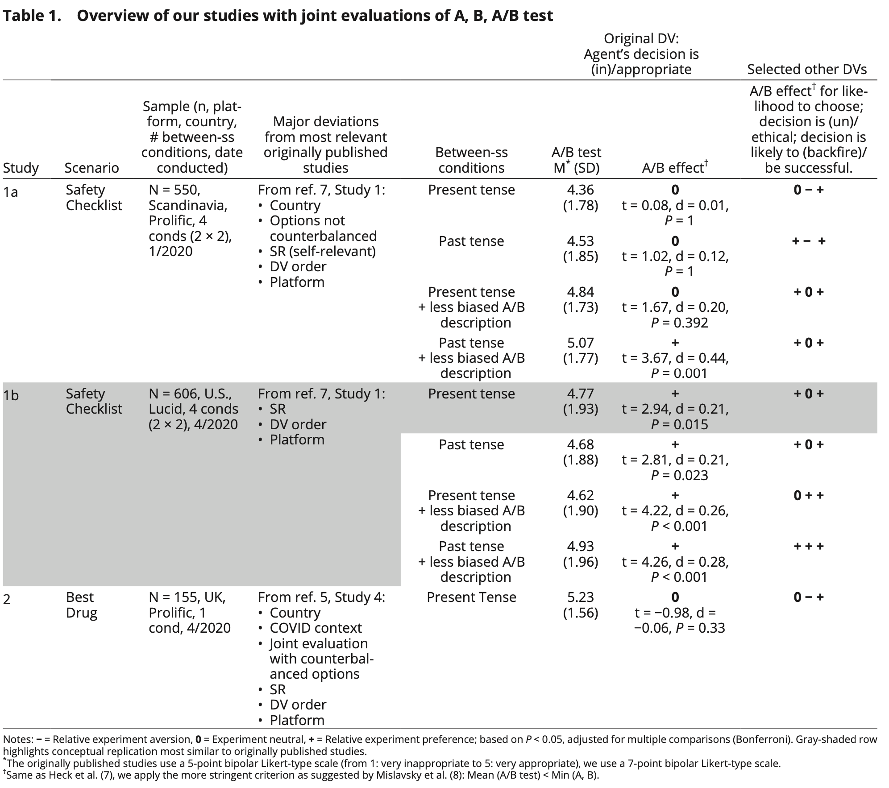

```{r echo=FALSE}
library(tidyverse)
source("../functions.R")
```

```{css}
.btn-group{
  display:none;
}
```

[Back to index](../index.nb.html)

# Abstract / Key Points

The authors (Meyer et al) warn that this could cause policymakers to avoid running large-scale field experiments or being transparent about running them and might contribute to an adverse heterogeneity bias in terms of who is participating in experiments. 

In one direct and six conceptual preregistered replications (total N = 5,200) of the previously published larger-effect studies, using the same main dependent variable but *with variations in scenario wordings, recruitment platforms, and countries, and the addition of further measures to assess people’s views*, we test the generalizability and robustness of these findings. 

Together, we find that the original results *do not appear to generalize*. That is, our triangulation reveals insufficient evidence to conclude that people exhibit a common pattern of behavior that would be consistent with relative experiment aversion, thereby supporting recent findings by R. Mislavsky, B. Dietvorst, U. Simonsohn, Mark. Sci. 39, 1092–1104 (2020). (Experiments are rated as at least as acceptable as the least acceptable policies they contain.)

In particular, we made a small number of changes to the wording of the original scenarios to further enhance respondents’ under- standing of the presented options (e.g., making it clearer that the agent does not know which individual policy is best/better) and to describe the scenarios in self-relevant terms to make the hypothetical more tangible and produce potentially more truthful responses (SI Appendix, Tables S1–S3 present the side-by-side comparison of the language of the original scenarios from refs. 5 and 7 and our adapted ones).

# Results 

We find that people either significantly prefer experiments or do not significantly differentiate between them and the universal implementation of the individual policies, deviating dramatically from the previously published empirical evidence (5, 7). 

  - That is, only in our direct replication Study 5 do we replicate a significantly negative and large effect size (d = −0.84, P < 0.001), indicating what Meyer et al. (5) define as experiment aversion.     - However, when we vary the approach as done in our conceptual replications, we often find the opposite pattern with significantly positive effects, indicating a *relative preference for experiments* ranging in size from small (d = 0.21, P < 0.05) to medium (d = 0.44, P = 0.001).


 

 

None of our additional between-subject factors (e.g., tense: present vs. past) robustly moderated the A/B Effect (see ref. 17).


`r colored("Our research reveals that even consistently replicating results as in refs. 5–7 and our Study 5 does not necessarily mean that those results represent robust insights. Instead, they may merely be artifacts or confounds of contextual circumstances and insufficient triangulation with multiple approaches (7, 10). ", "gold", bold = T)` 

Focusing on the original dependent variable: Appropriateness of the agent’s decision (Tables 1 and 2, second last column) and comparing the previous work to our two conceptual replication studies most similar to the previously published research (our joint evaluation Study 1b and our separate evaluation Study 4; in particular, see gray-highlighted condition rows) suggest that the *choice of recruitment platform* may have contributed to the differing results. 

Previous work has documented platform differences among others in participants’ attention, comprehension, reliability, and behavior (e.g., refs. 18, 19).

Our research additionally reveals that as part of triangulation, it may be useful to consider various operationalizations of assessing people’s views, the latter of which is particularly important when there is no obvious one correct measure, and the goal is to establish whether there exists a genuine tendency in people’s responses.
  
  - e.g., asking participants to consider how likely they themselves would be to choose to be exposed to each of the policies (as we have done) and eliciting participants’ willingness to publicly vote for an approach or support it financially. 

Policymakers may not need to be concerned about using evidence-based practice more so than about universally implementing individual policies. 

`r colored("In addition, we conclude that whenever communicating a policy, it is useful to remember that there is no “neutral” language, and policymakers can and should be mindful of their communication choices and perhaps even test them.", "gold", bold = T)` 

--- 
[Back to index](../index.nb.html)


`r colored("", "gold", bold = T)`


  

