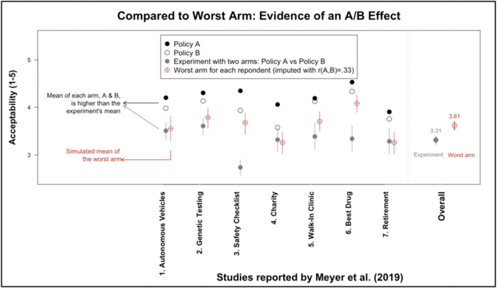

```{r echo=FALSE}
library(tidyverse)
source("../functions.R")
```

```{css}
.btn-group{
  display:none;
}
```

[Back to index](../index.nb.html)

# Abstract / Key Points

Why they chose between-participant design in the first place

  - We deliberately used a between-subjects design to maximize external validity: Universal implementation of policies usually occurs without mention of foregone alternatives, whereas A/B tests inherently acknowledge those alternatives. The belief that experiments deprive people of potentially beneficial interventions, but universally implemented policies do not, is not a “confound” to be avoided but, rather, a key mechanism underlying the A/B effect. It is a consequential failure to recognize that “the world outside the experiment is often just the A condition of an A/B test that was never conducted”

Addressing their concerns: 

  - Our studies 1 and 2 already showed that objection rates to experiments can be higher than the sum of objections to either arm. Moreover, in studies 4 through 6, there is no rational reason for respondents to prefer one anon- ymous drug over another, so, unlike peanut allergies and lactose intolerance, the total objections by people who read about an A/B test cannot logically be the sum of people who object to receiving “drug A” and people who object to “drug B.” Yet still we see a large A/B effect.
  - We note that in their simulated within-subjects design Mislavsky et al. chose the 7 scenarios we studied with the smallest A/B effects (including one nonsignificant effect). When we replace just 3 of these 7 that had the smallest effects with 3 of our larger-effect studies and run their own code the aggregate evidence supports—by their own criterion—“experiment aversion”



Fig. 1. Simulation run using Mislavsky et al.’s R code. We modified their simulation—which they used to claim that there was no evidence for experiment aversion—by replacing the 3 weakest studies (“Basic Income,” “Health Worker Recruitment,” and “Teacher Well-being”) with 3 studies that found a large A/B effect (“Safety Checklist,” “Walk-In Clinic,” and “Best Drug”). We used the same input correlation (r = 0.33) that Mislavsky et al. obtained from 99 Amazon Mechanical Turk participants. The overall comparison (Far Right) now produces evidence of an A/B effect, where the mean of the worst arm (M = 3.61) is greater than (and outside the 95% CI limits of) the mean of the experiment (M = 3.31).

-----
[Back to index](../index.nb.html)


`r colored("", "gold", bold = T)`


  

