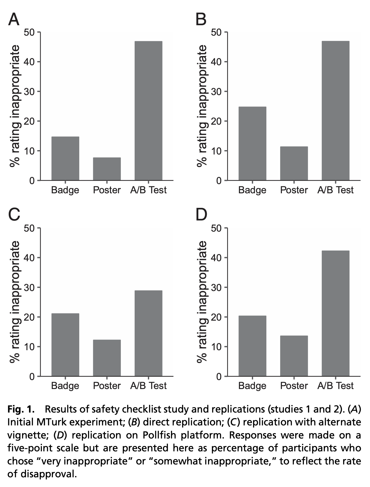

```{r echo=FALSE}
library(tidyverse)
source("../functions.R")
```

```{css}
.btn-group{
  display:none;
}
```

[Back to index](../index.nb.html)

# Abstract / Key Points

We find robust evidence across 16 studies of 5,873 participants from three diverse populations spanning nine domains—from healthcare to autonomous vehicle design to poverty reduction—that people frequently rate A/B tests designed to establish the comparative effectiveness of two policies or treatments as inappropriate even when universally implementing either A or B, untested, is seen as appropriate. This effect persists even when there is no reason to prefer A to B and even when recipients are treated unequally and randomly in all conditions (A, B, and A/B). This experimentation aversion may be an important barrier to evidence-based practice.

We propose that they all exhibit a common pattern that has previously been labeled the “A/B illusion”: people appeared to judge a randomized experiment comparing two unobjectionable policies or treatments (A and B), neither of which was known to be superior, as less appropriate than simply implementing either A or B for everyone.

Beginning with the second of our 16 studies, we preregistered our methods and hypotheses, including the prediction that participants would object more to an A/B test that compared two unobjectionable policies than to the implementation of either policy alone.

## Method and Results 

- Between-person experiment 
- MTurk or Pollfish 
- IV: A-everyone; B-everyone; A/B ranodom assignment 
- DV: Appropritateness (1-5 point) 




-----
[Back to index](../index.nb.html)


`r colored("", "gold", bold = T)`


  

