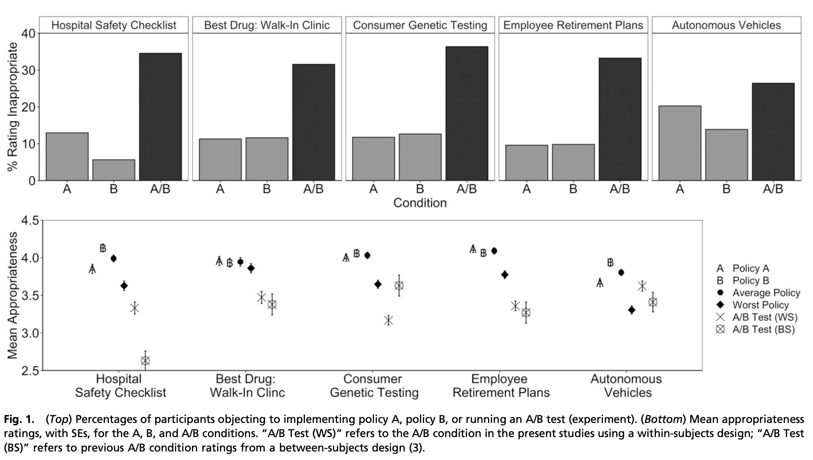

```{r echo=FALSE}
library(tidyverse)
source("../functions.R")
```

```{css}
.btn-group{
  display:none;
}
```

[Back to index](../index.nb.html)

# Abstract / Key Points

1) People unsurprisingly object to experiments only when they object to a policy or treatment the experiment contains, or 2) people can paradoxically object to experiments even when they approve of implementing either condition for everyone.

If people sometimes object to A/B tests more than they object to either of the policies these tests compare, and absent any rational reasons that might exist for objecting to particular experiments, such a pattern may threaten evidence-based practices and policy by reflecting a genuine aversion to randomized evaluation

# Method and Results 

Participants rated the appropriateness of and rank-ordered each of three alternative decisions available to a leader: implement policy A, implement policy B, or conduct an A/B test to learn which policy is more effective and implement it for everyone going forward.

In all five experiments, more participants objected to A/B tests (by rating them somewhat or very inappropriate) than objected to either policy (Fig. 1, Top). 
  
  - Participants also demonstrated the A/B Effect by rating each A/B test as less appropriate than their average rating of policies A and B (mean [A,B]; ps ≤ 0.01; Table 1 reports inferential statistics and effect sizes). 
  - In all but one experiment (“Autonomous Vehicles”), participants met Mislavsky et al.’s (8, 9) more stringent criterion for “experiment aversion” by rating the A/B test as less appropriate than their least-preferred policy (min [A,B]) (ps < 0.001; Fig. 1 Bottom).

In four of five scenarios, including two of the three Mislavsky et al. preferred, participants therefore viewed unilateral implementation of untested policies as more appropriate than an A/B test designed to evaluate these policies—even when the policy being implemented was their least-favorite of the two.



In four out of five domains, people tended to prefer direct implementation to rigorous evaluation of untested policies, even when they judged one policy to be superior to the other. Converging measures and tests refuted the hypothesis that people object to A/B tests only when they contain a policy the rater finds undesirable

`r colored("If the information available affects reactions to A/B tests, then providing more (or less) information, and paying careful attention to how the policy or experiment is described, may improve reactions to randomized experiments.", "gold", bold = T)` (See Marzer et al., 2023)
 

-----
[Back to index](../index.nb.html)


  

