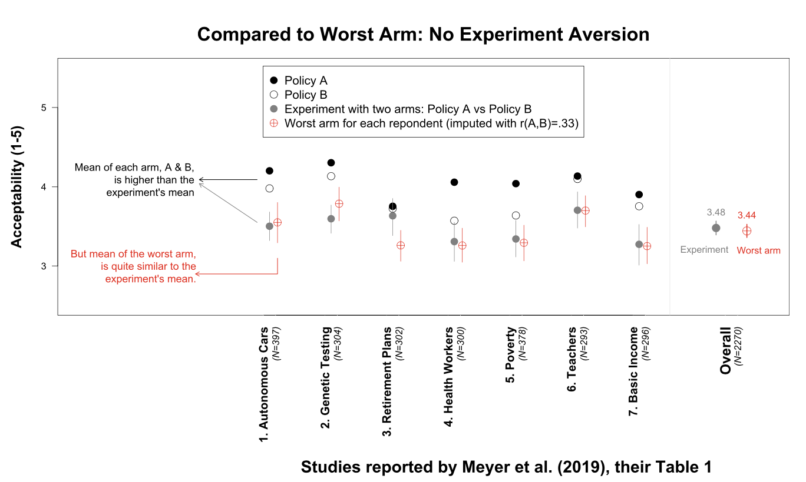

```{r echo=FALSE}
library(tidyverse)
source("../functions.R")
```

```{css}
.btn-group{
  display:none;
}
```

[Back to index](../index.nb.html)

# Abstract / Key Points

This is based on their finding that "People don’t dislike a corporate experiment more than they dislike its worst condition” that used a within-subject design to compare what a person would object 
  
Example: 

  - In the A-only condition, 30% of people would object to it (e.g., peanut allergy)
  - Same goes in the B-only condition (e.g., lactose-intolerant)
  - In the A/B random assignment condition, there will be 60% of people objecting the experiment 
  - This is why in our studies policies A and B were evaluated by the same people, and we compared the least acceptable policy for each participant to the acceptability of the experiment. 

Empirical demonstration: 

  - Ask another sample on MTurk to rate both A-only and B-only conditions and thus get the correlation between the two. 
  - Use this correlation to impute each participant from Myer et al's worst arm. 



Fig. 1. All analyses were performed on data collected by Meyer et al. (1). Average acceptability of policies A and B (black and white circles, respectively), and of the experiment (gray circle), reproduce results in table 1 of ref. 1. *The acceptability of the worst arm is computed by randomly pairing observations between A and B, inducing the correlation within pair that we obtained in new data: r(A,B) = 0.33*. For each of the 7 studies, 10,000 pairs (with replacement) were formed. The lowest-rated policy was computed within each pair and averaged across them. This is the estimated average acceptability of the worst arm. Vertical lines depict 95% (bootstrapped) confidence intervals. Note: results are not sensitive to the imputed correlation of r(A,B) = 0.33. With r = 0.5 the mean of the worst arm is M = 3.51, still very similar to the experiment, M = 3.48. With r = 0.2 it is M = 3.40. The R code to reproduce Fig. 1 is available from https://osf.io/jcwnz/ (7).

-----
[Back to index](../index.nb.html)


`r colored("", "gold", bold = T)`


  

