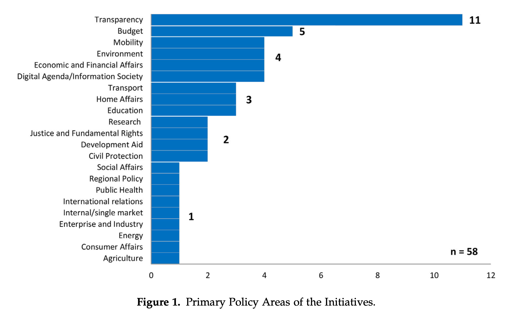

```{r echo=FALSE}
library(tidyverse)
source("../functions.R")
```

```{css}
.btn-group{
  display:none;
}
```

[Back to index](../index.nb.html)

# Abstract / Key Points

We analyze 58 data-driven policy-related initiatives and elaborate on a number of persistent challenges that have been discussed in the recent literature: representativeness of data, validity of results, the need to engage citizens, and the need to ramp up data skills in public sectors and in society in general.

We find that some policy areas, notably efforts to improve government transparency, are far more represented than others, such as use of social media data for policy evaluation.

We also find Big Data used more often in the policy cycle for foresight and agenda setting, or interim evaluation and monitoring, rather than for policy implementation and ex post evaluation.

One reason for the lag in policymaking uses is that it may be easier to explain or predict, for example, sales of books rather than policy interventions since the former have fewer variables. ---> in policymaking, measureable outcomes are complex

In policymaking, moreover, it is essential to ensure transparency, accuracy, inclusion, and accountability. 

One way to understand this demand is in terms of the ongoing rationalization of society, whereby there is a need to harness scientific knowledge to the pursuit of governing. But this application of science to governing leads to the further requirement of assessing the success or efficacy of applying Big Data techniques. 

<hr>

Def of big data: "Big Data is a step change in the scale and scope of the sources of materials (and tools for manipulating these sources) available in relation to a given object of interest” (Schroeder, 2014)

This is a realist definition of data which highlights the scientific nature of data as evidence, with implications for debates about whether policy uses Big Data as evidence, or if not, for legitimating policies (which falls under the heading “policy-driven data” rather than the other way around, i.e., cherry-picking data to support a predetermined policy position, as suggested by our opening quote from Dickens, and which we discuss below), in which case its uses are not evidence based or scientific.

Access to data is key 

Social media ---> it is possible to measure peoples’ concerns without the need to survey them, and this is possible in a more comprehensive and timely and less costly way than with traditional media.

Behavioral indicator: while traditional media measurements arguably reflect the concerns of journalists and media institutions, what people *select and share* via new social media may provide a more accurate and direct way of obtaining information of their interests and views (see also Stephens-Davidowitz, 2017).

Big Data does not just apply to large populations: *Individual lives and interactions with others and with the environment*, for example, can be measured in real time and using several types of measurement.

Ethical and leagal issues 

1. Privacy and consent 

2. Surveillance 

  - However, what is overlooked in this dominant discourse about Big Data is a different troubling aspect, which is that people may *get used to the convenience and benefits *that Big Data provide, and in this way adapt to how their behavior may be shaped by this technology (as when, e.g., certain consumption offerings are tailored to individuals and not so much chosen as conformed to)

3. Inclusion 
  - ---> opens up a divide between those with access to the technology as against those who do not ---> A critical concern here is the *power asymmetries* whereby those with access to the data (e.g., mobile phone operators and governments who set the rules for use of the data) can exercise control over populations without scrutiny, and with the possibility of rights violations.

They find that `r colored("while there are many initiatives holding much promise, these efforts fall short because of a limited feedback loop", "gold", bold = T)`, whereby these initiatives could obtain responses from citizens and their efficacy could be evaluated. ---> Specicial of Policu and Internet (2017): Emerging efforts to use “data to inform public policy with actual examples of successes and lessons from failures.”

  - Examples: 
    - Local government
    - The use of microdata to model unemployment 
    - The use of open data to understand how people in a community have the capacity to act on their own behalf
    - Hightlight the issue of "digitally invisible" 

One view that has recently come to the fore is the highly politicized nature of the evidence-based policy process, leading some researchers to speak of “policy-based evidence” (Strassheim & Kettunen, 2014)

`r colored("Data are never only neutral, and the more likely scenario is that the marshaling and selection of evidence (the data) takes place in order to promote the policies of a particular group, or that these data will be selected to be skewed toward a desired outcome, and that the very aim of promoting evidence-based methods is to push a particular agenda in the first place that will not be influenced by the analysis of data, regardless of which policy they support or point to (Kitchin, 2014). ", "gold", bold = T)` 


`r colored("All this is simply to make the point that the data-driven nature of policy-making raises fundamental questions about the role of scientific knowledge in shaping society. This point, however, must be taken conjointly with larger trends whereby society depends ever more on science, and that peoples’ lives are being suffused ever more by the uses of data (most directly via the quantified-self movement, but also in many areas such as credit scores, online hotel rankings, and much more). This article will take an agnostic view on the issue of the scientific and data-driven nature of policymaking in the first instance, and come back to the issue in the conclusion.", "gold", bold = T)`

<hr>




Linking different data sources has become common: The practice of using only a single data source applied to 14 projects, but most common were initiatives that use two data sources together (n = 28). Other initiatives (n = 16) used three, four, or five data sources. Data obtained by means of standard, large-scale surveys by statistical offices (e.g., annual surveys of households and companies) are often used in combination with other, new data sources.

  - e.g., For example, traditional survey data linked with social media data (e.g., sentiment mining) allow for trend analysis as well as nowcasting of consumer confidence and business investments.

Data source: 
  
  1. Social media data
  2. Sensor data 
  3. Mobile phone data 
  
Most initiatives rely on simple descriptive statistics and did not show visualizations 

<hr>

As such, using Big Data for policymaking requires data literacy on the side of citizens and other stakeholders, as well as on the side of the policymakers and other professionals who collect and analyze data.

A scientific approach using Big Data in policymaking would need to be designed not to match predetermined outcomes, but to enhance knowledge about policy options.

Science must avoid being shaped by general public concerns insofar as they are not directly related. Current debates about “fake news” and “post- truth,” for example, may be in the public eye. But they are not directly relevant to data-driven approaches to data-driven analysis (though data-driven analysis can provide social scientific insight to inform these debates). And whereas privacy and inclusion are much debated, they have not emerged as important issues in the initiatives that were examined in this study.

-----
[Back to index](../index.nb.html)


`r colored("", "gold", bold = T)`


  

