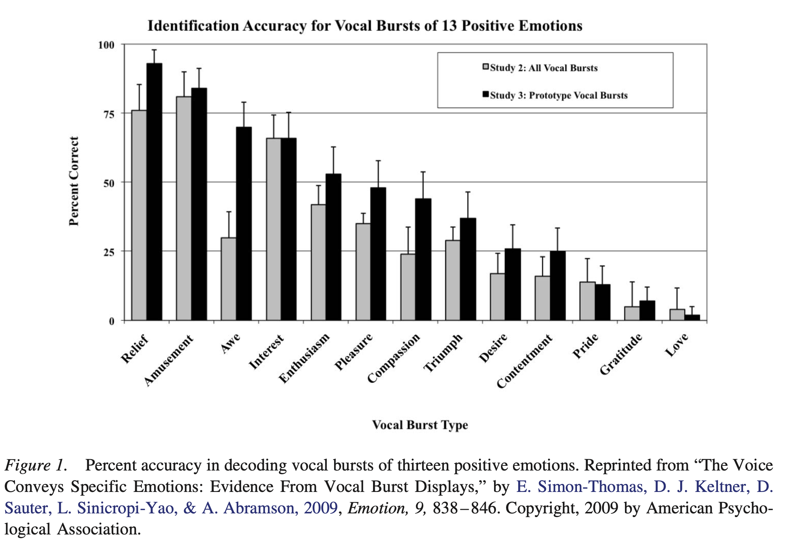

```{r echo=FALSE}
library(tidyverse)
source("../functions.R")
```

```{css}
.btn-group{
  display:none;
}
```

[Back to index](../index.nb.html)

# Abstract / Key Points

It is no longer tenable to assume that all positive emotions have identical response profiles or effects upon motivation and cognition.

In this article, we synthesize existing literature on positive emotion differentiation, proposing that the positive emotions are best described as branches of a “family tree” emerging from a common ancestor mediating adaptive management of fitness-critical resources (e.g., food) ---> `r colored("positive emotions as functionally discrete entities", "gold", bold = T)`  

We then offer a new theoretical framework, built upon a foundation of phylogenetic, neuroscience, and behavioral evidence, that accounts for core features as well as mechanisms for differentiation. 

Def of emotions: brief, multicomponent, largely automatic psychological mechanisms that coordinate a variety of cognitive, physiological, and motor processes, facilitating an adaptive response to particular kinds of fitness-relevant opportunities or threats 

  - Subjective feeling is deemphasized in this definition, which instead highlights biological systems and cognitive mechanisms that support motivation and behavior.

For the most part, however, programs of research on various positive emotions have developed independently. These emerging areas of inquiry highlight the need to develop an overarching theoretical framework that integrates the evidence to date, and can guide future research

-----

# Current Evidence for Positive Emotion Differentiation

## 1. Expression in the Face, Posture, Touch, and Voice

The ability to clearly express positive emotions to conspecifics is crucial, and new evidence is revealing the diversity of ways in which positive emotions are communicated nonverbally

- Positive emotions in the face and posture:
  - only one display had been linked to positive emotion—the Duchenne smile: zygomatic major muscle & orbicularis oculi muscle
  - People may have difficulty distinguishing intense positive from intense negative emotions based on spontaneous facial expressions (e.g., identifying those who had just won vs. lost a point in a tennis match), but can do so reliably based on body posture (Aviezer, Trope, & Todorov, 2012).
    - e.g., pride (upward head tilt); Amusement is associated with a distinctive bouncing, tilting head movement, as well as the drop-jaw open mouth Duchenne smile of laughter and play; Self-reports of love are associated with open-arm gestures that convey the intent of affectionate touch (Gonzaga, Keltner, Londahl, & Smith, 2001).
  - A *social functional perspective* predicts emotion-specific expressions such as those described above will show continuity with primate behaviors that communicate qualities of relationships between conspecifics (e.g., reproductive inter- est, dominance/submissiveness, play; Eibl-Eibesfeldt, 1989).
  - In one study of romantic partners, self-reports and partner attributions of love were associated with 1–5 second nonverbal displays of smiling, mutual gaze, affiliative hand gestures, open posture, and forward leans. In contrast, reports and attributions of sexual desire were predicted by mouth movements such as lip licks, lip wipes, and tongue protrusions (Gonzaga et al., 2001). 
  - In a follow-up study of women recounting a positive close relationship experience, the affiliative nonverbal display of love—but not the lip-licks of sexual desire—predicted the peripheral release of oxytocin (Gonzaga et al., 2006). 
  - Thus, even the closely related states of love and sexual desire showed differences in expression that tracked theoretically relevant physiological response.
- Positive emotions in touch 
  - Touch rewards: Gentle, affiliative touch is detected by specialized mechanoreceptors in the skin (Löken, Wessberg, Morrison, McGlone, & Olausson, 2009), and triggers activation in the orbitofrontal cortex, a region included in the reward circuit (Rolls, 2000).
  - Touch bonds: Affectionate touch is considered a key mechanism for parent-infant bonding (Bai, Repetti, & Sper- ling, 2016; Feldman, Weller, Zagoory-Sharon, & Levine, 2007). 
  - Touch soothes: Married women anticipating an electric shock showed decreased threat-related activity in key brain areas when holding the hand of a spouse, but not that of a stranger (Coan, Schaefer, & Davidson, 2006).
  - The tactile experiment: two people separated by a curtain, and the decoder decode the emotion of the touch from the toucher; the decoder chose from a close-end list
  - The distinct communicative functions of touch appear especially important for those positive emotions involving relational closeness or interdependence 
- Positive emotions in the voice 
  - The emotions involved in close relationships—love, desire, and gratitude, for example— appear not to be as easily identified solely through vocal cues.
  
Combined with the data on communication via touch, these findings support Ekman’s (1992) proposal that the expres-  signals of various emotions are far from random, but selectively involve those modalities most consistent with the function of the emotion itself and the context in which the emotion is most likely to occur.

The available data suggest that nonverbal expressions and their interpretation are shaped by a combination of evolved, universal signal features and learned, culturally idiosyncratic components, as well as display rules guiding modulation of expression in particular contexts, in complex ways that are far from clear at this time

 

## 2. Positive Emotions and the Autonomic Nervous System

Autonomic specificity hypothesis (ASH):  “no shade of emotion, however slight, should be without a bodily reverberation as unique, when taken in its totality, as is the mental mood itself” (James, 1884, p. 192)

The overwhelming emphasis has been on anger, fear, sadness, disgust, and a single positive state—happiness. (Cacioppo et al., 2000)

Few ASH-inspired studies prior to 2000 had clearly stated what they meant by “happiness,” or explicitly compared different positive emotions.

Shiota et al., 2011: 

  - During anticipation of a monetary reward (“enthusiasm,” evoked by a series of lottery-like slides in which participants won an increasing amount of money) participants showed a broad increase in sympathetically mediated activation across cardiac, vascular, and electrodermal systems. 
  - The “attachment love” slides depicting childhood fictional icons, such as Big Bird, evoked heightened cardiac activity without signs of vascular constriction, akin to a “challenge” profile documented in agentic appraisals of difficult tasks
  - In contrast, responding to awe slides strongly suggested withdrawal of sympathetic influence on the heart, consistent with preparation for stillness rather than physical move- ment.

 

## 3. Effects on Cognition and Judgement 

Feeling good can facilitate creativity, broadening of attentional scope, and/or increased reliance on heuristics 

These studies suggest that many current generalizations about the effects of positive emotion on cognition, judgment and decision-making may prove to be moderated by distinctions among specific positive emotions.

Gable and Harmon-Jones (2008) found that high-approach, appetitive emotions tended to narrow attentional focus whereas low-approach emotions broadened it.

Oveis, Horberg, and Keltner (2010) reported differing effects of compassion and pride on patterns of perceived self-other similarity: 
  
  - compassion, thought to direct attention toward vulnerable or suffering others, increased perception of self-other similarity for weak others; 
  - pride, a high-status-signaling emotion, increased perception of self-other similarity for strong others, and reduced self-other similarity to weak others.


Shiota et al., 2007:
  
  - Awe, thought to promote accommodative cognition when processing new information, and nurturant love, which should promote vigilant attention to the environment (Hrdy, 2006) both increased the effect of argument quality on peoples’ endorsement of a persuasive message, relative to a neutral-affect condition.
  - Anticipatory enthusiasm, contentment, at- tachment love, and amusement all reduced this effect, with participants relying on a simple “number of arguments” heuristic to endorse the message regardless of argument quality, as seen in earlier research. 
  - Importantly, the overall pattern of effects could not be accounted for by any single dimension of appraisal (e.g., certainty) or subjective experience (e.g., pleasantness).


Griskevicius et al. (2010): `r colored("“rose-colored glasses” phenomenon", "gold", bold = T)` 

  - They found that pride selectively increased the desirability of consumer products intended for public display, such as expensive watches and shoes, but not comparably priced products that would enhance comfort at home, such as a new sofa or bed; the reverse was true for contentment. 

# Proposed Theoretical Framework: The Positive Emotion Family Tree

We posit that a number of distinct positive emotions exapted from a primordial state promoting the acquisition of food 

 

Def: We define “positive” emotions in terms of a common aspect of adaptive function: to facilitate effective management of and response to opportunities, presented by the current environment, to acquire material, social, and/or informational resources that are crucial for promoting fitness. `r side_note("Does this definition also apply to negative emotions? I guess if you simply replace 'opportunities' with 'threat' then this def would also apply to negative emotions. ")`

We assume this function is shared across positive emotions, but has been elaborated into more distinct functions over the course of our ancestors’ evolution as new, qualitatively distinct kinds of resources were introduced. Our approach emphasizes similarities among the adaptive problems addressed by positive emotions as a class, rather than defining positive emotions in terms of subjective pleasantness or approach motivation.
  
  - feelings are subjective, internal experiences that may include conscious awareness of these responses but interpret them and their meaning through socially and psychologically constructed concepts
  - feeling of pleasantness is influenced by cultural and psy- chological factors (e.g., Kitayama, Karasawa, & Mesquita, 2004), and “negative” emotions such as sadness, anger, and fear can be experienced as pleasant under the right conditions 
  
The case of anger 

  - High in approach motivation
  - Can feel pleasant 
  - Can be seen as a response to the combination of reward and threat in the environment `r side_note("When is anger a response to reward?")`
  - NTS: If they think that anger can be a response to the combination of reward and threat, then it's unreasonble to not include anger in their analysis, and anger would fit well into their definition of positive emotions. 


## 1. The Trunk: The Neural Reward System

Neuroscientific evidence strongly indicates that acquisition and management of fitness-relevant resources is supported by a highly conserved circuit of neural structures, often referred to as the “reward system.” In mammals, the mesolimbic pathway linking the ventral tegmental area and nucleus accumbens is a key component of this system; the system also includes the uncinate fasciculus, ventral pallidum, and areas of the frontal cortex. 

The neurotransmitter dopamine plays a major role in activity within the mesolimbic reward pathway. 

## 2. The Branches: Modulation of the Reward System

“Branches” of the positive emotion tree consist of specialized responses to new kinds of resources,

What follows is necessarily speculative, given the early state of what is known about the human and mammalian central nervous systems and the complex, multifaceted nature of emotion. However, evidence is strong and growing that a variety of neurotransmitters and peptides modulate dopaminergic activity within the me- solimbic pathway as well as the structures to which it projects. 

1. Serotonin 

- Serotonergic systems throughout the brain support a wide range of functions, including sleep cycle regulation (Portas, Bjorvatn, & Ursin, 2000), memory (Buhot, Martin, & Segu, 2000), and executive cognition. 
- Serotonin transporter gene provide growing evidence that serotonergic activity supports modulation of behavior in response to the social environment 
  - Responding to and detecting cues of social status 
  - Behavioral dominance ---> more assertive, confident behavior 
  - Enjoys greater popularity and esteem 
- Consistent with the finding that serotonin enhances dopaminergic mesolimbic pathway activity, social dominance has pronounced implications for reward-seeking behavior.

A serotonergic mechanism for modulating reward-seeking behavior based on one’s level of dominance may have provided an ancient neurobiological foundation for human pride—an emotional response to the opportunity of high social status (Tracy & Robins, 2007; Tracy, Robins, & Tangney, 2007). Notably, the human pride display is highly similar to the dominance display of primates and other mammals (e.g., postural ex- pansion; Tracy & Robins, 2008), and is recognized cross-culturally as an indicator of high social status (Tracy et al., 2013).


2. Opioid peptide

Enjoyment of eating (instead of the anticipation of eating) and physical warmth 

It is "liking" instead of "wanting" 

In humans as well as rats, mu-opioid activity in the cingulate cortex helps alleviate distress responses to separation from an attachment figure, rejection, and other social pain

Naltrexone, an opioid antagonist, reduces people’s affiliative feelings toward partners in an economic trust game (Schweiger, Stemmler, Burgdorf, & Wacker, 2014). In one striking study, naltrexone was found to inhibit a previously observed effect in which physical warmth in- creased people’s feelings of social connectedness (Inagaki, Irwin, & Eisenberger, 2015).

As a mechanism linking the pleasurable enjoyment of physical and social warmth, opioid activity within the mesolimbic pathway may provide a neurobiological foundation for mammalian attachment *love*—an emotional response to the opportunity of affiliation, interdependence, and intimacy

Touch evokes an opioid response in many mammals including rodents, humans, and primates, providing a mechanism by which affiliative social contact might activate endoge- nous pleasure, as well as alleviate distress (Dunbar, 2010; Weller & Feldman, 2003).

*Gratitude*, experienced when one unexpectedly benefits from another’s altruistic act (McCullough et al., 2001), may be a distinct variant of attachment love in the context of relationships that are not currently communal and intimate, yet show strong potential for developing these qualities. 


3. Testosterone

The androgen testosterone, in addition to driving the development of masculine phenotype and peripheral sexual response (Bhasin et al., 2001; Penton-Voak & Chen, 2004), plays an important role in male and female sexual desire—an emotional response to the opportunity presented by a high-quality potential sex partner 

4. Cannabinoids and the basal ganglia

Play, fun ---> amusement 

5. Oxytocin 

Ample evidence links oxytocin not only to childbirth and nursing, but also to the formation of bonds that facilitate this long-term commitment

Intranasal oxytocin has been found to increase early attention to positive facial expressions (Domes et al., 2013), cooperation in a repeated prisoner’s dilemma game (Rilling et al., 2012), and subjective feelings of trust (Van IJzendoorn & Bakermans-Kranenburg, 2012). 

Modulating effects of oxytocin on dopamine activity within the me- solimbic reward pathway may support interdependent relationships in general, and provide a neurobiological foundation for *nurturant love* in particular—an emotional response to the important adaptive opportunity presented by offspring and other vulnerable kin.

## 3. The Leaves, or Why People Are Not Lobsters

We consider the neural system(s) described above, and the mechanisms by which they facilitate adaptive behavior, to be evolutionarily conserved *physiological-motivational-behavioral* foundations on which the richness and complexity of human emotional experience is built.

In positing the role a neurotransmitter might have played at the beginning of a new “branch” of the positive emotion tree, we do not mean to suggest one-to-one correspondence between neurotransmitters and positive emotions.

This necessitates an important caveat regarding our use of the term “discrete” in the present article’s title—our discrete positive emotions are functionally semidistinct, and can be differentiated from each other on several aspects of emotional responding, but also share common features reflecting their relationship to a primordial mechanism promoting acquisition of food.

# The Work to Be Done: A Research Agenda

 

Evidence for distinct nonverbal expressions is mixed, with strong data on some positive emotions and limited data on others

Cognitive processes are less studied 

  - Cognitive processes strongly emphasized in evolutionary psychology approaches to discrete emotions (Tooby & Cosmides, 2008). Theoretical perspectives emphasizing the valence of core affect have inspired extensive programs of research on pleasant mood and cognitive processing (Ashby, Isen, & Turken, 1999; Bless & Fiedler, 2006; Forgas, 2008), yet this aspect of emotional responding has traditionally received limited attention from discrete emotion researchers (Lerner, Li, Valdesolo, & Kassam, 2015). 
  
Subjective experience 

  - Commonly used self-report measures of overall positive affect, such as the Positive and Negative Affect Schedule (PANAS; Watson et al., 1988), will not capture differences among specific positive emotional states. Caution is also needed in assuming that research participants attach the same meaning to emotion terms that researchers do. Going beyond simple emotion labels to examine thought content, feeling and subjective motivation during an emotional experience will strongly enrich this approach.
  

# Lost in Translation: Positive Emotion Differentiation in Applied Research
In contrast, the understanding that different positive emotions can have quite different effects would facilitate interventions and practices that match emotion states to desired outcomes in precise, yet theory-driven ways.

Clinical psych: 

  - dispositional joy (a construct similar to enthusiasm in the present taxonomy) and amusement have been found to prospectively predict subsequent increases in mania symptom severity, whereas compassion (a construct similar to nurturant love) shows the opposite effect, and awe and contentment show no effect at all on mania symptom magnitude 
  - studies have linked depressive symptom severity specifically to deficits in dispositional and experimentally evoked pride 
  - Individual profiles of depression symptoms are remarkably heterogeneous, with nearly 1,500 unique potential combinations that would qualify for diagnosis (Ostergaard, Jen- sen, & Bech, 2011). Research already suggests that certain symptom clusters are associated with particular kinds of losses (i.e., of an important relationship partner vs. failure; Keller & Nesse, 2006). Functional analyses of the four positive emotions above could be used to develop hypotheses about distinct symptom clusters expected given disruption of emotional responding to the corresponding kinds of rewards.
  
Behavior change: 

   - The nuances of *which* positive emotion to employ may, however, prove crucial. Here, again, functional analyses of distinct positive emotions should facilitate their effective use in interventions, and help prevent backfires.
  -  For example, positive emotions involving strong appetitive motivation, such as enthusiasm and pride, are unlikely to help people resist temptation. Perhaps for this reason, some “positive affect” manipulations have been found to increase alcohol craving in alcohol-dependent participants (Mason, Light, Escher, & Drobes, 2008), and high-calorie snacking in obese participants (Udo et al., 2013).
  - However, Tice and colleagues (2007) have found that the experience of amusement/humor may help restore self-regulatory capacity, making it easier to nudge behavior in desired directions.
  - Different positive emotions may also have different implications for health message processing. As discussed earlier, many positive emotions promote shallow, peripheral processing of persuasive messages—hardly ideal for achieving lasting effects. However, nurturant love and awe were both found to have the opposite effect, promoting more systematic processing and, in awe, greater cognitive elaboration of the message as well (Griskevicius et al., 2010). A discrete positive emotion approach built on functional analyses may help those developing health behavior interventions to le- verage positive emotions more effectively.


# Conclusion: What We Gain From a Science of Discrete Positive Emotions

Is the discrete emotion approach “right” within affective science, broadly speaking? How “discrete” will the positive emotion constructs we have proposed prove to be? At the current stage of evidence, we consider these questions to be highly worth pursuing, rather than having clear answers.

Any attempt to answer them depends on data assessing links among various com- ponents of emotional responding — 
  
  - elicitors, 
  - appraisals, cognitive biases and processes, 
  - neural activity and peripheral physiological reactivity, 
  - expression, 
  - behaviors and action tendencies

Such data can be used to test whether variability in the positive emotion domain is best explained by the relatively categorical approach emphasized here, or, for example, in terms of the effects of a series of continuous, interacting appraisal dimensions

The theoretical framework we have described facilitates hypotheses and research designs that will produce these data, while acknowledging that the boundaries between emotion constructs may be *fuzzy* rather than sharp. We anticipate that data will ultimately point to a convergence of the discrete function, appraisal component, and dimensional theories of emotion, in which each understanding of “emotion” maps to a psychological mechanism that is real in the neural, behavioral, and phenomenological sense. 

<hr>

[Back to index](../index.nb.html)


  

