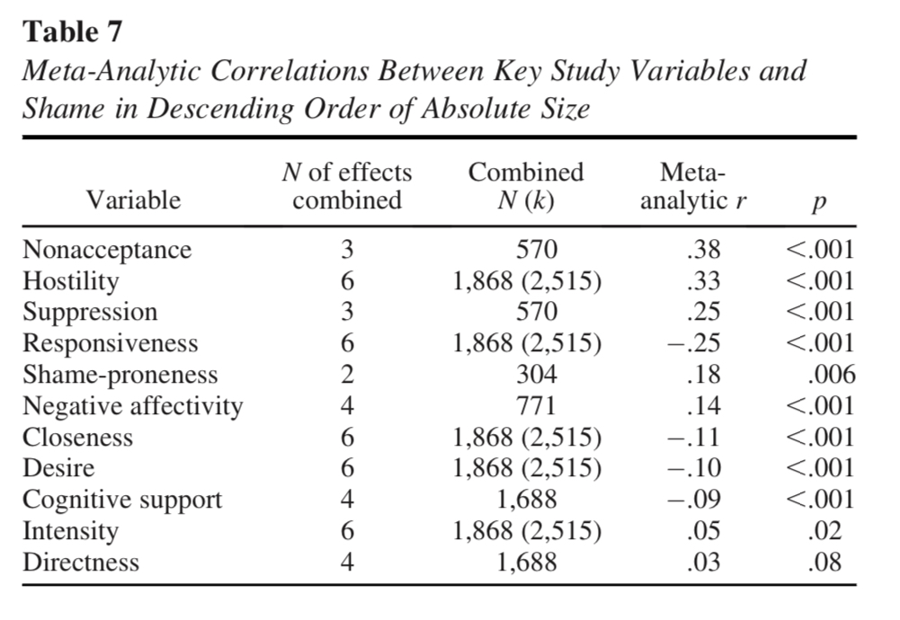

```{r echo=FALSE}
library(tidyverse)
source("../functions.R")
```

# Back to index 

[Back to index](../index.nb.html)

# Abstract 
N = 1868 (6 samples)

Autobiographical recall and ecological sampling (total instances analyzed: 2515)

Shame as an affective outcome of recieving interpersonal emotion regulation 

Both explortoary and confirmatory 

Correlates: 
  
  - individual (e.g., trait external shame-proneness)
  - situational (e.g., desire for regulation)
  - relational (e.g., perceived closeness with the provider)
  - interaction-specific (e.g, perceiptions of provider hositility)

Results: 

  - The induction of shame from receiving IER is not uncommon 
  - The strongest correlates of shame were individual differences in
  `r side_note("Suppression without valence (intentionally including a domain general measure)")`
    - nonacceptance of negative emotions 
    - expressive suppression 
    - interaction-specifc ratings of provider responsiveness and hostility 
    


# Intro
Def of IER: “slice of interpersonal interactions deliberately devoted to influencing one's own (intrinsic) or others’ (extrinsic) emotions” (Dixon-Gordon et al., 2015, p. 37).

Emotion sharing is beneficial for sharers (e.g., Nils & Rime, 2012; Pennebaker et al., 2001; Rime, 2009)

However, IER can also produce *undesirable outcomes* (Dixon-Gordon et al., 2015)

  - self-injury (Dixon-Gordon et al., 2018)
  - internalizing symptoms (Spendelow et al., 2017)

Def of shame 

  - an aversive, self-concious emotion associtated with negative evaluations of the whole self 
  - commonly triggered by failures to attain standards or ideals, particularly when people perceive themsevles as being negatively evaluated by others 

research on received support has found that perni- cious effects of visible support are tempered under some condi- tions. For example, prior studies have reported fewer negative consequences when visible support is perceived as responsive and is focused on emotional support (vs. practical support), when the intensity of receivers’ distress is high, and when receivers are less concerned about negative social evaluation (see Zee & Bolger, 2019).
 
# Aims 
We examined receivers’ reports of attempted support transactions in which another person tried to help them change how they were feeling. These interactions are, by definition, acts of *visible* support, as participants are asked to report on interactions in which another person tried to help them, but with an emphasis on interactants’ *emotion regulatory motives*. 

In this way, we sought to bridge the emerging emphasis in the social support literature on understanding how social support transactions do or do not meet receivers’ self-regulatory needs (see Zee et al., 2020) with the interpersonal emotion regulation literature (see Zaki & Williams, 2013).

1. Our first aim was to examine how often people experience shame as an outcome of receiving interpersonal emotion regulation. 

2. Our second aim was to evaluate whether shame is merely a byproduct of ineffective or unhelpful interactions, or whether shame sometimes arises even when an interaction is perceived as effective overall.

3. Which features of the 4 units of analysis mattered above and beyond individual differences 

    (1.) individual differences (these are domain-specfic in purpose)
      - negative affectivity
      - external shame-proneness
      - difficulties accepting negative emotions- 
      - tendencies to suppress outward expressions of emotion 
    
    <br>
    (2.) stable features of the relationship between the receiver and the provider `r arr("r")` these factors likely modulate the extent to which emotion-laden interactions with specific others are perceived as asymmetric, evaluative, and threatening
    
      - type of relationship 
      - perceived closeness 
      
     <br>
    (3.) contextual factors found to matter (see Zee & Bolger, 2019 for review)
    
      - receivers' emotional intensity 
      - receivers' desire for emotion regulation 
    
     <br>
    (4.) receivers' experiences of the IER interaction itself based on 4 separable dimensions of providers' behavior (Swerdlow & Johnson, 2020)
      - responsiveness
      - hostiity 
      - provision of cognitive support 
      - avaliability of physical presence 

`r colored("Hypotheses:", "gold")`

We hypothesized that shame responses to receiving interpersonal emotion regulation would be more likely to arise:

  - **in individuals who were prone to negative affectivity and shame and who tend to judge themselves for experiencing distress and suppress outward expressions of emotion;** 
  - **in the context of less close relationships;**  
  - **in situations that were characterized by intense emotions and a stronger desire for regulation; and**
  - **in interactions with regulation providers who were perceived as less responsive and more hostile.**

# S1 

Data-driven, explortory approach 

Aims:

  - to provide an initial estimate of the proportion of visible attempted interpersonal emotion regulation interactions associated with moderate-or-greater shame
  - to assess whether shame ratings could be adaquately separated from ratings of the overall helpfulness of interpersonal emotion regulation interactions 
  - to identify features of the relationship, situation, and interaction that were uniquely associated with shame so that these could be included in subsequent confirmatory studies 
  
## Method

  - Sample 1: 898 undergrads; Samle 2: 199 adults
  - Autobiographical recall of an instance of the most recent time when they received interpersonal emotion regulation from someone else ("when someone else tried to help you manage your emotions or feel better)
  
### Measurements

  `r side_note("The goal here is *explicit, conscious*")`
  - Goal-directed nature of IER: *"think about times when you wanted to feel more or less positive, more or less negatve, or more or less calme, and someone else tried to help you."*
  - *Two interesting measures about how individuals communicated their needs and goals*
  `r side_note("People in general do not know what they want, and they are not direct about their needs and goals. <br> But when their interaction partners are hostile, they are more likely to be clear, so are when they voluntarily seek IER.")`
    - 1. clarity: The extent to whcih they had a clear sense of what they wanted the provider to do or say (1-5) 
      - Ss1: M = 2.66, SD = 1.15; Ss2: M = 2.65, SD = 1.25 

```{r}
tibble(Vars = c("Sought", "Intensity", "Hostility","Cognitive"), 
       S1_Correlation = c(.17, -.11, .04,-.10),
       n_sigS1 = c("","", "ns", ""), 
       S2_Correlation = c(.09, -.15, .23, .10), 
       n_sigS2 = c("ns","", "", "ns"))
```

  - 2. directness: How direct they were in commmunicating these desires to the provider (1-5) 
    - Ss1: M = 2.46, SD = 1.26; Ss2: M = 2.63, SD = 1.35 

```{r}
tibble(Vars = c("Sought", "Intensity", "Hostility","Cognitive"), 
       S1_Correlation = c(.14, -.13, .18, .16),
       n_sigS1 = c("","", "", ""), 
       S2_Correlation = c(.12, -.22, .27, .12), 
       n_sigS2 = c("ns","", "", "ns"))
```

### Analytic strategies 

Elastic net ---> Lasso + Ridge ---> minimize overfitting (`glmnet` and `caret` packages)
 
 - 10-fold CV
 - 8:2 train-test
 
### Results 

Shame: modals of Ss1 = 1 (M = 1.81, SD = 1.04), Ss2 = 2 (M = 2.18, SD = 1.29) 

  - *Shame is not common and not strong*
  - Interaction partner being a significant other is negatively associated with shame 
  - High itensity of emotion is positively associated with shame 
  
# S2 
Individual differences 

- General NA ---> Not correlated with shame 
- Nonacceptance of negative emotions ---> positively correlated with shame (only in Ss1) 
- Suppression ---> positively correlated with shame (only when other situational features are not entered into the model)


- Hostility has a positive effect and responsiveness a negative effect on shame across samples above and beyond individual variables 

# S3 

Daily diary and EMA 

# Mini meta




-----
[Back to index](../index.nb.html)


  

