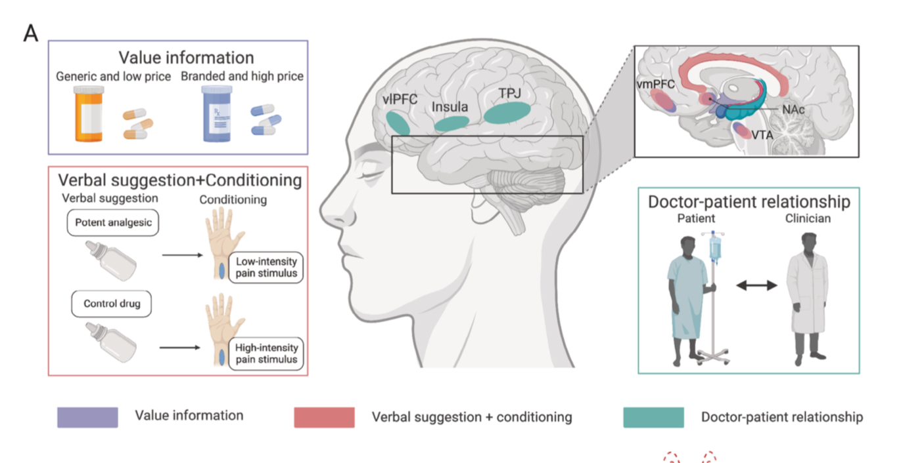

```{r echo=FALSE}
library(tidyverse)
source("../functions.R")
```

```{css}
.btn-group{
  display:none;
}
```

# Back to index 

[Back to index](../index.nb.html)

# Abstract 

def: Placebo and nocebo effects are salubrious benefits and negative outcomes attributable to non-specific symbolic components.

We review advances in employing psychosocial, pharmacological, and neuromodulation approaches to modulate/harness placebo and nocebo effects.

# Introduction 

`r side_note("Schedlowski M, Enck P, Rief W, Bingel U. Neuro-bio-behavioral mechanisms of placebo and nocebo responses: implications for clinical trials and clinical practice. Pharm Rev. 2015;67:697–730.")`
Placebo and nocebo effects have been observed in a plethora of conditions including pain, Parkinson’s disease, *depression*, anxiety disorders, immunologic responses, cardiovascular functions, and sleep disorders. 

The improved understanding of placebo and nocebo effects has built a basis for the crucial next step: shifting from understanding their biopsychosocial mechanisms through systematic observation to *modulating placebo and nocebo effects through experimental paradigms/designs or brain stimulation methods*. The proposed research focus shift echoes the growing interest in *optimizing placebo effects to improve therapeutic outcomes* and minimizing nocebo effects to avoid unintended exacerbation of symptoms in medical practice.

# Behavioral and neural bases for harnessing placebo and nocebo effects 

## Behavioral bases of placebo and nocebo effects 

`r colored("Expectiontion", "gold")` and `r colored("Leanring", "gold")`

Expectations 

  (1) verbal information 
  (2) associative learning, especially classic conditioning 
  (3) observational conditioning  
  (4) operant conditioning (reward/punishment)

Desire for pain relief interacted with expectations

Reduction of negaitve emotions as the mediator 

## Neural responses underlying placebo and nocebo effects 

Placebo analgesia can be bloced by naloxone <--- endogenous opioid and descending pain modulatory system (DPMS) play a crucial role 

Key regions in the DPMS originate in the cingulate cortex and PFC ---> PAG ---> rostroventral medulla and spinal cord 

Meta-analysis showed that placebo analgesia only has small effects on the neurologic pain signature ---> likely to act at the level of several brain netowrks beyond nociception that may be important for the emotions, decision making, and behaviors surrounding pain 

# Harnessing placebo and nocebo effects using psychosocial, pharmacological, and neuromodulation approaches

## Psychosocial approaches 

  1. Expectations
  2. Learning 
  3. Social interactions 

Combination of verbal suggestions/instructions and conditioning 

  - order matters ---> in placebo, verbal first; in nocebo, order doesn't matter 

Nocebo hyperalgesia is hard to get rid of when it is established via classical conditioning 

Social interaction (e.g., doctor-patient relationships)

  - exactly how this can be manipulated or applied is still under debate 


Psychosocial approaches, including valuable information and enhanced conditioning (i.e., verbal suggestion precedes conditioning), modulate the reward system (e.g., ventromedial prefrontal cortex [vmPFC], nucleus accumbens [NAc], and ventral tegmental area [VTA]). Trustful doctor–patient relationships rely on the brain-to-brain coupling in the temporoparietal junction (TPJ), insula, and ventrolateral prefrontal cortex (vlPFC).

## Pharmacological approaches 

Oxytocin and vasopressin ---> effects on pain are mixed 

  - previous research was done via verbal instructions 


Intranasally administered oxytocin/vasopressin travels to the brain via olfactory and trigeminal nerve fibers and may modulate placebo-related brain activities in the anterior cingulate cortex (ACC), NAc, hypothalamus, amygdala, hippocampus, and brainstem

## Neuromodulation apporaches 

Non-invasive brain stimulation (NIBS)

  - TMS
  - Transcranial electrical stimulation 
  <br>
  - PFC (DLPFC, vlPFC, vmPFC)
  <br>
  - limted to cortical regions 


Neuromodulational approaches including transcranial magnetic stimulation (TMS) and electrical stimulation (tES) target key regions in the prefrontal cortex (e.g., dorsolateral prefrontal cortex [DLPFC] and orbitofrontal cortex [OFC]) to modulate the reward system and descending pain modulation system (e.g., periaqueductal gray [PAG] and rostral ventromedial medulla [RVM]) to harness placebo effects

# Translating basic research findings into clinical treatment settings 

## General prinicples in clinical practice 

  (a) point out directly that a drug or treatment is effective 
  (b) Demystifying
  (c) build a supportive relationship 
  
## Appluying the learning model in clinical treatment 

condition-lik manipulation ---> expectancy manipulation 

## Varibility of placebo effects 

Sex and race: White, Female show stronger effect 

Psychological factors: expectation, trait optimmism, desire for control, eomtional distress, and maladpative cognitive appraisals of pain 


-----
[Back to index](../index.nb.html)


  

