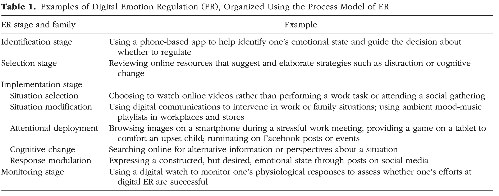

```{r echo=FALSE}
library(tidyverse)
source("../functions.R")
```

```{css}
.btn-group{
  display:none;
}
```

[Back to index](../index.nb.html)

# Abstract / Key Points

In this article, we discuss the emergence of digital emotion regulation, both as a widespread behavioral phenomenon and a new cross-disciplinary field of research. This field bridges two largely distinct areas of enquiry: (a) psychological research into how and why people regulate their emotions, which has yet to systematically explore the role of digital technology, and (b) computing research into how digital technologies impact users’ emotions, which has yet to integrate psychological theories of emotion regulation.

Digital ER: the use of digital technology as a tool for strategically influencing our affective states (including emotions, moods, and stress levels)



Although the authors claim that computing research and psych research can benefit from each other, I don't really see the values of the theoretical precision from psych and how they can be of interest of computing researchers or benefit the field. 

Future directions: 

1. Establishing methods for studying digital ER
2. Identifying common and unique characteristics of digital ER
3. Clarifying the benefits and harms of digital ER


-----
[Back to index](../index.nb.html)


`r colored("", "gold", bold = T)`


  

