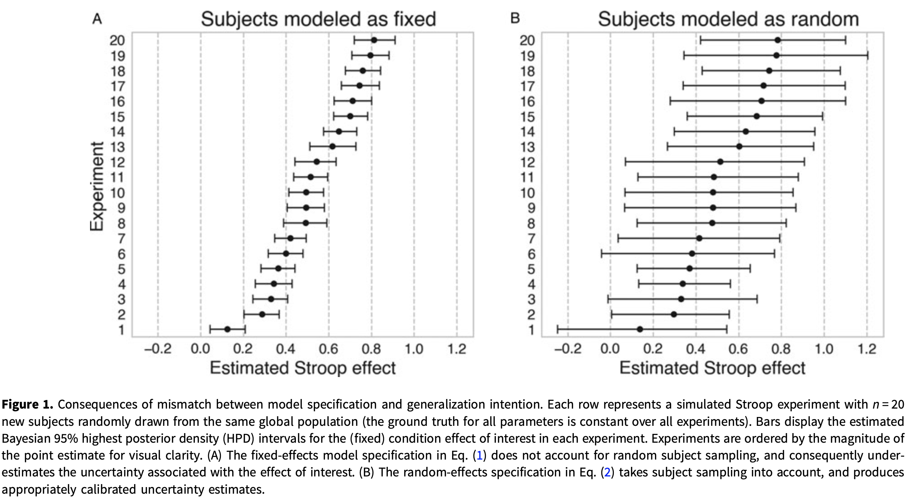

```{r echo=FALSE}
library(tidyverse)
source("../functions.R")
```

```{css}
.btn-group{
  display:none;
}
```

[Back to index](../index.nb.html)

# Abstract / Key Points

The critique primarily concerns that (1) variation in participants and (2) variation in stimuli were not taken into consideration 


Given that the theories and constructs psychologists are interested in usually have qualitative origins, and are almost invariably expressed verbally, a naive observer might well wonder why psychologists bother with numbers at all. 

Verbally expressed psychological constructs1 – things like cognitive dissonance, language acquisition, and working memory capacity – cannot be directly measured with an acceptable level of objectivity and precision. 

Every statistical model is a description of some real or hypothetical state of affairs in the world. 



Fixed effects are used to model variables that must remain constant in order for the model to preserve its meaning across replication studies; random effects are used to model indicator variables that are assumed to be stochastically sampled from some underlying population and can vary across replications without meaningfully altering the research question.

It’s hard to think of a better name for this kind of behavior than what Feynman famously dubbed cargo cult science (Feynman, 1974) – an obsessive concern with the superficial form of a scientific activity rather than its substantive empirical and logical content.


But I do think all psychologists, and early-career researchers in particular, owe it to themselves to spend some time carefully and dispassionately assessing the probability that the research they do is going to contribute meaningfully – even if only incrementally – to our collective ability either to understand the mind or to practically improve the human condition.

`r colored("The very fact that most of the phenomena psychologists study are enormously complex, and admit a vast array of causal influences in even the most artificially constrained laboratory situations, likely precludes the production of quantitative models with anything close to the level of precision one routinely observes in the natural sciences.", "gold", bold = T)` 

-----
[Back to index](../index.nb.html)


`r colored("", "gold", bold = T)`


  

