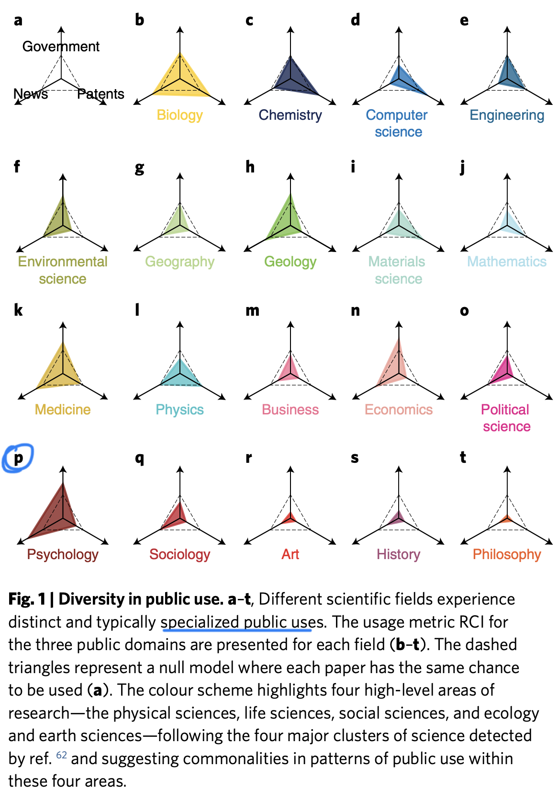

```{r echo=FALSE}
library(tidyverse)
source("../functions.R")
```

```{css}
.btn-group{
  display:none;
}
```

[Back to index](../index.nb.html)

# Abstract / Key Points

We find that different public domains draw from various scientific fields in specialized ways, showing diverse patterns of use. Yet, amidst these differences, we find two important forms of alignment. 
  
  - First, we find universal alignment between what the public consumes and what is highly impactful within science. 
  - Second, a field’s public funding is strikingly aligned with the field’s collective public use. 

Public use: Government, media, patent

the National Science Foundation for funding frivolous research and have called for greater trans- parency around the relevance of science




Specifically, we calculate the probability of being a hit paper within science, defined as those papers in the top 1% of citations within the same field and year, and examine the relationship to usage in the public domains (Methods and Fig. 2b). We find that papers referenced in public domains have a remarkably high likelihood of being hit papers within science. 


Reversing the exercise, we also see that, as the citation percentile of a paper rises, the probability for public use increases steeply, with extremely sharp increases at the very top of the citation distribution 

*the science referenced in public domains is not in conflict with what scientists themselves consider important; rather, impactful papers defined by these communities show substantial overlap*

Considering the findings, one may note that, in each of these public domains, the initial step beyond science involves an *intermediary*—via the journalist in media, the inventor or other domain expert in patenting, the potential policy expert in government—*all of whom may bring specialized capacities to bear in selecting what science they bring forth into their domain*. The broader public use—among those who read a news article, use an invented product or experience a policy—will then depend upon these intermediaries, who may help bridge the knowledge gap.

Notably, across the three domains, the representation of subfields in government documents has the lowest predictive power for funding, `r colored("suggesting that public investments in science better reflect the overall public interest captured by media or patents.", "gold", bold = T)`


Although each research field differs substantially in its relative role and contribution in science and beyond, the combination of their impacts beyond science powerfully predicts funding, `r colored("suggesting that, ultimately, what the public uses, what scientists use and what is funded are remarkably consistent.", "gold", bold = T)`

-----
[Back to index](../index.nb.html)


`r colored("", "gold", bold = T)`


  

